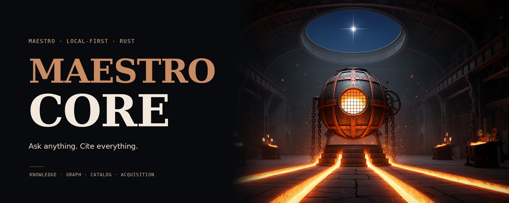
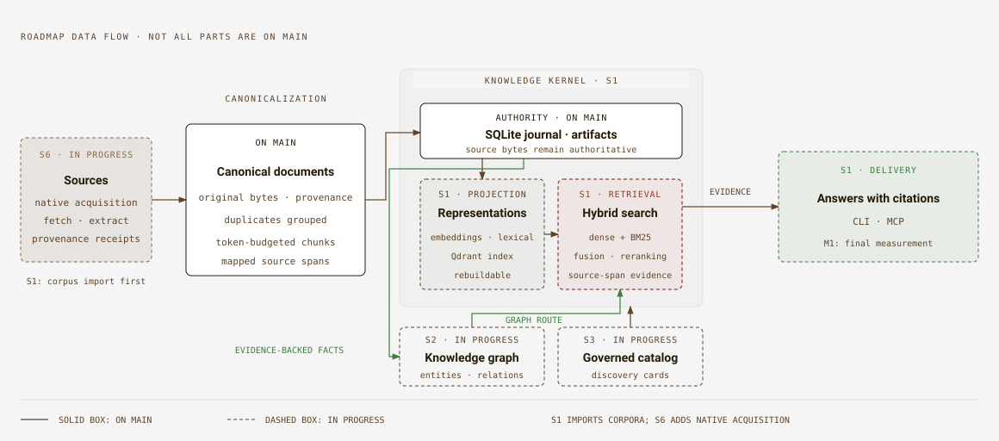

<p align="center">
  
</p>

<h1 align="center">🎼 Maestro Core</h1>

<p align="center">
  <strong>Ask anything. Cite everything.</strong><br />
  The Rust workspace for Maestro's local knowledge kernel, retrieval and governed agent runtime.
</p>

<p align="center">
  
  
  
</p>

<p align="center">
  <a href="https://github.com/Orchestration-Maestro/maestro-core/actions"></a>
  <a href="https://scorecard.dev/viewer/?uri=github.com/Orchestration-Maestro/maestro-core"></a>
  <a href="https://codecov.io/gh/Orchestration-Maestro/maestro-core"></a>
</p>

## ⚡ Quick start

Try the canonicalization CLI on the checked-in example. From the repository
root, with [rustup](https://rustup.rs) installed:

```sh
cargo run --locked -p maestro-canonicalization -- \
  crates/maestro-canonicalization/examples/input.md \
  --metadata crates/maestro-canonicalization/examples/metadata.json \
  --output target/canonical-example
cargo test --locked -p maestro-canonicalization
```

The first command prints a JSON summary: `24` blocks, `1` finding and
`"validation_status":"valid_with_warnings"`, with the path to `canonical.json`.
The warning is that the example's access policy is unknown, not public.
The artifact directory holds that JSON and a byte-identical `original.md`;
repeating the command verifies the existing snapshot rather than overwriting it.
See the [crate's README](crates/maestro-canonicalization/README.md) for the
library API, identities and validation contract.

This is a working command on `main`, not an end-to-end question-answering demo.
The `maestro` CLI and MCP knowledge tools are part of
[M1](#-status), still in final measurement.

## 🎯 Objectives

The [architecture](docs/architecture/README.md) sets the direction:

- **Keep the source behind every answer.** Carry provenance from original
  bytes through documents, chunks, retrieval and citations; refuse an answer
  that cannot be supported by its evidence.
- **One authority, rebuildable projections.** Keep the journal and artifacts
  in the kernel; treat vector indexes and the knowledge graph as projections,
  not independent sources of truth.
- **Local first, explicit egress.** Use local models by default, with a managed
  provider only where its profile explicitly selects it.
- **Govern actions, not just prompts.** Reviewed catalog policies, a host-owned
  broker, a sandbox and typed handoff contracts decide what an agent may do;
  source text and model output never grant permission.
- **Keep integrations replaceable.** Entry points share application commands;
  extensions consume a durable event stream without becoming core logic.

These are delivery goals, not a claim that every layer is on `main` today.

## 🔄 How it works

<p align="center">
  
</p>

The diagram shows the [roadmap](docs/architecture/06-roadmap.md), with the
parts already on `main` separated from the work in progress:

1. **Acquire sources (S6).** Native fetchers and extractors will produce
   faithful Markdown with provenance and acquisition receipts. S1 starts
   from imported corpora, without waiting for native acquisition.
2. **Canonicalize.** Preserve original bytes and supplied metadata in
   replayable documents, group duplicates without losing their occurrences,
   and make structural chunks within the selected tokenizer's budget.
3. **Build and query the knowledge kernel (S1).** The SQLite journal and
   content-addressed artifacts hold the authority and receipts. Embeddings
   and lexical vectors feed a Qdrant projection; hybrid retrieval, fusion and
   reranking select evidence for a cited answer.
4. **Add relationships and governed discovery (S2, S3).** The graph will
   connect entities and claims to evidence spans. The governed catalog will
   publish verified bundles of agents, skills, workflows and policies; its
   discovery cards become a searchable collection on the same kernel.
5. **Deliver evidence through the CLI and MCP (S1).** Search and answer
   operations will serve both developers and agent hosts, with citations
   resolved against the authoritative source bytes.

## 📍 Status

`main` contains four crates: canonicalization, repository conventions, kernel
building blocks and knowledge-pipeline building blocks. The latter include
collection and corpus contracts, router-backed token preparation and a
French/English lexical analyzer. There is no `maestro` runtime binary on
`main` yet.

**M1, “Ask Control-M”, is in its final measurement in
[PR #47](https://github.com/Orchestration-Maestro/maestro-core/pull/47).**
S2, S3 and S6 are also in progress. The
[roadmap](docs/architecture/06-roadmap.md) defines the remaining slices and
exit criteria; a planned milestone is not a shipped capability.

| Slice | Delivers | State | Milestone |
| --- | --- | --- | --- |
| S0 Foundation | Canonicalization, conventions, architecture and specs | On `main` | — |
| S1 Knowledge kernel + hybrid RAG | Journal, evidence, retrieval, cited answers, CLI and MCP | Building blocks on `main`; M1 in final measurement in PR #47 | M1 “Ask Control-M” |
| S2 Knowledge graph | Evidence-backed entities, relations and graph retrieval | In progress | M2 “Relationships answered” |
| S3 Catalog | Verified catalog bundles, host projection, routing and policies | In progress | M3 “Catalog installable” |
| S4 Orchestration runtime | Durable workflows, sessions, broker, sandbox and extensions | Planned | M4 “First governed workflow” |
| S5 Capabilities + InnerSource | Monitoring, Product Owner and orchestration-planning capabilities | Planned | M5 “First contributed capability” |
| S6 Native acquisition | Native fetchers, extraction, source policy and refresh | In progress | M6 “Python retired” |
| S7 Intelligence backend | Memory, code intelligence, governed knowledge and workbench | Planned | M7 “Maestro remembers” (I1) |
| S8 Provenance and reverse engineering | Provenance register, analyzers, behaviour contracts and clean-room boundary | Planned | M8 “Cleared to reimplement” |

## 🧭 Start here

| To | Read |
| --- | --- |
| Understand the design | [docs/architecture](docs/architecture/README.md) |
| See why a choice was made | [docs/adr](docs/adr/README.md) |
| Learn the vocabulary | [CONTEXT.md](CONTEXT.md) |
| Follow the active slice | [specs](specs/000-foundation/spec.md) |
| Work in this repository | [AGENTS.md](AGENTS.md) |

## 🔧 Develop

The crates build and pass their tests on Linux, macOS and Windows; CI runs them
on all three ([ADR-0018](docs/adr/0018-rustix-on-unix-and-win32-flags-on-windows.md)).
Install [rustup](https://rustup.rs), then the organization's gate from the
[latest maestro-rust-workflows release](https://github.com/Orchestration-Maestro/maestro-rust-workflows/releases/latest),
which installs the toolbelt CI runs, at the versions it runs, and the commit
hooks ([details](https://github.com/Orchestration-Maestro/maestro-rust-workflows/blob/main/docs/ci.md#the-tools-on-your-machine)).
`just check` runs exactly what CI runs, the steps of its checks job over the
commits a push sends, and the pre-push hook runs it
([details](https://github.com/Orchestration-Maestro/maestro-rust-workflows/blob/main/docs/ci.md#run-ci-before-you-push)):

```bash
cargo install --locked --git https://github.com/Orchestration-Maestro/maestro-rust-workflows \
  --tag vX.Y.Z rust-gate   # the latest release's tag
rust-gate setup   # the pinned toolbelt, and the commit hooks
just check        # CI's checks, here; it must pass before every push
just native       # the native tokenizer tests, through a local binding
```

The native tests read the tokenizer's artifacts where a binding file says they
are: see [TOKENIZER.md](crates/maestro-canonicalization/TOKENIZER.md).

## 📚 Documentation

- [Architecture](docs/architecture/README.md): the system, layers and invariants
- [Roadmap](docs/architecture/06-roadmap.md) and
  [traceability](docs/architecture/08-traceability.md): delivery and the
  requirements it preserves
- [Canonicalization](crates/maestro-canonicalization/README.md): the working
  CLI, library and source-preservation contract
- [Engineering](docs/standards/engineering.md),
  [security](docs/standards/security.md) and
  [Northstar](docs/standards/northstar.md): the organization's rules here
- [Banner credits](.github/assets/CREDITS.md): artwork, type and provenance

## Licence

MIT: [LICENSE](LICENSE). The banner's model and font licence notes are in
[its credits](.github/assets/CREDITS.md).
