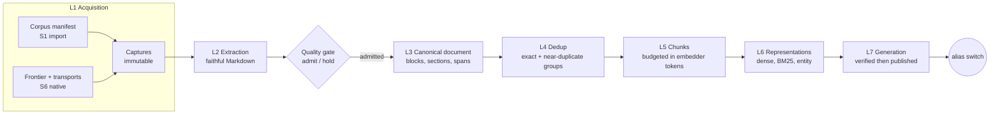
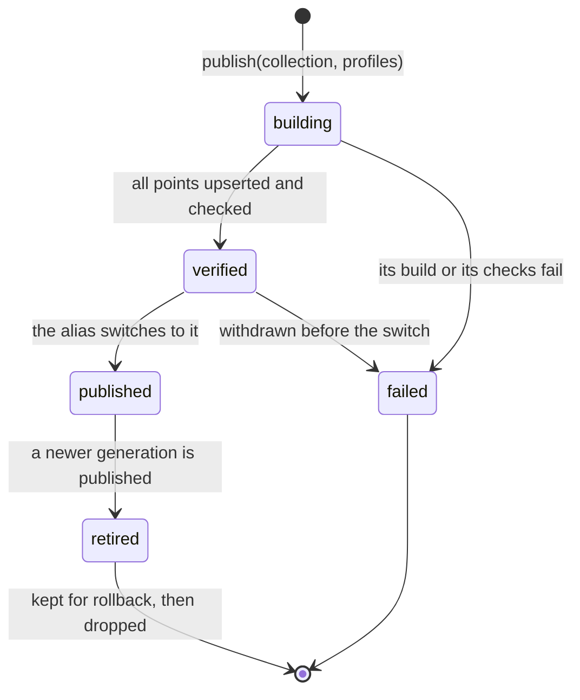

# 01 Knowledge pipeline

From an authorized source to a published, searchable generation. Layers L1–L7
of the [layer map](README.md#4-layer-map). Retrieval, the knowledge graph and
answers are in [02](02-retrieval-and-knowledge-graph.md). Every requirement
carried over from the earlier analyses is traced in
[08](08-traceability.md); integrations attach through the event stream and
source-connector extensions of [07](07-extensibility.md).



Every arrow is a **job** recorded in the kernel journal; every box writes
immutable artifacts. Nothing downstream consumes an output before its producer
has verified it and written its completion record last.

Two paths are scheduled separately and never mixed: **ingestion** maintains
versioned, searchable evidence; **question answering** reads an already
published generation. A question never triggers a crawl.

## 1. Collections, sources and scopes

| Term | Meaning |
| --- | --- |
| **Collection** | A logical body of knowledge: `ctm` (Control-M), `catalog` (the agent catalog), later `code:<repo>` and `memory:<project>`. Not a Qdrant collection, not a permission. |
| **Source** | A declared origin inside a collection: its kind, its reference, its transport and the profiles used to process it. |
| **Scope** | A node of the kernel's access tree: `workspace → collection → source`, and later `project`, `agent`, `run`, `session`. Every read is filtered by the caller's scopes. |
| **Document / revision** | A stable identity for one source document, and one exact version of its bytes and metadata. |

A collection is declared in a strict JSON document (ADR-0014) owned by whoever
owns the content (the private `ctm-collection` repository for Control-M):

```json
{
  "schema": "maestro-collection/1",
  "id": "ctm",
  "title": "Control-M 9.0.22 documentation",
  "visibility": "private",
  "profiles": {
    "extraction": "technical-html/1",
    "chunking": "structural-500-700/1",
    "embedding": "embed:winner",
    "sparse": "bm25-en-fr/1"
  },
  "quality": { "ledger": "quality/ledger.jsonl" },
  "sources": [
    { "id": "docs-core", "kind": "import", "sync": "manual",
      "manifest": { "binding": "corpus_root",
                    "path": "9.0.22/maestro-corpus.jsonl" } }
  ],
  "evals": { "suite": "evals/ctm" }
}
```

`visibility` becomes a scope tag on every derived record; `embed:winner`
resolves to a concrete model card at run time; `extraction` applies from S6 (S1
imports Markdown). Each source declares its **synchronization policy**
(`one-off`, `manual` or `watch`, an owner decision): automation is explicit,
bounded by the source's budgets and scope, and never widens access. Paths
resolve at run time from named bindings
(`$XDG_CONFIG_HOME/maestro/bindings.toml`); committed files hold logical names
only. A missing binding is a typed refusal before any work starts; unknown or
duplicate keys, dangling references and non-finite budgets are rejected.

The Control-M collection declares **15 sources**, kept verbatim from the earlier
source policy: ten documentation collections with their **40 entry URLs** (core,
three Automation API channels, Kubernetes, release notes, announcements,
deprecated features, integrations, the Python client), community records,
support knowledge-base articles, the electronic-distribution catalogue and its
assets, **ten GitHub repositories**, and document attachments. Their exact
seeds, exclusions and promotion decisions live in the private collection
repository (ADR-0009).

## 2. L1 Acquisition

### 2.1 S1 — import an existing corpus

The Control-M corpus already exists: 7,988 documents in the main manifest
(support KB, community, vendor web documentation, GitHub, internal archives,
security attachments), converted to Markdown by the current Python tooling.
S1 imports it through a small, vendor-neutral manifest instead of re-crawling:

```json
{"schema":"maestro-corpus/1","path":"docs/agent-install-unix.md",
 "sha256":"…","bytes":18233,"source_ref":"https://docs.bmc.com/…",
 "title":"Installing Control-M/Agent on UNIX","source_kind":"docs",
 "product":"control-m","component":"agent","platform":"unix","version":"9.0.22",
 "lang":"en","captured_at":"2026-09-13T16:34:20Z",
 "extractor":{"name":"crawl4ai+docling","version":"…","options":"…"},
 "access":{"visibility":"private","license":"vendor-documentation"}}
```

| Rule | Behaviour |
| --- | --- |
| Integrity | The file's SHA-256 must equal `sha256`; a mismatch refuses that entry (typed `DigestMismatch`), never imports it silently. |
| Identity | `document_id` = namespaced hash of `source_ref`, the origin URL or, when there is none, `corpus-path:` followed by `path`, which is relative to the manifest's directory; `revision_id` = canonicalization's content-and-metadata recipe. |
| Idempotency | An unchanged revision is recorded as `unchanged`; re-running an import is a no-op. |
| Metadata or permission change | Propagates even when the bytes are unchanged; embeddings are recomputed only if the prepared input changed. |
| Streaming | JSONL is streamed; memory is bounded by the largest document, not the corpus. |
| Report | Imported / unchanged / held / refused (with reasons) counts, as JSON and as a journal event. |

The exporter that writes this manifest from the Python corpus lives in the
private collection repository; the public importer knows nothing about BMC.
The count is re-measured at import; inventory presence is not content
validation.

### 2.2 S6 — native acquisition

Native acquisition replaces the Python producers **source family by source
family**, each one only after its connector matches the Python output on a
fixture set and a sampled live diff (see [roadmap S6](06-roadmap.md)). The
approach is a staged native engine with explicit adapters; a native shell
around the Python collectors is only a comparison harness, and a big-bang
rewrite is rejected. Until cutover, the Python route (Crawl4AI, Docling and its
scheduled refresh) remains the producer and the comparison oracle. Vendor
mechanisms are specified privately (ADR-0009); this section states the generic
requirements the native engine must meet. Connectors run as source-connector
extensions that lease items from the core-owned frontier
([07 §4.1](07-extensibility.md#41-what-an-extension-can-be)).

Scope of the Control-M collection: official documentation, community records
and replies, knowledge-base articles, GitHub source documents, public or
licensed attachments and the electronic-distribution catalogue and assets.
Installers are asset-only unless a separate decision admits a document from
them; importing a private archive is a separate, explicitly authorized ingress.

#### 2.2.1 Frontier and scheduling

| Aspect | Design |
| --- | --- |
| **Frontier** | Kernel tables `frontier_items(url, source, state, attempts, next_at, lease_owner, lease_until)`, one writer lease per source. States: queued → in-flight → captured → extracted → prepared, plus `unchanged`, `denied`, `blocked_auth`, `challenge`, `refused`, `withdrawn`. |
| **Modes** | *Full* revalidates every known in-scope item; *incremental* enumerates complete change windows with overlap and clock skew, verifies the oldest items first and takes every newly discovered item; *resume* reapplies current authorization and policy before continuing pending work. |
| **Change detection** | The source's own change signal first (a search index's last-modified date compared with our `collected_at` plus skew; an API catalogue's availability date; a repository HEAD), then validators (ETag, Last-Modified) and representation-aware content keys. A text-only hash is never the change key: links, metadata and HTML changes matter. |
| **Partitions** | Where a service caps result sets, enumeration subdivides deterministically into partitions small enough to list completely; coverage is accounted per partition; an unsplittable or unstable window stays incomplete. No remote snapshot is claimed where none exists. |
| **Scheduling** | Schedules ([07 §2](07-extensibility.md#2-entry-points)) run each source at its declared cadence; `maestro knowledge sync` runs it on demand. A failed source does not stop independent sources; dependent stages are blocked unless a verified prior revision is explicitly selected. |
| **Limits** | Attempts, pages, partitions, body/DOM/archive bytes, time, redirects, depth, disk and process-tree resources are bounded per run, with separate limits for multi-GB assets and bounded document bodies. A missing required budget blocks admission; reaching a cap ends the run with a partial receipt and durable pending items, never a completeness claim. Cancellation stops owned work and reaps processes; a client timeout is not cancellation. |
| **Politeness** | Per-origin pacing, bounded retry profiles per source (backoff on HTTP 429 with a ceiling), `Retry-After` honoured within operator limits; authentication expiry uses the normal renewal flow and blocks only when renewal fails or needs a person. |
| **Watermarks** | Advance only after the covered partitions and accepted state are committed; a capped or partial run leaves explicit pending work. |
| **Run receipt** | Unique per run (never overwritten): selections, policy and profile digests, mode, discovered / attempted / accepted / unchanged / denied / blocked / refused / withdrawn / pending counts and per-partition coverage. |

#### 2.2.2 Transports

Each source declares one of three transports:

| Transport | Mechanism | When |
| --- | --- | --- |
| `http` | reqwest 0.13, redirects handled manually with the egress policy evaluated before every hop, DNS re-resolved, private and metadata addresses refused | Hosts without bot protection: repository APIs and archives, signed asset URLs |
| `browser_request` | Requests issued **through a real Chromium network stack** (CDP), so the TLS and HTTP/2 fingerprint is the browser's | Hosts behind bot protection that fingerprints the client's TLS and HTTP stack, where changing headers does not help |
| `browser_render` | Full page navigation with explicit readiness conditions per site profile; auto-submitting SSO forms complete in the page | JavaScript-built pages and single-sign-on handshakes |

**Crawler engine:** Spider (2.53, Rust) driving Chrome over CDP is the
candidate. A bounded spike on one real authenticated documentation page gave
byte-identical selected HTML and identical structure (tables, rows, cells,
links, lists) to Crawl4AI. Maestro's frontier stays the single owner of URL
state; Spider is used as the fetch and render engine behind it, never as a
second queue. chromiumoxide 0.9 is the fallback CDP driver if Spider cannot
expose the per-request policy hooks the egress rules need.

#### 2.2.3 Sessions and authentication (private connectors)

1. **Reuse before login.** Probe the existing session first; read credentials
   only when it has lapsed, through `keepassxc-cli` (read-only, entry pair
   bound by the operator, unlock material on stdin). Never mix fields from
   different providers or accounts.
2. **Cookie stores are read, never written.** The signed-in profile's store is
   copied with its sidecar files and opened immutable; values are never logged
   or persisted. Session-scoped cookies are kept, which is why the signed-in
   browser must not be restarted and why a copied profile relaunched fresh
   loses the session.
3. **Compatibility.** Browser build, profile lock and keyring compatibility are
   checked before a session is reused; clearance state can be bound to the
   browser that obtained it.
4. **Device trust and MFA.** Remembered-device state avoids unnecessary
   challenges (it is not a promised session lifetime); a configured TOTP or
   e-mail factor keeps its normal flow, and when a person is required the run
   pauses. No code guessing, no challenge loops, no repeated MFA requests.
5. **Legal attestations** (for example an export-compliance declaration) are
   completed by a person in the same profile, never automated.
6. **Owned browser lifecycle.** An owned profile with a lease; managed start,
   stop and restart with session recovery; no killing, resetting or unlocking
   of someone else's browser or profile.
7. **Bindings, not names.** A collection selects sources; each source names an
   authentication role; the role resolves to one account, credential and
   session binding. Anonymous sources never look up credentials; accounts and
   realms stay isolated; the generic engine contains no vendor entry or
   profile names. A second, synthetic non-vendor collection and a wrong-account
   refusal test prove the separation before more real collections are added.
8. **Bounded first preflight.** Before any broad live run: one source and
   account, the saved session, one protected target; at most 180 seconds, two
   protected reads and one login cycle, retries off; it stops on a robots
   denial, account mismatch, missing binding, busy profile, challenge, MFA or
   failed access check, and records a redacted outcome. These limits do not
   apply to production runs, which have their own approved budgets.

#### 2.2.4 Discovery and enumeration

- Seeds and declared entry URLs are explicit inputs; links are discovered from
  every verified capture, even when its visible text is unchanged.
- Where a portal has no sitemap and no server-rendered index, enumeration uses
  the **entitlement-scoped search index** the portal itself uses, iterated by
  **facet partitions** so every result set stays under the page cap and
  completeness is provable (items seen equals the reported total for every
  partition). Keyword queries never serve as enumeration: they cannot prove
  completeness. Identifier brute force is forbidden.
- Discovery emits typed items that feed the fetch queue explicitly; a
  discovered item never depends on an old frontier file being picked up.

#### 2.2.5 Assets and catalogues

| Requirement | Design |
| --- | --- |
| Selection | Catalogue-driven, with stable file-path identity; patch levels are parsed from the authoritative field (a version field can hide the patch level) |
| Signed URLs | Minted just before transfer (they expire); a large transfer that outlives its URL is re-minted and resumed with `Range`; no CDN cookies or bearer tokens are forwarded; a partial prefix is never joined to a different representation |
| Silent-success trap | Every minted URL is validated as non-empty and absolute before use; an HTTP 200 with an empty value is a failure |
| Transfer | Streaming hashes, validated `200/206/416`, origin length, validators and magic bytes; `.part` files promoted atomically; a disk guard stops the job before the real backing store fills |
| Installers | Asset-only outcomes; extraction of any document inside them is a separate, approved decision |

#### 2.2.6 Repositories

Exact owner, repository and ref; the resolved commit is the identity; no
implicit LFS or submodules; archives extracted with traversal, absolute-path,
link and decompression-size checks; the old tree is replaced atomically, and a
recorded commit never excuses a missing or corrupted local tree.

#### 2.2.7 Source policy, robots and URL identity

The executable source policy is strict JSON (ADR-0014). The review-only
proposal (`maestro-ingestion-policy-proposal/1`, `draft_not_executable`) is
refused by the runtime parser. Exclusion registries (unwanted URLs, knowledge
base exclusions, promotion decisions) are sanitized operator exports, frozen and
hashed with the policy; a missing, corrupt or unreviewed required registry
blocks the affected source before any network access. Historical exceptions are
explicit promotion decisions, never renewed automatically.

**Decision order**, each step able to stop the request:

1. Caller authority, policy and required bindings. A source declaration narrows
   what may be attempted; it never establishes entitlement or processing grants.
2. URL, network, robots and exact denials. **A denial beats seeds, discovered
   links, resumes and retries.**
3. Content promotion, separate from acquisition: a retained capture is not
   automatically eligible for the corpus.
4. Cache bypass, last: it forces a fresh eligible fetch and bypasses nothing
   else (not robots, authentication, compliance, exclusions, network protection,
   budgets or storage checks). `cache_bypass_rules` is empty by default; there
   is no catch-all ignore or insecure switch.

**Robots** rules are parsed per RFC 9309 (agent groups, wildcards, `$` anchors,
longest match, Allow on equal-length ties) and **fail closed** when the file
cannot be read. An override is an explicit, recorded decision per source.

**URL identity** uses a real URL parser: HTTPS only, exact scheme, host and
port, path-boundary checks, no user info, control characters rejected, explicit
query semantics, fragment-free fetch identity. Meaningful queries are never
collapsed and signed transfer URLs never rewritten; unknown query semantics
fail rather than merge distinct content. An identity-changing migration is
versioned with an old-to-new mapping.

Policy is evaluated before every request, every redirect hop, every browser
subresource and every resumed item: destination IPs are re-resolved and
private, link-local and metadata addresses refused; credentials never cross
origins; downloaded scripts cannot grant new egress. Local test servers use a
separate test-only network grant, never a production switch.

#### 2.2.8 Captures

Envelope `{requested_url, final_url, redirect_chain (redacted), status,
selected headers, media_type, body_digest, fetched_at, transport, engine,
profile}`; body bytes in the artifact store. The representation is labelled
honestly: wire body, rendered DOM, selected HTML or derived API record are
different things. Login pages, challenges, error pages and empty shells are
typed non-content outcomes, never documents; a page classified by its magic
bytes can never masquerade as a PDF.

#### 2.2.9 Defects of the current route that the native engine must not reproduce

From the source audit, each backed by a failing synthetic regression before the
native connector ships:

1. Newly discovered knowledge-base items not handed to the fetch queue.
2. An incremental catalogue checkpoint overwriting the accepted catalogue.
3. Per-item failures recorded as visited, and processes exiting zero after
   failures.
4. Discovery reported complete, and watermarks advanced, on incomplete walks.
5. Curated community types discovered but never fetched; comment edits and
   deletions not reconciled.
6. Link and HTML changes hidden behind text-only equality.
7. Resume and redirects escaping scope checks; missing deny lists tolerated.
8. Mutable payloads carrying stale history labels.
9. Exclusions, deletions and converter changes leaving stale derived outputs.
10. Expired signed URLs retried without re-minting; owned-but-missing files
    suppressed.
11. Repository trees skipped on an unchanged commit without an integrity check.
12. Failed prerequisites feeding stale downstream stages.

## 3. L2 Extraction and normalization

Goal: Markdown that preserves every technical element a practitioner needs.
Commands, parameters, tables, warnings and prerequisites are content, not
decoration.

| Input | Path | Notes |
| --- | --- | --- |
| HTML (vendor docs, KB, community) | Structured HTML only (the stored `content_html` / selected DOM, **never a flattened text field**, which loses table structure) → site-profile selectors → htmd 0.5.5 with custom handlers; dom_smoothie 0.18 readability only as a fallback, and only if the fidelity suite shows it adds value over htmd alone | Site selectors first; readability heuristics can drop prerequisites, code and tables |
| Internal wikis | The platform's API before HTML scraping: stable page and block IDs, hierarchy, revisions, attachments, change cursors and effective permissions | Each wiki product needs its own supported mapping before it is advertised |
| PDF, Office | Bake-off between **Xberg** (Rust core, formerly Kreuzberg; the `xberg` 1.2 and legacy `kreuzberg` 4.x crates are both published, the qualified line is pinned) and **docling.rs** (the Rust port of Docling; its full PDF path uses PDFium, ONNX Runtime and model assets), with the current **Python Docling** as the comparison oracle | Docling stays a justified exception only if both Rust candidates lose required structure; OCR and layout engines (Tesseract, PaddleOCR, model-based) are explicit profile features, never implicit downloads |
| Spreadsheets | `calamine` | Tables and formulas preserved |
| Images, audio, video, scans | OCR, transcription and visual interpretation as **derived records** with source references, method, uncertainty and provenance (owner decision); originals kept independently | Interpretations never become accepted knowledge automatically; each profile is authorized and evaluated separately |
| Markdown | Parsed directly | Never round-tripped through a document converter |
| Structured data (JSON/YAML) | Typed normalizers to Markdown tables/code | Never passed through a document converter |
| Code files (S7) | Not converted; tree-sitter code pipeline | See [04](04-intelligence-backend.md) |

**Conversion defects to guard against** (each a golden fixture):

1. Layout tables wrapping real tables are unwrapped before conversion;
   otherwise nested tables collapse.
2. Column-alignment padding is stripped while keeping GFM valid; code fences
   are untouched.
3. **No general whitespace compaction**: it can corrupt strings in code
   samples; only table padding is cleaned.
4. Literal code, prefixes and special characters survive conversion unchanged.
5. Images keep their alt text and an asset reference; no description is
   invented outside the separately evaluated interpretation profile.

**Extractor contract.** Every extractor, built in or an extension, returns the
same result: typed blocks, tables with cell structure, source locations where
available, extractor/model/configuration versions, warnings and
missing-content indicators, and the extraction method (`native`, `ocr` or
`model-generated`). One qualified path is selected per media type; engines are
alternatives behind this contract, never consecutive stages. Model assets are
provisioned ahead of time and extraction is tested with the network blocked; no
first-use download.

**htmd handlers:** fenced code with the detected language, byte-exact; GFM
tables with header detection (spans flattened with an explicit note, never
dropped); admonitions as labelled blockquotes; definition and nested lists;
absolute links, heading anchors, images as ``.

**Fidelity receipt** per document: counts of headings, code blocks, tables,
rows, cells, list items, links and images in the source and in the Markdown,
plus extractor name, version, options and warnings. Escalation to another
extractor is triggered by missing or garbled **structure**, not merely by the
absence of text. A loss above the profile's tolerance (default: zero code
blocks or tables lost) refuses the document with the diff. Extraction never
applies question-specific filtering that would remove material later questions
need.

**Normalization rules:** original bytes never change; derived views may apply
Unicode normalization (`unicode-normalization`) and drop zero-width characters,
but never alter case-sensitive identifiers, code indentation, numbers, units,
versions or negations; line endings become LF; language is detected (whatlang)
into metadata; secrets are scanned for and quarantined before indexing.
`ammonia` is used only to render HTML safely for people, never as extraction or
as a prompt-injection defence.

## 4. Corpus quality gate

Retrieval quality cannot exceed corpus quality, so every document receives an
explicit outcome before indexing. Checks are format-aware (a short changelog is
not low quality; a long page of navigation is not good quality), and no model
rewrites documents into "clean" Markdown.

| Outcome | Meaning | Indexed? |
| --- | --- | --- |
| `accepted` | Passed the automatic checks and the collection's rules | Yes |
| `accepted_with_warnings` | Accepted under an explicit policy that keeps the warnings visible in evidence | Yes, flagged |
| `needs_reextraction` | Structure lost or garbled; queued for another extraction profile | No |
| `quarantined` | Needs review (suspected secret, hostile content, unresolved provenance) | No |
| `excluded` | Out of scope by a recorded decision (version, channel, object type, product) | No |

- **Automatic checks** (Maestro): empty or near-empty bodies, replacement
  characters, navigation-heavy output, incomplete tables, extraction artifacts,
  application-error markers, sign-in or challenge pages, fidelity-receipt
  losses, missing assets, missing provenance or required metadata,
  canonicalization failures.
- **Collection rules** (private, versioned): version retention (e.g. keep
  9.0.22, discard superseded releases), channel preference (keep the latest
  publication channel of duplicated documentation), validated mixed-edition
  rules, recorded exceptions tagged `policy_exception`, object-type scope. Each
  rule carries who decided it and how to reverse it.
- **Mirroring is not ingestion.** A source can be mirrored in full while only
  part of it is admitted, so that, for example, support articles do not
  dominate official documentation in retrieval.
- The quality ledger is an artifact of the collection; the importer applies it
  and records every disposition in the kernel; retrieval reports dispositions
  in evidence.

## 5. L3 Canonicalization

The existing canonicalization crate (`maestro-canonicalization` since S0) is imported unchanged in
behaviour (S0 only brings it to the organization's lint and file-size gates).

| Aspect | Contract |
| --- | --- |
| API | `canonicalize(CanonicalizeInput) -> CanonicalDocument` (pure), `validate_document` (replay against the exact Markdown), `group_exact`, `chunk_documents` |
| Versions | schema `1.2.0`; parser `canonicalization/0.3.0+pulldown-cmark/0.13.4+source-accounting` |
| Three representations | Original Markdown (immutable reference bytes), canonical document (typed blocks, hierarchy, metadata, findings, mappings), derived retrieval text (search-friendly rendering that never overwrites evidence) |
| Identities | `document_id` (explicit or namespaced source reference), `revision_id` (content + merged metadata + extractor blocks), stable block IDs, content fingerprints |
| Structure | ordered arena of typed blocks with parent block, parent section, heading path, **start-inclusive, end-exclusive UTF-8 byte spans** into the preserved Markdown and extractor mappings; sections with real levels; links indexed by position |
| Honesty | Missing metadata is unknown, not fabricated; unknown permissions are not public; PDF page coordinates are never reconstructed from Markdown |
| Status | `Valid`, `ValidWithWarnings`, `Failed`; a failed document stays inspectable and is never eligible downstream |

Outputs are stored as two artifacts (`original.md`, `canonical.json`) in the
kernel's content-addressed store; the kernel tables reference their digests.

## 6. L4 Deduplication

Four distinct fingerprints, never confused:

| Fingerprint | Equality of |
| --- | --- |
| Original-byte | Preserved source bytes |
| Canonical-content | The documented, versioned structured representation |
| Prepared-input | The exact final model input, context included |
| Chunk occurrence | One source occurrence under one processing profile, not merely a text hash |

| Kind | Method | Effect |
| --- | --- | --- |
| **Exact** | `group_exact(scope, inputs, policy)` within an explicit scope (the collection) | Content is prepared once per group; every occurrence keeps its own source reference, revision history and access tags. Identical text never merges permissions, and deleting one occurrence never deletes another or resurrects revoked content. Equality never lowercases or collapses whitespace: case-sensitive paths and indentation are meaning. |
| **Near-duplicate** (grouping only) | MinHash (128 permutations over word 5-gram shingles) + LSH banding proposes candidates; **every candidate is confirmed by exact shingle Jaccard** (≥ 0.85, tuned on labelled pairs) | Records `near_dup_groups` (e.g. two versions of one topic) for version-aware collapsing at retrieval. It never deletes, never asserts exact equality, and never uses embeddings or model judgment. Signature estimates alone are not trusted, so confirmation is mandatory; a single changed version number or "not" can change the answer. |

Dedup decisions form a ledger that retrieval consults for duplicate-source
provenance.

## 7. L5 Chunking

Profile `mapped-structural-chunks/1` from the existing crate:

- Structural units (sections, then blocks); **target 500 and hard maximum 700
  tokens of the complete prepared input**: context parts (title, heading path),
  separators, text and the model's special tokens all count.
- Zero primary overlap by default; short sections may stay short; context is
  carried by the context parts instead.
- An indivisible unit above the maximum is **refused**, never truncated.
- Every chunk maps back to original UTF-8 byte spans; chunk → section →
  document links support small-to-big expansion. Parent sections stay
  navigable source objects, not a second embedded copy.

| Structure | Required behaviour |
| --- | --- |
| Prose | Complete sections or paragraphs first; oversized sentences split deterministically with honest mappings |
| Lists | Item and parent context preserved; oversized items explicitly continued |
| Code | Complete units when possible; split at lines or logical boundaries; language and locations preserved; continuations marked without claiming syntactic completeness |
| Tables | Row groups; headers repeated as contextual copies; cell identity preserved; oversized cells handled explicitly |
| Assets and difficult blocks | References and captions preserved; if no safe split exists, the document is refused rather than content silently omitted |

**Chunk contract:** source revision and section references, contributing
blocks and spans (non-contiguous material keeps several spans), ordinal and
part ordering, source-backed text, input parts with roles (source content,
heading context, table-header or parent-list context, separators), the exact
prepared input with its hash and token count, processing profiles, policy and
duplicate references, warnings. Query instructions never enter document inputs
unless the embedding contract requires it.

**Gate:** 100 % of eligible content covered with explicit exclusions (context
repetition does not inflate coverage); every chunk resolves to an admitted
revision; IDs, ordering, fingerprints and counts are stable for identical
inputs; interrupted work never appears complete; a configuration change creates
new derivatives without overwriting sources.

**Token counting follows the embedder.** The chunker takes a `TokenCounter`
(introduced in S1 as a behaviour-preserving refactor of the existing concrete
parameter):

```rust
/// Counts tokens exactly as the selected embedding model will see them.
pub trait TokenCounter {
    /// Identity of the model, tokenizer build and preparation policy.
    fn contract_id(&self) -> &str;
    /// Re-verifies the qualified artifacts; called at batch boundaries.
    fn verify(&self) -> Result<(), Error>;
    /// The ordered token IDs of the complete prepared input, special tokens
    /// included: their number is the count, and parity compares the IDs.
    fn token_ids(&self, prepared_input: &str) -> Result<Vec<u32>, Error>;
}
```

| Adapter | Where | Use |
| --- | --- | --- |
| `NativeTokenizer` | canonicalization crate (existing) | Reference for parity qualification; spawns `llama-tokenize` per call, so it is slow and machine-bound |
| `RouterTokenizer` | `maestro-knowledge` | Default: `POST /tokenize` (`add_special`, `parse_special`) on the router endpoint of the **selected** embedding model; no machine paths, batchable |

Qualification (ADR-0008): both adapters must return identical **ordered token
IDs, special-token placement and counts** for the same GGUF on the fixture set
(English and French, composed and decomposed accents, emoji, whitespace and
line endings, Markdown, code, tables, identifiers, literal special-token
strings, empty inputs, and inputs of 499/500/501/699/700/701 tokens). Equal
counts alone are not parity: the earlier comparison found the cached
`tokenizer.json` disagreeing with the GGUF runtime in 22 of 41 cases, which is
why the counter is the runtime itself. **The chunk profile identity includes
the counter's contract ID**, so a different embedder produces a new chunk set.

**Contextual enrichment** (optional, decided by evaluation): an LLM writes one or
two sentences situating each chunk; the sentence is prepended to the embedding
input only, never displayed as source text, stored as a derived artifact with
its own profile, and shipped only if the bake-off shows a gain worth its cost.
Late chunking and late interaction are different techniques, evaluated
separately.

## 8. L6 Representations

**Embedding profile** (one per dense space): model card (model ID, file digest,
quantization, runtime build), tokenizer contract, separate document and query
templates, special-token behaviour, pooling, normalization, **measured**
dimensions, input and batching limits. Equal dimensions never prove two spaces
compatible.

| Validation | Rule |
| --- | --- |
| Input | The exact prepared input and its hash from the chunk set; its token budget re-checked |
| Output | One sequence embedding per input, mapped by the verified response contract; finite values, non-zero norm, the profile's normalization, the expected dimension; no cropping or padding to fit the index |
| Batch vs single | Batched and single results agree within a documented numerical tolerance |
| Cache | Keyed by prepared-input hash + complete embedding profile; reusing a vector never merges occurrences or permissions |

**BM25 contract** (versioned independently of the embedder): lexical source text
and optional factual context, case handling, analyzer and tokenization,
stemming, stopwords, the French/English policy, IDF statistics scope, lexical
template version and server configuration. Neural token counts never size BM25
inputs; a learned sparse model never silently replaces BM25; exact identifiers
are also stored as filterable payload; chunks whose analyzer yields no terms
follow an explicit policy.

| Representation | Status |
| --- | --- |
| Dense | Required; model chosen by the bake-off |
| BM25 (Qdrant server-side `qdrant/bm25`) | Required; tokenizer settings tested on identifier queries (commands, parameters, error codes as whole tokens) |
| Learned sparse (e.g. BGE-M3 sparse, SPLADE) | Candidate; complements or replaces BM25 only on evidence |
| Late interaction (multivector, MaxSim) | Candidate; kept only if it beats the cross-encoder trade-off |
| Entity vectors (S2) | For entity linking in the graph route |

Model runtimes are candidates too: the router (llama.cpp) serves the current
models; Text Embeddings Inference, mistral.rs, fastembed/ONNX Runtime and
Candle enter the bake-off when a candidate model needs them.

Embedding runs as a resumable job: batches sized by tokens, each batch recorded
in the journal, retries idempotent because point IDs are deterministic.

## 9. L7 Indexing and publication



The kernel records every generation and refuses any other move. A failed
generation is final: it is never published and never resumed, and it does not
hold back the next build of its collection. Publishing a generation retires
the one published before it, in the same transaction; the retired generation
is kept for rollback. How long it is kept, and how a rollback returns to it,
is settled with the publish command.

| Aspect | Design |
| --- | --- |
| Naming | Qdrant collection `{collection}__g{N}`; alias `{collection}` points at the published generation |
| Atomic switch | One `update_collection_aliases` call swaps the alias; readers never see a partial generation |
| Vectors | Named `dense` (size = measured dimensions, cosine, HNSW m=16, ef_construct=200, in RAM); sparse `bm25` (IDF modifier); optional `late` multivector (MaxSim, on disk, no HNSW) |
| Statistics scope | One Qdrant collection per generation isolates BM25 statistics; where several scopes share one, the Qdrant 1.19 IDF corpus filter scopes term rarity. Neither is an authorization mechanism |
| Quantization | Scalar int8 only when memory requires it; measured, not assumed |
| Point IDs | UUIDv5 of the chunk occurrence ID: re-publishing is idempotent |
| Payload | `chunk_id, section_id, doc_id, revision_id, collection, source_kind, product, component, platform, version, version_order, lang, scope_tags, quality, title, section_path, url, token_count, identifiers, preview` (≤ 300 characters). Full text stays in the kernel |
| Payload indexes | keyword: `collection, source_kind, product, component, platform, version, lang, scope_tags, quality, doc_id, section_id, identifiers`; integer: `version_order`; `scope_tags` as tenant key |
| Outbox | The kernel journal is the outbox: projection writes are applied idempotently and acknowledged; two local transactions are never presented as one distributed transaction |
| Verification | Required representations present, references resolve, profiles match the generation record, a retrieval smoke subset passes. **A point count alone is insufficient** |
| Invariants | Staging is invisible; every search pins a generation; the previous generation stays for rollback; a filter is never treated as a snapshot; current revocations apply even to pinned older generations |

## 10. Lifecycle

| Change | Recomputed |
| --- | --- |
| Markdown or relevant assets | New immutable revision and its derivatives; prior evidence stays distinguishable |
| Parser, normalization or chunker profile | New canonical or chunk generation and mappings; originals untouched |
| Embedding model, input template, pooling | New embedding profile, chunk set if the tokenizer changes, new generation |
| Extraction schema or model (S2) | Affected claims and dependent summaries |
| Permissions or source metadata | Policy, filters, caches and provenance, even with unchanged bytes |

**Times are distinct:** content revision, permission revision, acquisition
time, world-valid time (what a document asserts) and record time (when we
learned it). A fetch timestamp is never the historical date a document states.
An inaccessible item is not deleted: a tombstone requires an explicit
withdrawal or a complete authorized reconciliation, and a new exclusion stops
processing and publication immediately while retained history stays
access-controlled.

**Deletion and revocation** propagate to chunks, vector and lexical entries,
claims, graph paths, summaries and caches; access is checked at search, graph
traversal, passage read, context expansion and final delivery. Caches are keyed
by generation, permission context and profiles; a missing policy never becomes
public.

**Durable automation** is a state machine, not an agent loop: discovered →
fetched → parsed → normalized → admitted → chunked → embedded → staged →
validated → published, with quarantine, bounded retries and deletion handling.
Jobs record input revision, stage profile version, idempotency key, attempts,
retry time and lease. In-process channels provide backpressure, not
durability. Network, parsing/OCR, embedding, reranking and generation have
separate budgets; interactive work has priority over ingestion.

## 11. Kernel records used by the pipeline

| Table | Key columns |
| --- | --- |
| `collections` | `id, title, visibility, profiles_json` |
| `sources` | `id, collection_id, kind, transport, reference, profiles_json` |
| `documents` | `id, collection_id, source_id, source_ref` |
| `revisions` | `id, document_id, original_digest, canonical_digest, status, captured_at, metadata_json` |
| `quality_dispositions` | `revision_id, disposition, reasons_json, rule_ids, decided_by, decided_at` |
| `occurrences` | `revision_id, source_id, source_ref` (exact duplicates keep every occurrence) |
| `near_dup_groups` | `group_id, revision_id, jaccard` |
| `chunk_sets` | `id, collection_id, chunk_profile, counter_contract_id, state, manifest_digest` |
| `chunks` | `id, chunk_set_id, revision_id, section_id, digest, token_count, span_start, span_end` |
| `generations` | `id, collection_id, chunk_set_id, embedding_profile, sparse_profile, state, point_count, published_at` |
| `frontier_items`, `captures` (S6) | acquisition state and capture envelopes |
| `jobs`, `events` | lifecycle and journal (see [04 §3](04-intelligence-backend.md#3-the-kernel-building-blocks)) |

## 12. Commands

```text
maestro knowledge collection add <collection.json>
maestro knowledge import   --collection ctm [--source docs-core]
maestro knowledge quality  --collection ctm            # dispositions report, held items
maestro knowledge prepare  --collection ctm            # dedup + chunk set
maestro knowledge publish  --collection ctm            # embed + index + verify + switch
maestro knowledge status   --collection ctm            # sets, generations, jobs, health
maestro knowledge verify   --collection ctm            # replay digests, recount, spot-check
maestro knowledge sync     --collection ctm [--full]   # S6: acquisition refresh
```

Noun-then-verb grammar, `--json` versioned output on stdout and diagnostics on
stderr (the Herdr CLI conventions the earlier proposal adopted). Exit codes: 0
success, 1 refused or failed, 2 usage error. Long commands print their job ID
first; acknowledgement is not completion: `maestro run wait <job>` waits, a
client timeout never cancels, `--resume <job>` continues unfinished work, and
an idempotency key bound to the operation and its frozen inputs makes a retried
request return the existing job.

## 13. Failure modes

| Failure | Behaviour |
| --- | --- |
| Corpus file digest mismatch | Entry refused with both digests; others continue |
| Document held by the quality gate | Not indexed; listed with its reasons in `knowledge quality` |
| Canonicalization `Failed` | Revision stored for inspection, excluded from chunking |
| Unit above 700 tokens with no legal split | Document refused with the offending unit; nothing truncated |
| Router unavailable | Typed `Unavailable { service: "router", remediation }`; the job is resumable |
| Embedding with wrong dimension or non-finite values | Batch refused; no partial generation is published |
| Qdrant down during publish | Generation stays `building`; `--resume` continues from the last journaled batch |
| Crash between upsert and alias switch | Generation stays `verified` (`building` if its checks had not all passed); the alias still points at the previous generation |
| Session expired during acquisition (S6) | Items stay pending; the run stops with `session_expired`; resume after re-authentication |
| WAF challenge (S6) | Typed `challenge` outcome with backoff; never saved as content |
| Concurrent publish on one collection | Refused by the job lease |

## 14. Tests and evaluations

| Level | What it proves |
| --- | --- |
| Unit | Manifest parsing, identity recipes, MinHash/LSH with exact confirmation, generation state machine, payload mapping, robots parser rules |
| Contract | CLI JSON schema and exit codes; idempotent import; refusal paths above |
| Property | Chunk spans reconstruct the source bytes; token budgets never exceeded; dedup never loses an occurrence |
| Parity | `RouterTokenizer` = `NativeTokenizer` on the qualification fixtures (local, needs models) |
| Integration | Qdrant in a pinned service container: publish, alias switch, crash-resume |
| Acquisition fixtures (S6) | Local browser fixtures (delayed DOM, SSO hand-off, challenge and login pages, cache behaviour); asset-server fixtures (200/206/416, expired URLs, changed validators, truncated transfers, unsafe archives); all without real credentials |
| Fidelity | Golden HTML/PDF fixtures: code, tables, nested tables, admonitions, padding, literal preservation |
| Evaluation | Retrieval suites against each generation before publishing; see [02 §10](02-retrieval-and-knowledge-graph.md#10-evaluation) |

## 15. Performance budget

Estimates to be replaced by measurements in S1; none is a promise.

| Stage | Expected order of magnitude on the reference workstation (RTX 5090) |
| --- | --- |
| Import + canonicalize ~8,000 documents | minutes (CPU-bound, parallel per document) |
| Prepare (dedup + chunk) | minutes; dominated by token counting, batched over HTTP |
| Embed 50–100K chunks | tens of minutes, depending on the selected model |
| Qdrant upsert + verify | minutes |
| Incremental refresh | proportional to changed items only |

The native token counter currently spawns one process per uncached count;
before optimizing, measure hashing, process start, vocabulary loading,
tokenization, split attempts and persistence, then compare a persistent
token-only worker with the reference. Never replace exact counts with character
estimates. Stage-level memory is measured too; bounded-memory streaming is not
claimed.
