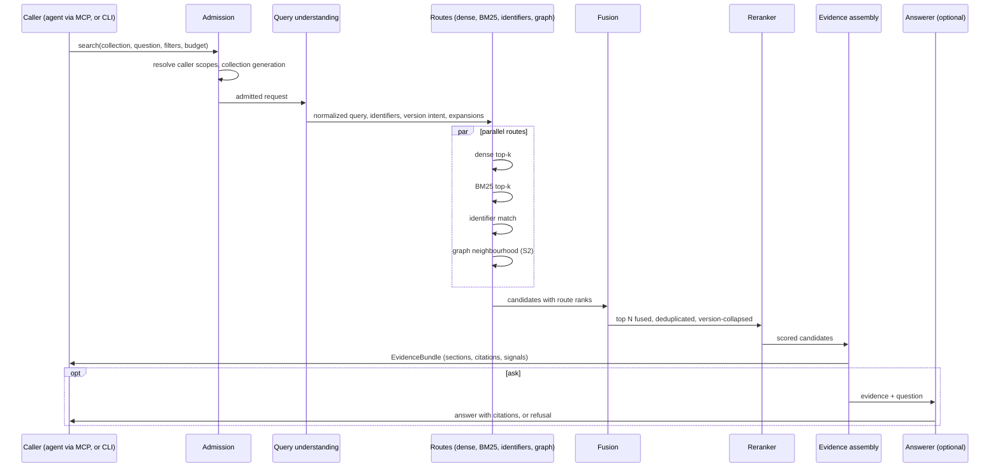
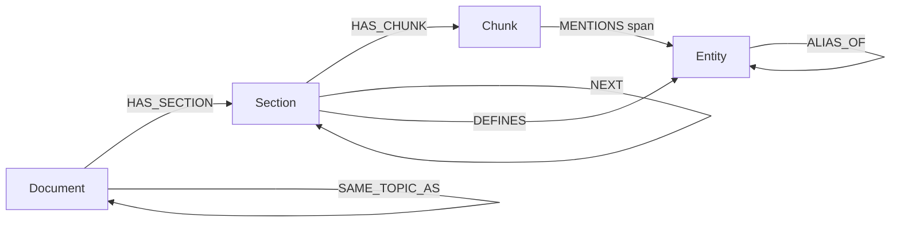

# 02 Retrieval and knowledge graph

From a question to a set of cited, verifiable passages, and optionally to a
grounded answer. Layers L8–L10 of the [layer map](README.md#4-layer-map). The
knowledge graph is built in S2 on the kernel of S1.



## 1. Admission and scope

Every request is admitted before any index is touched:

1. **Caller identity** comes from the transport context (the local user for the
   CLI; the host session and agent node for MCP and runs), never from a field
   the caller writes.
2. **Scopes**: the kernel resolves which collections and scope tags the caller
   may read. The filter is applied inside every route (Qdrant payload filter,
   graph query predicate, kernel reads), not after ranking.
3. **Generation**: the request is pinned to the published generation of each
   collection at admission time; a run keeps the same generation for its whole
   duration (no moving `latest` mid-run).
4. **Budget**: result count, maximum evidence tokens and a deadline are bounded
   and echoed in the response.
5. **Default scope** (owner decision): the current project and the resources
   explicitly shared with it. Searching other authorized spaces needs a
   requested scope expansion, visible in the response; few results never
   broaden the search silently.

Permissions are rechecked at every route, graph traversal, passage read,
context expansion and final output. Caches are keyed by generation, permission
context and profiles; communities, summaries and caches never reveal content
from a document the caller cannot read, and a current revocation applies even
when an older generation is queried.

## 2. Query understanding

Cheap, deterministic steps first; model calls only where evaluation shows value.

| Step | Method | Output |
| --- | --- | --- |
| Normalize | Trim, collapse whitespace, keep case for identifiers | Normalized text |
| Language | whatlang | `lang` (fr, en, …) |
| Identifiers | Regex families (commands, parameters, error codes, file paths, ports, versions) + the graph's entity dictionary (S2) | Exact tokens for the identifier route and entity linking |
| Version intent | Explicit version in the query, else the caller's default, else "latest published" | Version filter or boost |
| Query type | Rules first (question words, imperative verbs, error-code presence), a small model only if rules prove insufficient | `lookup`, `procedure`, `troubleshooting`, `concept`, `comparison`, `global` |
| Cross-lingual expansion | The selected generator translates a French query to English **for the BM25 route only** (dense models are multilingual) | English lexical query, kept only if the bake-off shows recall gains |
| HyDE (optional) | Hypothetical answer embedded as an extra dense query | Enabled only on measured gain |

Decomposition of a multi-step question belongs to the calling agent (it can
call `knowledge_search` several times); the search operation stays a single,
bounded retrieval.

## 3. Retrieval routes

| Route | Mechanism | Starting k | Strength |
| --- | --- | --- | --- |
| R1 Dense | Qdrant `dense` named vector, query embedded with the profile's own query instruction (never another model's prefix, never applied to the reranker) | 100 | Paraphrases, cross-lingual meaning |
| R2 Lexical | Qdrant sparse vector that maestro computes with its versioned `bm25-en-fr/1` analyzer; Qdrant applies IDF (`modifier: idf`), and a query is analysed with its generation's profile ([R7](../../specs/001-knowledge-kernel/research.md#r7-server-side-bm25)) | 100 | Exact words, rare terms |
| R3 Identifier | Payload/keyword match on extracted identifiers + kernel full-text lookup | 20 | Commands, parameters, error codes: must never be missed |
| R4 Graph (S2) | Entity linking → bounded typed traversal → supporting chunks | ≤ 50 evidence items | Relationships, dependencies, multi-hop |
| R5 Late interaction (candidate) | Qdrant multivector MaxSim | 100 | Fine-grained matching, if selected by the bake-off |
| R6 Structured | Exact query over a known scope in the kernel (counts, inventories, "which versions") | — | Exhaustive answers; top-k results are never counted |

Starting depths are budgets to tune with the ladder protocol (§10), not
optima. Routes run in parallel under the admission deadline. A route that fails
or times out is reported in the response (`routes: {graph: "unavailable"}`).
Degradation depends on the question: without the graph, a documentary
explanation may proceed with the limitation disclosed, but a dependency
conclusion that needs the graph is refused rather than asserted unchecked.

**Query routing by type:** definitions and parameters use R1–R3; dependency
and multi-hop questions add R4; exact inventories and counts use R6; broad
synthesis uses several searches and community navigation (§8.5). The graph can
act as a filter, an explorer or a candidate generator; it is not always a third
list to fuse.

## 4. Fusion

Deduplication, fusion and reranking are different operations: deduplication
decides sameness, fusion combines rankings, reranking reads the question and a
passage together.

1. **Per-route cleanup**: remove ineligible candidates and keep each chunk at
   most once per route **before** assigning ranks; routes oversample so
   filtering does not leave an artificially small pool.
2. **Candidate identity deduplication** across routes:

   | Situation | Action |
   | --- | --- |
   | Same chunk in several routes | One candidate keeping each route's rank, origin and paths |
   | Same text at different sources | Separate candidates with their own provenance, marked as one content group; mirrors are not corroboration |
   | Nearly identical text | Never merged automatically |
   | Different versions | Kept distinct unless the query excludes one |
   | Graph echo of its own seed | Path kept for explanation; not an independent vote |

3. **Reciprocal Rank Fusion** in Rust, one fusion over the separate route lists
   (never stacked fusions that count the documentary signal twice):

   `score(d) = Σ_r  w_r / (K + rank_r(d))`, with **one-based** ranks, `K = 60`
   and equal weights to start, tuned on the evaluation suite; ties break on the
   stable chunk ID. Qdrant's built-in RRF uses zero-based ranks and a default
   `k = 2` (our `K = 60` equals Qdrant `k = 61`) and weights differently, so the
   convention is explicit and regression-tested. Raw cosine and BM25 scores are
   never added together.
4. **Version collapse**: near-duplicate candidates (see
   [01 §6](01-knowledge-pipeline.md#6-l4-deduplication)) collapse onto the
   requested version (or the latest); alternates are listed, not ranked.
5. Output: the top **N = 80–120** fused candidates for reranking, including any
   passage required to support a graph path.

Alternatives kept for the bake-off: DBSF where score gaps are informative,
Qdrant's server-side prefetch fusion for R1+R2 (an optimization), and learned
ranking once enough relevance labels exist.

## 5. Reranking

- A cross-encoder scores (query, candidate) pairs; the candidate text is the
  chunk with its context header (title › section path), exactly as indexed.
- The reranker model is the bake-off winner; candidates include multilingual
  cross-encoders and LLM-based rerankers servable by llama.cpp.
- **Input contract**: token counts use the **reranker's** tokenizer (question,
  title, passage and special tokens); truncation is disabled; an oversized
  passage is split into windows that keep their source offsets instead of
  losing its end.
- **Output mapping**: results come back sorted by score; each is mapped to its
  candidate by the returned index, never by response position.
- After this stage the reranker score orders passages; the fusion score stays
  for candidate selection, diagnostics and deterministic tie-breaks. The two
  are never added.
- **Scores are not probabilities** and not factual confidence. An
  "insufficient evidence" threshold is calibrated on the unanswerable subset of
  the eval suite and recorded in the profile.
- Latency: measured in S1 at 30, 60 and 120 candidates, batched through the
  router; the chosen depth is the smallest that keeps the measured gain.
- If the reranker is unavailable, `search` returns the fused order flagged
  `rerank: "unavailable"`; `ask` refuses unless the caller's policy accepts
  degraded evidence.

## 6. Evidence assembly

The unit a caller receives is a **section of source text**, not an isolated
chunk: technical procedures lose meaning when cut.

1. **Small-to-big**: each selected chunk expands to its enclosing section (or a
   bounded window of sibling blocks when the section is long), from the
   authoritative artifacts in the kernel; permissions and relevance of the
   added text are rechecked.
2. **Merge**: overlapping or adjacent chunks of the same canonical revision
   become one read of the **union of their half-open source spans** (for
   example `[1000, 1600)` and `[1450, 2050)` read once as `[1000, 2050)`), never
   concatenated; all chunk references are kept.
3. **Diversity**: Maximal Marginal Relevance (λ = 0.7) across sections, so five
   near-identical passages do not crowd out the one that differs. Similarity is
   a redundancy penalty, not a deletion rule: differences in numbers,
   conditions, negation and versions are protected.
4. **Support groups**: a conclusion that needs a chain (service → package →
   library) keeps every link's supporting passage together; part of the budget
   is reserved for these groups; if a group cannot fit, another path is chosen
   or the answer is qualified. A high-scoring endpoint never replaces a missing
   intermediate proof.
5. **Budget**: fill up to the evidence token budget (default 6,000 tokens of the
   answerer's tokenizer, roughly 8–12 passages or support units), in rank order,
   then order passages by document structure for reading.
6. **Conflicts**: when two passages state different values for the same entity
   and attribute (e.g. a default port that changed between versions), both are
   kept and flagged with their versions.
7. **Signals and trace**: rerank score, routes that agreed, version and whether
   the passage is procedural live in a `trace` section, separate from the
   evidence itself.

The bundle also carries the claims and paths used (S2), the **known gaps**
(required evidence not found or not accessible) and, when `ask` is used, an
**answer-support plan** that maps each planned statement to its evidence before
any text is drafted, so an unsupported conclusion is caught before generation.

```json
{
  "schema": "maestro-evidence/1",
  "collection": "ctm", "generation": 7, "query": "…", "lang": "fr",
  "routes": {"dense": "ok", "bm25": "ok", "identifier": "ok", "graph": "ok", "rerank": "ok"},
  "passages": [{
    "n": 1, "section_id": "…", "doc_id": "…", "revision_id": "…",
    "title": "Installing Control-M/Agent on UNIX", "section_path": ["Installation", "Prerequisites"],
    "version": "9.0.22", "url": "https://…", "span": [18230, 20411], "digest": "sha256:…",
    "text": "…verbatim source text…", "score": 0.83, "routes": ["dense", "bm25"],
    "procedural": true, "alternates": [{"version": "9.0.21", "section_id": "…"}]
  }],
  "conflicts": [{"entity": "…", "attribute": "default port", "passages": [2, 4]}],
  "budget": {"evidence_tokens": 5870, "limit": 6000}
}
```

## 7. Grounded generation (`ask`)

Agents usually receive the evidence bundle and write the answer themselves; the
built-in answerer serves the CLI and evaluation, and defines the safety bar that
agent roles must meet.

| Guard | Enforcement |
| --- | --- |
| Answer only from evidence | System contract; structured output `{answer, citations[], refusal?}` constrained by JSON Schema (llama.cpp `json_schema`) |
| Every claim cited | Citation indices must exist; sentences without citations are flagged |
| **Commands are never invented** | Deterministic check: every code span and command-like token in the answer must appear verbatim in a cited passage, else the answer is rejected and regenerated once, then refused |
| Procedures verbatim | For `procedure` questions the answer quotes the source steps (evidence-first mode) instead of paraphrasing them |
| Refuse when unsupported | Rerank threshold not met, out-of-scope question, or conflicting evidence without a version decision → explicit refusal with the reason and the closest passages |
| Same language as the question | Checked; mismatch regenerates once |
| Faithfulness | Optional judge check (entailment of each cited sentence), reported as a signal; a second call to the same model is not an independent oracle |
| Validated before delivery | Every cited passage exists, belongs to the pinned generation, is still accessible and maps to a real source location; quotations match the stored text; numbers and versions are checked. Citations are resolved from stored evidence, never generated as URLs. A verified answer is buffered until these checks finish; unverified text is never streamed as verified |

Structured output: `answer`, claim-to-evidence references, uncertainties and
unanswered parts. On a failed check the answerer revises, retrieves missing
evidence within its budget, or returns a qualified partial answer.

The answerer model is a bake-off winner; the Copilot-managed route may also
answer when the caller's provider profile allows sending the evidence to it.

## 8. Knowledge graph (S2)

### 8.1 Why a graph

Vector and lexical search find passages that *look like* the question. They do
not answer "what depends on X", "which parameters affect Y in version 9.0.22",
"what changed between versions", or "what are the main themes of this corpus".
The graph adds typed relationships with evidence, so the retrieval layer can
follow them and the answerer can explain a path. It augments passage retrieval;
it never replaces the passages that prove a relation.

### 8.2 Graph model



| Element | Kinds / properties |
| --- | --- |
| **Entity** kinds | `Component` (e.g. Enterprise Manager, Server, Agent), `Command`, `Parameter`, `ConfigFile`, `ErrorCode`, `Message`, `Version`, `Platform`, `Port`, `Feature`, `Concept`, `API` |
| **Relation** types | `REQUIRES`, `CONFIGURES`, `PART_OF`, `DEPENDS_ON`, `REPLACES`, `DEPRECATED_IN`, `INTRODUCED_IN`, `APPLIES_TO`, `CAUSES`, `RESOLVES`, `DEFAULTS_TO`, `ALIAS_OF` (closed list, extended by ADR) |
| Relation properties | `evidence: [chunk_id + span]`, `extractor` (rule ID or model card), `confidence`, `valid_from_version`, `valid_to_version`, `generation` |
| Structural nodes | `Document`, `Section`, `Chunk` mirror the kernel (IDs only, no text) |

Relations are **claims with evidence**, not facts: a relation without at least
one verified evidence span is never stored.

| Rule | Design |
| --- | --- |
| Qualified claims | A claim carries subject (with version), predicate, object, conditions, environment, validity period and validation status, and points to its supporting spans; a materialized shortcut edge keeps that provenance |
| Three logical graphs | *Documentary* (sources, revisions, sections, passages), *factual* (claims and evidence) and *navigation* (similarity, co-occurrence, communities). Similarity helps search; it never proves a fact |
| Two times | World-valid time (when a claim holds) and record time (when it was learned); a collection date never replaces an unknown validity; contradictions stay visible (the newest does not always win) |
| Anchoring | Claims anchor to source blocks and spans, never to one chunking scheme; a new chunk profile only remaps chunks to spans. Extraction windows are sections or bounded block groups with their headings |
| Coverage | Graph coverage is visible: "no relation in the graph" never means "no relation" |
| Answers are not evidence | Model answers, summaries and hypotheses never become corpus evidence; hypotheses are marked as such (see [04 §6](04-intelligence-backend.md#6-phase-i3--governed-semantic-and-temporal-knowledge)) |

### 8.3 Construction pipeline

| Stage | Method | Cost | Output |
| --- | --- | --- | --- |
| A. Structure | From canonical documents: sections, order, links, versions | None (deterministic) | Document/Section/Chunk nodes, `LINKS_TO`, `NEXT` |
| B. Rule extraction | Domain rule packs: commands from code blocks, parameters from parameter tables (name, default, component, version), error codes by pattern, components from a curated dictionary | Low (deterministic) | High-precision entities and `DEFAULTS_TO`, `PART_OF`, `APPLIES_TO` relations |
| C. Model extraction | The selected extractor model reads a chunk with its context and returns typed relations as JSON Schema output; **each relation must quote its evidence, and the quote must be an exact substring of the chunk**, otherwise it is dropped | High: runs offline as a resumable job with a token budget; prioritized on sections the eval shows under-served | Typed relations with confidence |
| D. Entity resolution | Normalize names; alias rules; blocking by entity kind; entity-vector similarity; automatic merge only for identical normalized names within a kind; everything ambiguous goes to a review queue | Medium | Canonical entities, `ALIAS_OF` edges, review items |
| E. Temporal and conflict | Relations carry version ranges; the same subject/predicate with different objects across versions becomes two ranged relations, not an overwrite | Low | Version-aware claims, conflict records |
| F. Communities (optional) | Leiden communities on the entity graph; summaries generated **on demand** for global questions and cached per generation (LazyGraphRAG-style), not precomputed for every community | On demand | Community IDs, cached summaries |

Rule packs and extraction prompts are catalog content (versioned, reviewed); the
Control-M rule pack lives in the private collection repository.

### 8.4 Authority and projection

The facts (entities, aliases, mentions, relations, claims, review items) live in
the **kernel** (SQLite tables, generation-stamped). The graph database is a
projection used for traversal and algorithms, rebuildable at any time.

| Aspect | Design |
| --- | --- |
| Engine | Neo4j 2026.x Community Edition as a separate local service (GPLv3 server, used over Bolt; our code stays MIT) |
| Driver | Behind an internal `GraphStore` interface: neo4rs 0.9 (community Bolt driver, release candidate; transactions, reconnects, types and timeouts qualified in S2) or Neo4j's official HTTP Query API (not the deprecated transactional endpoint); fallback server Neo4j 5.26 LTS |
| Identifiers | Application IDs (`document_id`, `revision_id`, `chunk_id`, `entity_id`, `claim_id`, generation) shared with Qdrant payloads; Neo4j internal IDs are never stored as keys (they are reused after deletion) |
| Generations | Community Edition has one user database, so every node and relation carries `gen`; the kernel records the current generation per collection and every query binds `$gen`; old generations are deleted in the background |
| Loading | Full rebuild: kernel → CSV → `neo4j-admin database import` (fastest, offline); incremental: batched `UNWIND … MERGE` through neo4rs |
| Indexes | Uniqueness on `(gen, id)` per label; full-text index on entity names and aliases for linking fallback |
| Algorithms | Graph Data Science library for Leiden, PageRank, Personalized PageRank and node similarity where its licence allows (Community edition: four cores, projections cost memory); otherwise petgraph 0.8 in-process on the exported subgraph. Global analytics never run in the interactive path |
| Variants compared | Qdrant only + rerank; Neo4j only (its vector and full-text indexes with graph); Qdrant + Neo4j with application fusion. The pairing stays only if it wins on the graph suite; embeddings are not duplicated in both stores without evidence |
| Embedded alternative | LadybugDB (`lbug` 0.20, the maintained fork of the archived Kùzu) as an adapter spike: Cypher, embedded, no JVM; adopted for laptops if it passes the graph eval and the operations tests |
| Absent graph | The graph route reports `unavailable`; passage retrieval still works |

### 8.5 Graph retrieval route (R4)

1. **Entity linking**: identifiers from query understanding, dictionary lookup
   (names and aliases), then entity-vector search; top seed entities with scores.
2. **Mode selection** from the query type:
   - *local*: typed 1–2 hop neighbourhood of the seeds, relation-type weights,
     version filter (`valid_from ≤ v < valid_to`);
   - *path*: shortest typed paths (length ≤ 4) between two linked entities, for
     "how does A relate to B";
   - *global*: communities touched by the seeds; on-demand summaries map-reduced
     for thematic questions.
3. **Evidence resolution**: every relation used resolves to its supporting chunk
   IDs; those chunks become graph-route candidates, carrying a human-readable
   path explanation (`Agent —REQUIRES→ Java 17 (9.0.22)`).
4. Candidates enter fusion under the independence rule; the explanation travels
   into the evidence bundle.

Traversal is parameterized and bounded (usually 1–2 hops, cap 3 for local mode,
allowed relation types, maximum evidence items); graph candidates are ranked
deterministically by constraint satisfaction, entity match, allowed path type
and length, with a stable tie-break. Two modes: *independent* (seeds from the
question) and *seeded expansion* (seeds from dense/BM25 results).

**Advanced methods, in order, each only on measured gain:** solid hybrid →
sourced graph → bounded traversal → communities (GraphRAG global search and DRIFT)
or propagation (HippoRAG 2 with Personalized PageRank) → adaptive policies.
LightRAG's incremental graph-plus-vector ideas and LazyGraphRAG's deferred
summaries are reimplemented as principles; n-ary relations use qualified
claims rather than a hypergraph store. Graphs do not improve every question
type; a method that regresses simple facts, permissions, deletions or latency
is not shipped.

### 8.6 One graph infrastructure, several graphs

The same projection machinery serves every graph the platform needs: the
knowledge graph (S2), the catalog dependency graph (S3: which workflows use a
skill, what a policy change affects), run lineage (S4: which artifacts came from
which node and model), the code graph (S7-I2) and the memory graph (S7-I1).
Each is a kernel-authoritative fact set with its own generation stamp.

## 9. MCP tools (knowledge)

| Tool | Input | Output | Slice |
| --- | --- | --- | --- |
| `knowledge_collections` | — | Collections visible to the caller with their published generation | S1 |
| `knowledge_search` | `collection`, `query`, optional `version`, `k`, `max_tokens` | `maestro-evidence/1` bundle | S1 |
| `knowledge_get` | `section_id` or `chunk_id` | Exact text with provenance | S1 |
| `knowledge_graph_neighbors` | `entity` (ID or name), `relation_types?`, `version?`, `depth ≤ 2` | Entities and relations with evidence references | S2 |
| `knowledge_graph_path` | `from`, `to`, `max_length ≤ 4` | Paths with evidence references | S2 |
| `knowledge_entity_resolve` | name or identifier, optional kind | Candidate entities with evidence, ambiguity kept explicit | S2 |
| `knowledge_evidence_trace` | `claim_id` | The claim's supporting spans, revisions and extraction record | S2 |
| `knowledge_ask` | `collection`, `question` | Validated cited answer or refusal (§7) | S1 |
| `knowledge_research` | `question`, budget | A bounded research run (plan → search → read → find gaps → complete → verify → answer), executed as a workflow in the engine | S4 |

Resources: revisions and evidence bundles are readable as MCP resources
(`maestro://revision/{id}`, `maestro://evidence/{id}`). There is no generic
SQL, Cypher or Qdrant filter tool; tool annotations such as `readOnlyHint` are
hints to clients, not security. Limits: every tool has a maximum response size
(default 64 KiB) and reports truncation explicitly (never silent). Scope checks
run per call.

**Research runs** stop when new results add no evidence, respect turn, call,
token, depth, parallelism and time limits set by the host, never call
`knowledge_research` recursively, and treat a self-critique by the same model
as a check, not independent validation.

**Four ways in, one core.** In-process Rust functions (returning an evidence
bundle), the CLI, MCP and the local HTTP API of
[07 §2](07-extensibility.md#2-entry-points) all call the same application
operations with the same permissions, evidence rules and limits. The strict
local profile keeps the whole chain local: a local MCP server feeding a cloud
model is not local, so passages go only to the provider profile the caller's
policy allows.

## 10. Evaluation

Evaluation is the gate that selects models, fusion weights and features, and it
blocks regressions.

| Suite | Content | Where it runs |
| --- | --- | --- |
| `synthetic-retrieval` | Public synthetic corpus (non-vendor topics) with labelled questions | Public CI on every PR (deterministic fake embedder for pipeline checks; real models locally) |
| `ctm-retrieval` | 100+ Control-M questions (FR/EN) with expected sections; ~15 % unanswerable | Local, private (`just eval`); reports attached to PRs |
| `ctm-identifiers` | Queries naming commands, parameters, error codes | Local, private |
| `ctm-answers` | Questions with reference answers and required citations | Local, private |
| `ctm-graph` (S2) | Relationship, dependency, version-difference and multi-hop questions | Local, private |

| Metric | Definition |
| --- | --- |
| Recall@k | Share of answerable questions with at least one expected section in the top k (k = 5, 10) |
| MRR@10 | Mean reciprocal rank of the first expected section |
| nDCG@10 | Graded relevance with multiple expected sections |
| No-answer accuracy | Share of unanswerable questions correctly refused |
| Citation precision / recall | Cited passages that support the answer / required passages cited |
| Command exactness | Share of answers whose commands all appear verbatim in evidence (must be 100 %) |
| Faithfulness | Judge-assessed entailment of cited sentences (judge qualified against human labels) |
| Latency | p50 / p95 per stage and end to end |

**Ladder protocol:** each capability must beat the previous rung on the same
generation and questions: BM25 → dense → hybrid → + identifier route → + rerank →

- graph → + contextual enrichment → + late interaction. A rung that does not pay
for its cost is not shipped. After selection, a drop of more than 2 points on
Recall@10 or MRR@10, or any command-exactness failure, blocks the change.

**Golden set construction:** questions are drafted from the corpus by an agent,
covering all query types and both languages; the collection owner validates a
stratified sample (at least 20 %), and every expected answer points at section
IDs, not free text. The set starts at 100+ questions for M1 and grows toward
200–500 (exact identifiers, paraphrases, close versions, tables,
contradictions, unanswerable questions), with held-out items the tuning never
sees. Targets are declared before a run and never lowered after a failure.

**Diagnosis before tuning.** Evidence recall is measured per route **before**
fusion, using the independent `search_dense` and `search_bm25` diagnostics
that exist from the first published generation. A failure is classified as
*not retrieved* (fix extraction, chunking or retrieval), *retrieved but
misranked* (fix fusion, reranking, context selection) or *present but wrong*
(fix generation and validation). If no route found the evidence, fusion and
reranking cannot recover it. Functional indexing acceptance is not corpus-wide
relevance quality.

**Graph evaluation** scores three outcomes separately (graph construction,
retrieved evidence, answer), with the same generator and context budget across
variants.

## 11. Performance budgets

Targets to be validated in S1/S2 on the reference workstation.

| Operation | p95 target |
| --- | --- |
| `knowledge_search` without graph | < 1.5 s |
| `knowledge_search` with graph | < 2.5 s |
| `ask` with a local answerer | < 10 s to the complete answer |
| Entity linking | < 150 ms |
