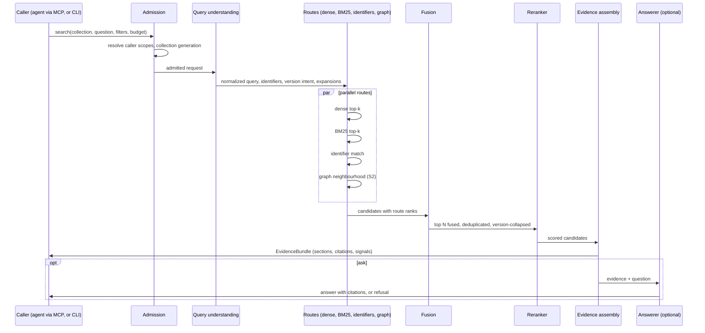

# 02 Retrieval and knowledge graph

From a question to a set of cited, verifiable passages, and optionally to a
grounded answer. Layers L8–L10 of the [layer map](README.md#4-layer-map). The
knowledge graph is planned in S2 on the integrated kernel of S1.
[The S2 specification](../../specs/002-knowledge-graph/spec.md) and
[ADR-0021](../adr/0021-embedded-ladybug-graph-projection.md) govern this design;
G25 qualification and G24 release evidence are still required. The G01–G05
rule-only SQLite neighbors pilot is not M2.


```mermaid
sequenceDiagram
  participant C as Caller (agent via MCP, or CLI)
  participant A as Admission
  participant U as Query understanding
  participant R as Routes (dense, BM25, identifiers, graph)
  participant F as Fusion
  participant K as Reranker
  participant E as Evidence assembly
  participant G as Answerer (optional)
  C->>A: search(collection, question, filters, budget)
  A->>A: resolve caller scopes, collection generation
  A->>U: admitted request
  U->>R: normalized query, identifiers, version intent, expansions
  par parallel routes
    R->>R: dense top-k
    R->>R: BM25 top-k
    R->>R: identifier match
    R->>R: graph neighbourhood (S2)
  end
  R->>F: candidates with route ranks
  F->>K: top N fused, deduplicated, version-collapsed
  K->>E: scored candidates
  E->>C: EvidenceBundle (sections, citations, signals)
  opt ask
    E->>G: evidence + question
    G->>C: answer with citations, or refusal
  end
```

## 1. Admission and scope

Every request is admitted before any index is touched:

1. **Caller identity** comes from the transport context (the local user for the
   CLI; the host session and agent node for MCP and runs), never from a field
   the caller writes.
2. **Scopes**: the kernel resolves which collections and scope tags the caller
   may read. The filter is applied inside every route (Qdrant payload filter,
   graph query predicate, kernel reads), not after ranking.
3. **Generation**: the request is pinned to the published generation of each
   collection at admission time; a run keeps the same generation for its whole
   duration (no moving `latest` mid-run).
4. **Budget**: result count, maximum evidence tokens and a deadline are bounded
   and echoed in the response.
5. **Default scope** (owner decision): the current project and the resources
   explicitly shared with it. Searching other authorized spaces needs a
   requested scope expansion, visible in the response; few results never
   broaden the search silently.

Permissions are rechecked at every route, graph traversal, passage read,
context expansion and final output. Caches are keyed by generation, permission
context and profiles; communities, summaries and caches never reveal content
from a document the caller cannot read, and a current revocation applies even
when an older generation is queried.

## 2. Query understanding

Cheap, deterministic steps first; model calls only where evaluation shows value.

| Step | Method | Output |
| --- | --- | --- |
| Normalize | Trim, collapse whitespace, keep case for identifiers | Normalized text |
| Language | whatlang | `lang` (fr, en, …) |
| Identifiers | Regex families (commands, parameters, error codes, file paths, ports, versions) + the graph's entity dictionary (S2) | Exact tokens for the identifier route and entity linking |
| Version intent | Explicit version in the query, else the caller's default, else "latest published" | Version filter or boost |
| Query type | Rules first (question words, imperative verbs, error-code presence), a small model only if rules prove insufficient | `lookup`, `procedure`, `troubleshooting`, `concept`, `comparison`, `global` |
| Cross-lingual expansion | The selected generator translates a French query to English **for the BM25 route only** (dense models are multilingual) | English lexical query, kept only if the bake-off shows recall gains |
| HyDE (optional) | Hypothetical answer embedded as an extra dense query | Enabled only on measured gain |

Decomposition of a multi-step question belongs to the calling agent (it can
call `knowledge_search` several times); the search operation stays a single,
bounded retrieval.

## 3. Retrieval routes

| Route | Mechanism | Starting k | Strength |
| --- | --- | --- | --- |
| R1 Dense | Qdrant `dense` named vector, query embedded with the profile's own query instruction (never another model's prefix, never applied to the reranker) | 100 | Paraphrases, cross-lingual meaning |
| R2 Lexical | Qdrant sparse vector that maestro computes with its versioned `bm25-en-fr/1` analyzer; Qdrant applies IDF (`modifier: idf`), and a query is analysed with its generation's profile ([R7](../../specs/001-knowledge-kernel/research.md#r7-server-side-bm25)) | 100 | Exact words, rare terms |
| R3 Identifier | Payload/keyword match on extracted identifiers + kernel full-text lookup | 20 | Commands, parameters, error codes: must never be missed |
| R4 Graph (planned S2) | Question-only exact names/identifiers/reviewed aliases → bounded admissible traversal → whole source proofs | ≤ 50 evidence items | Relationships, dependencies, multi-hop |
| R5 Late interaction (candidate) | Qdrant multivector MaxSim | 100 | Fine-grained matching, if selected by the bake-off |
| R6 Structured | Exact query over a known scope in the kernel (counts, inventories, "which versions") | — | Exhaustive answers; top-k results are never counted |

Starting depths are budgets to tune with the ladder protocol (§10), not
optima. Routes run in parallel under the admission deadline. A route that fails
or times out is reported in the response, with its reason
(`"routes": {"graph": {"unavailable": "<reason>"}}`). A configured graph `none`
is disabled with zero opens/probes/calls, not unavailable. A selected missing,
stale, locked or rebuilding graph never enables SQL or Neo4j fallback.
Degradation depends on the question: without the graph, a documentary
explanation may proceed with the limitation disclosed, but a dependency
conclusion that needs the graph is refused rather than asserted unchecked.

**Query routing by type:** definitions and parameters use R1–R3; dependency
and multi-hop questions add R4; exact inventories and counts use R6; broad
synthesis uses several searches; community navigation is deferred (§8.5). The
graph can act as a filter, an explorer or a candidate generator; it is not
always a third list to fuse.

## 4. Fusion

Deduplication, fusion and reranking are different operations: deduplication
decides sameness, fusion combines rankings, reranking reads the question and a
passage together.

1. **Per-route cleanup**: remove ineligible candidates and keep each chunk at
   most once per route **before** assigning ranks; routes oversample so
   filtering does not leave an artificially small pool.
2. **Candidate identity deduplication** across routes:

   | Situation | Action |
   | --- | --- |
   | Same chunk in several routes | One candidate keeping each route's rank, origin and paths |
   | Same text at different sources | Separate candidates with their own provenance, marked as one content group; mirrors are not corroboration |
   | Nearly identical text | Never merged automatically |
   | Different versions | Kept distinct unless the query excludes one |
   | Graph echo of its own seed | Path kept for explanation; not an independent vote |

3. **Reciprocal Rank Fusion** in Rust, one fusion over the separate route lists
   (never stacked fusions that count the documentary signal twice):

   `score(d) = Σ_r  w_r / (K + rank_r(d))`, with **one-based** ranks, `K = 60`
   and equal weights to start, tuned on the evaluation suite; ties break on the
   stable chunk ID. Qdrant's built-in RRF uses zero-based ranks and a default
   `k = 2` (our `K = 60` equals Qdrant `k = 61`) and weights differently, so the
   convention is explicit and regression-tested. Raw cosine and BM25 scores are
   never added together.
4. **Version collapse**: near-duplicate candidates (see
   [01 §6](01-knowledge-pipeline.md#6-l4-deduplication)) collapse onto the
   requested version (or the latest); alternates are listed, not ranked.
5. Output: the top **N = 80–120** fused candidates for reranking, including any
   passage required to support a graph path.

Alternatives kept for the bake-off: DBSF where score gaps are informative,
Qdrant's server-side prefetch fusion for R1+R2 (an optimization), and learned
ranking once enough relevance labels exist.

## 5. Reranking

- A cross-encoder scores (query, candidate) pairs; the candidate text is the
  chunk with its context header (title › section path), exactly as indexed.
- The reranker model is the bake-off winner; candidates include multilingual
  cross-encoders and LLM-based rerankers servable by llama.cpp.
- **Input contract**: token counts use the **reranker's** tokenizer (question,
  title, passage and special tokens); truncation is disabled; an oversized
  passage is split into windows that keep their source offsets instead of
  losing its end.
- **Output mapping**: results come back sorted by score; each is mapped to its
  candidate by the returned index, never by response position.
- After this stage the reranker score orders passages; the fusion score stays
  for candidate selection, diagnostics and deterministic tie-breaks. The two
  are never added.
- **Scores are not probabilities** and not factual confidence. An
  "insufficient evidence" threshold is calibrated on the unanswerable subset of
  the eval suite and recorded in the profile.
- Latency: measured in S1 at 30, 60 and 120 candidates, batched through the
  router; the chosen depth is the smallest that keeps the measured gain.
- If the reranker is unavailable, `search` returns the fused order flagged
  `"rerank": {"unavailable": "<reason>"}`; `ask` refuses unless the caller's
  policy accepts degraded evidence.

## 6. Evidence assembly

The unit a caller receives is a **section of source text**, not an isolated
chunk: technical procedures lose meaning when cut.

1. **Small-to-big**: each selected chunk expands to its enclosing section (or a
   bounded window of sibling blocks when the section is long), from the
   authoritative artifacts in the kernel; permissions and relevance of the
   added text are rechecked.
2. **Merge**: overlapping or adjacent chunks of the same canonical revision
   become one read of the **union of their half-open source spans** (for
   example `[1000, 1600)` and `[1450, 2050)` read once as `[1000, 2050)`), never
   concatenated; all chunk references are kept.
3. **Diversity**: Maximal Marginal Relevance (λ = 0.7) across sections, so five
   near-identical passages do not crowd out the one that differs. Similarity is
   a redundancy penalty, not a deletion rule: differences in numbers,
   conditions, negation and versions are protected.
4. **Support groups**: a conclusion that needs a chain (service → package →
   library) keeps every link's supporting passage together; part of the budget
   is reserved for these groups; if a group cannot fit, another path is chosen
   or the whole proof is dropped with an explicit gap and any conclusion
   needing it is refused. A high-scoring endpoint never replaces a missing
   intermediate proof.
5. **Budget**: fill up to the evidence token budget (default 6,000 tokens of the
   answerer's tokenizer, roughly 8–12 passages or support units), in rank order,
   then order passages by document structure for reading.
6. **Conflicts**: when two passages state different values for the same entity
   and attribute (e.g. a default port that changed between versions), both are
   kept and flagged with their versions.
7. **Signals and trace**: rerank score, routes that agreed and whether the
   passage is procedural live in a `trace` section, separate from the evidence
   itself, which carries the version.

S1 assembles evidence after reranking, using only the pinned generation and its
named, currently authorized candidates. It inherits the request's absolute
deadline and does not call a route or model. Overlapping and adjacent seed
spans become one half-open source slice; gaps and revisions remain separate.
Sections come from canonical heading blocks. A window contains whole lexical
siblings only. `windowed: true` means the passage does not cover its chosen
section/content extent; it never changes the verbatim text, span or digest.

Selection uses ordinal input rank and case-sensitive word-shingle Jaccard with
λ = 0.7. A protected signature disables the redundancy penalty when source
numbers, code, conditional/negation blocks or version metadata differ. S1
version collapse is conservative: only byte-identical complete section text
with matching path occurrence and product context in one document or
manifest-allowed near-duplicate group may collapse to numeric latest; comparison
queries and version inventories keep versions distinct. S1 conflict flags come
only from exact differing values in supported canonical tables, within the
same authorized correspondence family. These are possible structured
conflicts, not semantic contradiction detection. Graph support paths and
arbitrary support groups remain outside S1.

`request_budget` echoes the accepted request limits unchanged. An optional
`inventory` is the exact structured result from the pinned generation; it is
independent of supporting passages, so an inventory may be present when no
passage fits. Neither a missing inventory nor missing passages assert corpus-
wide absence. The evidence budget counts only the compact JSON array of final
passages, including citation metadata and window markers. The default
`evidence-utf8-bytes/1` counter records `estimated: true`; it is a conservative
byte proxy, not a guarantee about an unselected answerer's tokenizer. An exact
answerer-bound counter records its contract ID and `estimated: false`; its
failures never fall back to bytes. Trace chunk IDs, scores and routes refer only
to retained primary seeds, not alternates; alternate sections are not extra
votes. Final reading order groups by document/revision in best input-rank order,
then by source span.

Planned S2 graph evidence uses the separate closed `maestro-evidence/2`
contract for claims, paths, supports, attachment identity and coverage. The
non-graph `/1` below stays unchanged and rejects graph fields. Whole proof
groups survive ranking, token budgets (including graph metadata) and the final
64 KiB wire limit, or are removed with sanitized **known gaps**. An
**answer-support plan** maps every proposed conclusion to its complete source
proof before generation; a caller-written complete flag is not evidence.

```json
{
  "schema": "maestro-evidence/1",
  "collection": "synthetic", "generation": 7, "query": "…", "lang": "fr",
  "routes": {"dense": "ok", "lexical": "ok", "identifier": "ok", "structured": "ok", "rerank": "ok"},
  "request_budget": {"k": 10, "max_tokens": 6000, "deadline_ms": 1500},
  "inventory": {"kind": "documents_by_set", "set_filter": null, "total_documents": 12, "sets": [{"value": "synthetic", "documents": 12}]},
  "passages": [{
    "windowed": true,
    "n": 1, "section_id": "…", "doc_id": "…", "revision_id": "…",
    "title": "Installing the lantern controller", "section_path": ["Installation", "Prerequisites"],
    "version": "2.0", "source_ref": "https://…", "span": [18230, 20411], "digest": "sha256:…",
    "text": "…verbatim source text…", "alternates": [{"version": "1.1", "section_id": "…"}]
  }, {
    "n": 2, "section_id": "…", "doc_id": "…", "revision_id": "…",
    "title": "…", "section_path": ["…"], "version": "1.0",
    "source_ref": "https://…", "span": [4096, 5210], "digest": "sha256:…",
    "text": "…verbatim source text…", "alternates": []
  }],
  "conflicts": [{"entity": "…", "attribute": "default port", "passages": [1, 2]}],
  "known_gaps": ["…"],
  "budget": {"evidence_tokens": 5870, "limit": 6000, "counter": "evidence-utf8-bytes/1", "estimated": true},
  "trace": [
    {"n": 1, "score": 0.83, "routes": ["dense", "lexical"], "chunk_ids": ["chunk-a"], "procedural": true},
    {"n": 2, "score": 0.61, "routes": ["lexical"], "chunk_ids": ["chunk-b"], "procedural": false}
  ]
}
```

## 7. Grounded generation (`ask`)

Agents usually receive the evidence bundle and write the answer themselves; the
built-in answerer serves the CLI and evaluation, and defines the safety bar that
agent roles must meet.

| Guard | Enforcement |
| --- | --- |
| Answer only from evidence | System contract; structured output `{answer, citations[], refusal?}` constrained by JSON Schema (llama.cpp `json_schema`) |
| Every claim cited | Citation indices must exist; sentences without citations are flagged |
| **Commands are never invented** | Deterministic check: every code span and command-like token in the answer must appear verbatim in a cited passage, else the answer is rejected and regenerated once, then refused |
| Procedures verbatim | For `procedure` questions the answer quotes the source steps (evidence-first mode) instead of paraphrasing them |
| Refuse when unsupported | Rerank threshold not met, out-of-scope question, or conflicting evidence without a version decision → explicit refusal with the reason and the closest passages |
| Same language as the question | Checked; mismatch regenerates once |
| Faithfulness | Optional judge check (entailment of each cited sentence), reported as a signal; a second call to the same model is not an independent oracle |
| Validated before delivery | Every cited passage exists, belongs to the pinned generation, is still accessible and maps to a real source location; quotations match the stored text; numbers and versions are checked. Citations are resolved from stored evidence, never generated as URLs. A verified answer is buffered until these checks finish; unverified text is never streamed as verified |

Structured output: `answer`, claim-to-evidence references, uncertainties and
unanswered parts. On a failed check the answerer revises, retrieves missing
evidence within its budget, or returns a qualified partial answer.

The general answerer model is a bake-off winner; an approved provider profile
controls any managed route. S2 acceptance instead freezes the local at-most-4B
S1 answerer card/settings in G08, uses at most one retry, and refuses missing
proofs, invented links, inferred transitivity and unresolved contradictions.
There is no private-data egress or larger-answerer substitution in S2.

## 8. Knowledge graph (S2)

### 8.1 Why a graph

Vector and lexical search find passages that *look like* the question. They do
not establish "what depends on X", "which parameters affect Y in version 2.0"
or "what changed between versions". Global thematic summaries are deferred.
The graph adds typed relationships with evidence, so the retrieval layer can
follow them and the answerer can explain a path. It augments passage retrieval;
it never replaces the passages that prove a relation.

### 8.2 Graph model

The kind and relation vocabularies are closed lists, extended by ADR:

| Vocabulary | Values |
| --- | --- |
| Entity kinds | `Component`, `Command`, `Parameter`, `ConfigFile`, `ErrorCode`, `Message`, `Version`, `Platform`, `Port`, `Feature`, `Concept`, `API` |
| Relation types | `REQUIRES`, `CONFIGURES`, `PART_OF`, `DEPENDS_ON`, `REPLACES`, `DEPRECATED_IN`, `INTRODUCED_IN`, `APPLIES_TO`, `CAUSES`, `RESOLVES`, `DEFAULTS_TO`, `ALIAS_OF` |

Only `DEFAULTS_TO` is a pilot predicate. `ALIAS_OF` names alias identity, not an
extractable S2 claim or projection edge: aliases are authoritative, reviewed,
reversible records ([S2 plan A2](../../specs/002-knowledge-graph/plan.md#a2-claims-and-source-verification)),
not knowledge proofs. Later extractors use only the permitted claim predicates;
they cannot expand either vocabulary without an ADR.

| Element | S2 boundary |
| --- | --- |
| Entity | Typed application ID, collection, normalized name and exact source spelling; the pilot uses `Parameter`. |
| Claim | Typed subject/predicate/object, conditions/environment, known half-open version/world-time bounds or explicit unknown validity, record time, profile and review state. |
| Support | Nonempty original source span, revision/block ID and exact quote digest; independent kernel authority and byte checks. |
| Literal default | `DEFAULTS_TO` has a typed text/boolean/integer/decimal object with its source lexeme preserved, not an invented entity. |
| Structure | Reuse canonical block/source references; no literal, Document or Section projection nodes. Literal defaults cannot create entity-to-entity proof paths. |

Knowledge relations are **claims with evidence**, not guaranteed facts. An
accepted knowledge claim needs at least one verified support; rejected
candidates stay in their receipts. Catalog edges use their own authority (§8.6).

| Rule | Design |
| --- | --- |
| Qualified claims | A claim carries subject (with version), predicate, object, conditions, environment, validity period and validation status, and points to its supporting spans; S2 materializes no shortcut or derived edges |
| Logical layers | Documentary structure stays in the kernel/canonical artifacts; S2 projects sourced claims. Similarity, co-occurrence and community navigation are deferred and never prove a fact |
| Two times | World-valid time (when a claim holds) and record time (when it was learned); a collection date never replaces an unknown validity; contradictions stay visible (the newest does not always win) |
| Anchoring | Claims anchor to source blocks and spans, never to one chunking scheme; a new chunk profile only remaps chunks to spans. Extraction windows are sections or bounded block groups with their headings |
| Coverage | Graph coverage is visible: "no relation in the graph" never means "no relation" |
| Answers are not evidence | Model answers, summaries and hypotheses never become corpus evidence; hypotheses are marked as such (see [04 §6](04-intelligence-backend.md#6-phase-i3--governed-semantic-and-temporal-knowledge)) |

### 8.3 Construction pipeline

| Stage | Method | Cost | Output |
| --- | --- | --- | --- |
| A. Structure | Reuse canonical blocks and original byte spans; no structural-node projection | Deterministic | Source references for verification |
| B. Rule extraction | One closed, digest-bound, data-only parameter table rule, frozen by G01; no scripts | Deterministic, no model/service | `DEFAULTS_TO` literal claims and retained rejections |
| C. Model extraction | Qualified separate Extractor role; Qwen3-4B is a candidate, not selected. Closed JSON, original block/window quote verification through the same admission path | Offline leased/resumable jobs, bounded windows, `Room::Free`, at most 1,024 output tokens | Candidates and rejection receipts; quote validity alone is not semantic truth |
| D. Entity resolution | Same exact spelling, normalized name, kind and collection joins across documents reversibly; colliding spellings/kinds stay ambiguous | Deterministic names and sourced reviewed aliases, no fuzzy/vector linking | Source-backed identities and review history |
| E. Temporal and conflict | Preserve contradictory values, conditions, unknown validity and supersession under frozen generation membership | No newest-record-wins overwrite | Version-aware claims and complete supporting evidence |

Only pilot/synthetic development failures guide extraction windows or tuning;
held-out acceptance labels and failures never do. Rule/profile changes require
new frozen inputs. Vendor rule packs, prompts and receipts stay in the private
collection. The public table is synthetic; plan A0 names the planned private
receipt binding and its unconfirmed scope. G05 must independently check every
private pilot claim before expanding. No pilot result declares M2.

### 8.4 Authority and projection

The facts (entities, aliases, mentions, relations, claims, review items) live in
the **kernel** (SQLite tables, generation-stamped). The graph database is a
projection used for traversal and algorithms, rebuildable at any time.

| Aspect | Design |
| --- | --- |
| Engine | Planned embedded LadybugDB through owner-approved `lbug`, subject to G25's six-row qualification bar. No S2 graph service, network port, Docker, JVM or first-use download. |
| Boundary | G27's application-ID typed-edge port (§8.6); lbug calls stay in knowledge's `graph/projection/` and `graph/cypher.rs`. No backend-choice trait in S2. |
| Identifiers | Collection, generation, entity and claim application IDs; never engine IDs. Source references stay authoritative in SQLite/artifacts. |
| Generations | Frozen claim/profile attachment, once per generation; writer owns unpublished files, readers retain immutable published pins, only if G25 proves this safe in independent processes. |
| Loading | One resumable parameterized-batch loader from the complete frozen kernel snapshot; no CSV/COPY or second incremental loader. Native I/O stays outside SQLite transactions. |
| Readiness | Flush/close/reopen and verify schema, indexes, IDs, counts and digests before kernel-controlled publication. Reader-safe cleanup preserves other collections and retained generations. |
| Algorithms | Bounded admissible neighbors/paths only. Leiden, PageRank, Personalized PageRank, node similarity and global analytics remain deferred; no GDS or petgraph fallback. |
| Variants compared | Same-run Qdrant-only, LadybugDB-only and pairing on frozen inputs with the same at-most-4B answerer; no duplicate embeddings. D3's quality gates decide M2, not a working import. |
| Later selected Neo4j | Separate adapter behind deployment-modes D07's later `GraphStore`; not conditional on lbug failure and never a runtime fallback. G25 failure instead requires an S2 re-plan ruling before substitution. |
| Disabled/unavailable | Graph `none` makes zero calls. A selected absent/stale/locked/rebuilding graph reports `unavailable`; passage retrieval continues, unsupported graph conclusions refuse. |

G01–G05 may use indexed SQLite one-hop neighbors while G25 runs. G11 removes
that temporary traversal branch; SQLite retains claim/export/evidence reads,
not recursive traversal. G25 pins versions/features and measures native build,
cache, packaging and process behavior on Linux, Windows and macOS. G30/G22 must
prove ordered semantic equality after actual graph-file deletion/rebuild and
authoritative backup/restore. These are planned obligations, not passed gates.

### 8.5 Graph retrieval route (R4)

1. **Question-only seeds:** exact identifiers/names and reviewed aliases from
   the FR/EN question; no dense/BM25-seeded expansion or vector/fuzzy linking.
   Ambiguous names remain explicit.
2. **Admissible traversal:** fixed parameterized Cypher applies scope,
   eligibility, generation, version and conditions at every hop **before**
   shortest-path selection, ranking or limits. Local depth is at most two,
   path length four, evidence 50 items; native expansion, time and cancellation
   are also bounded. Stable application IDs break ties.
3. **Authority recheck:** the kernel rechecks every entity, claim and support
   against current grants and eligibility under the request's pin. Hidden and
   unknown IDs have identical responses; an unauthorized middle link cannot
   win as an unfiltered shortcut.
4. **Whole proofs:** source spans remap to the pinned chunk set and survive
   fusion/reranking/budgeting as complete groups. Graph echoes are not extra
   votes. Limited traversal reports coverage, never corpus-wide absence.

**Deferred, not delivered by S2:** GraphRAG global/DRIFT search, HippoRAG-style
Personalized PageRank, Leiden communities, PageRank, node similarity,
LightRAG-style incremental loading, LazyGraphRAG summaries, vector/fuzzy
linking and dense-seeded expansion. Each needs measured gain and a later plan;
none is an implicit requirement to build before the first useful neighbors.

### 8.6 One graph infrastructure, several graphs

G27 plans the minimal public port at
`crates/maestro-knowledge/src/graph/projection/port.rs`: typed-edge write/read
operations on collection/generation/application IDs and explicit authoritative
edge families, with scoped reads. No raw Cypher, lbug types or engine IDs cross
it. S3 C27a consumes it for catalog dependencies, which name catalog records,
not documentary spans; catalog edges never become knowledge claims or proofs.

Deployment-modes D07 later wraps this API in `GraphStore` for backend choice.
Run lineage (S4), code (S7-I2) and memory (S7-I1) remain later consumers, not
graph frameworks built in S2. Each slice retains its own authority and family
boundary.

## 9. MCP tools (knowledge)

G01's source inspection at `821851a` finds the bounded local stdio server
already dispatching collections, chunk/section get, search and ask through
shared operations. This is not M1 release or real-client acceptance evidence.
The four S2 graph tools and the resource URIs below remain planned.

| Tool | Input | Output | Slice |
| --- | --- | --- | --- |
| `knowledge_collections` | — | Collections visible to the caller with their published generation | S1 |
| `knowledge_search` | `collection`, `query`, optional `version`, `k`, `max_tokens` | `maestro-evidence/1` bundle | S1 |
| `knowledge_get` | `section_id` or `chunk_id` | Exact text with provenance | S1 |
| `knowledge_graph_neighbors` | `entity` (ID or name), `relation_types?`, `version?`, `depth ≤ 2` | Entities and relations with evidence references | S2 |
| `knowledge_graph_path` | `from`, `to`, `max_length ≤ 4` | Paths with evidence references | S2 |
| `knowledge_entity_resolve` | name or identifier, optional kind | Candidate entities with evidence, ambiguity kept explicit | S2 |
| `knowledge_evidence_trace` | `claim_id` | The claim's supporting spans, revisions and extraction record | S2 |
| `knowledge_ask` | `collection`, `question` | Validated cited answer or refusal (§7) | S1 |
| `knowledge_research` | `question`, budget | A bounded research run (plan → search → read → find gaps → complete → verify → answer), executed as a workflow in the engine | S4 |

Resources: revisions and evidence bundles are readable as MCP resources
(`maestro://revision/{id}`, `maestro://evidence/{id}`). There is no generic
SQL, Cypher or Qdrant filter tool; tool annotations such as `readOnlyHint` are
hints to clients, not security. Limits: every tool has a maximum response size
(default 64 KiB) and reports truncation explicitly (never silent). Scope checks
run per call.

**Research runs** stop when new results add no evidence, respect turn, call,
token, depth, parallelism and time limits set by the host, never call
`knowledge_research` recursively, and treat a self-critique by the same model
as a check, not independent validation.

**Four ways in, one core.** In-process Rust functions (returning an evidence
bundle), the CLI, MCP and the local HTTP API of
[07 §2](07-extensibility.md#2-entry-points) all call the same application
operations with the same permissions, evidence rules and limits. The strict
local profile keeps the whole chain local: a local MCP server feeding a cloud
model is not local, so passages go only to the provider profile the caller's
policy allows.

## 10. Evaluation

Evaluation is the gate that selects models, fusion weights and features, and it
blocks regressions.

| Suite | Content | Where it runs |
| --- | --- | --- |
| `synthetic` | Public synthetic corpus (non-vendor topics) with 56 labelled questions in `tests/fixtures/synthetic` | Public CI on every PR with pinned Qdrant 1.19 and deterministic fake inference |
| `ctm-retrieval` | Owner-pinned private questions from eligible official documentation; contents, counts and review receipt remain private | Local, private; reports remain private |
| `ctm-identifiers` | Queries naming commands, parameters, error codes | Local, private |
| `ctm-answers` | Questions with reference answers and required citations | Local, private |
| `ctm-graph` (planned S2) | Relationship, dependency, version-difference, multi-hop and unanswerable questions; provisional 100 held-out items, pending owner confirmation | Local, private scratch restore |

The public synthetic CI leg uses pinned Qdrant and deterministic fake inference;
its temporary test adapter records route/fusion rankings and T021 metrics without
T032's abstention policy. Its no-answer accuracy of zero is expected and is not a
regression result. Reports remain candidates until the supervisor seeds a
baseline from a reviewed integration; later baseline changes require review.
After seeding, integrity and degradation fail closed and the gate compares
Recall@5/10, MRR@10, nDCG@10, no-answer accuracy and false abstentions, with no
latency threshold.

| Metric | Definition |
| --- | --- |
| Recall@k | Share of answerable questions with at least one expected section in the top k (k = 5, 10) |
| MRR@10 | Mean reciprocal rank of the first expected section |
| nDCG@10 | Each expected answer item (one name or one `group`) gains 1 at its best rank, over the ideal ranking of every item |
| No-answer accuracy | Share of unanswerable questions correctly refused |
| Citation precision / recall | Cited passages that support the answer / required passages cited |
| Command exactness | Share of answers whose commands all appear verbatim in evidence (must be 100 %) |
| Faithfulness | Judge-assessed entailment of cited sentences (judge qualified against human labels) |
| Latency | p50 / p95 per stage and end to end |

An expected section may name a non-blank `group` when it is a copy of another
expected answer for the same question. Recall@k and MRR@10 continue to count any
member; nDCG@10 uses each group's best member rank and counts the group once.

**Ladder protocol:** each capability must beat the previous rung on the same
generation and questions: BM25 → dense → hybrid → + identifier route → + rerank →

- graph → + contextual enrichment → + late interaction. A rung that does not pay
for its cost is not shipped. After selection, a drop of more than 2 points on
Recall@10 or MRR@10, or any command-exactness failure, blocks the change.

**Golden set construction:** questions are drafted from eligible official
documentation by an agent; an independent model checks every question and its
expected sections, and the owner decides only flagged wording or answerability
changes. Every expected answer is a section named by its document's
`source_ref` and heading path, or a sectionless document named whole; the runner
resolves each name against the generation. Equivalent version copies form one
grouped evaluation item. The private repository keeps the current scope rule,
question set and review receipt; public CI uses synthetic fixtures only.
Targets are declared before a run and never lowered after a failure.

**Diagnosis before tuning.** Evidence recall is measured per route **before**
fusion, using the independent `search_dense` and `search_bm25` diagnostics
that exist from the first published generation. A failure is classified as
*not retrieved* (fix extraction, chunking or retrieval), *retrieved but
misranked* (fix fusion, reranking, context selection) or *present but wrong*
(fix generation and validation). If no route found the evidence, fusion and
reranking cannot recover it. Functional indexing acceptance is not corpus-wide
relevance quality.

**S2 graph evaluation** scores construction, complete retrieved proofs and
answers separately through the existing `eval ladder --manifest`. Its fixed
[D3 gates](../../specs/002-knowledge-graph/spec.md#gate-decision-rules) supersede
the general two-point tolerance above: pairing needs at least five points of
complete-proof recall gain with a strictly positive paired 95% interval, no
Recall@10/MRR@10/supported-answer loss, at least 95% relation precision, exact
spans/quotes/commands and at least 16/20 correct refusals, in each of three runs.
All rungs freeze the same answerer/card/settings/context; same-run Qdrant-only
is the comparator, G08's S1 result only a drift check. Suite size and the
independent precision-review protocol remain pending owner confirmation.

## 11. Performance budgets

Targets to be validated in S1/S2 on the reference workstation.

| Operation | p95 target |
| --- | --- |
| `knowledge_search` without graph | < 1.5 s |
| Graph route span / graph tool server time (S2, warm private graph) | ≤ 500 ms |
| `knowledge_search` with graph | < 2.5 s |
| `ask` with a local answerer | < 10 s to the complete answer |
| Entity linking | < 150 ms |
