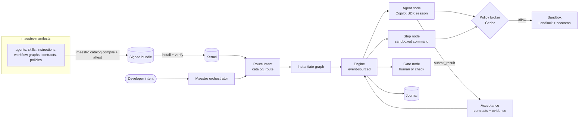
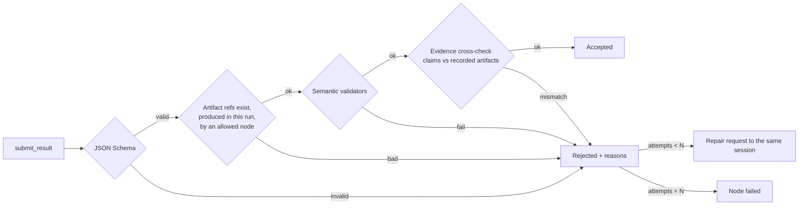

# 03 Agent orchestration

How a developer's intent becomes governed, verifiable work: the catalog, the
workflow graphs, the orchestration engine, agent sessions on GitHub Copilot and
llama.cpp, the policy broker, the sandbox and the handoff contracts. Layers
L11–L13 of the [layer map](README.md#4-layer-map).



**Principles.** The catalog declares; the host decides. A workflow graph is the
unit of execution, reviewed like code. Dynamic plans are graphs too, validated
by the same compiler and approved before they run. A model's output never
authorizes an effect and never certifies its own success. Three levels are never
confused: an **instruction** to a model (evaluated, not a barrier), a **runtime
configuration** (which tools a session sees) and a **deterministic control** (the
broker refusing an effect). The manifest describes all three; only the last is
enforcement, and every locked value names the component that enforces it and the
test proving it cannot be bypassed.

## 1. The catalog (`maestro-manifests`)

### 1.1 Layout

```text
agents/base/maestro.agent.md                 # the orchestrator
agents/base/<role>.agent.md                  # only the roles a v1 workflow needs (§2.6)
agents/capabilities/<capability>/<role>.agent.md
skills/<name>/SKILL.md  (+ references/, scripts/)
instructions/<name>.instructions.md
prompts/<name>.prompt.md
workflows/<name>/workflow.md                 # graph spec (frontmatter) + documentation (body)
contracts/<name>.schema.json                 # JSON Schema 2020-12
policies/*.cedar  policies/schema.cedarschema.json
profiles/models/<role>.toml                  # allowed provider/model profiles per role
mcp/<server>.toml                            # approved MCP servers and tool allowlists
extensions/<name>/extension.toml             # event subscribers and connectors (07)
hooks/<name>.json                            # native Copilot hook projections
settings/classes.toml                        # every configurable key and its one override class
presets/<name>.toml                          # project presets (defaults, recipes, capabilities)
bootstrap/base/  bootstrap/<language>/       # project templates: base + language overlays
evals/scenarios/<name>.yaml                  # scenario tests for workflows and agents
CODEOWNERS                                   # generated from one ownership model
```

### 1.2 Formats: Copilot-native first

| Resource | Format | Maestro additions |
| --- | --- | --- |
| Agent | Copilot custom agent profile `.agent.md`: YAML frontmatter (`name`, `description`, `tools`, `mcp-servers`, optional `model`) + Markdown body | `metadata:` in frontmatter if the Copilot parser tolerates it (verified by an S3 spike), otherwise a sidecar `<name>.maestro.toml`: `id`, `version`, `owner`, `maturity`, required skills and instructions, policies, contracts, allowed profiles, discovery card |
| Skill | Agent Skills `SKILL.md`: frontmatter `name`, `description`, optional `license`, `metadata`, `allowed-tools` | Same metadata keys as agents |
| Instructions | Copilot `.instructions.md` with `applyTo` globs | — |
| Prompt | Copilot `.prompt.md` | — |
| Workflow graph | `workflow.md`: graph spec in YAML frontmatter, human documentation in the body | Maestro-specific (§2) |
| Contract | JSON Schema 2020-12 + named semantic validators | — |
| Policy | Cedar policies + a Cedar schema | — |

The agent body keeps a fixed structure (Purpose, Responsibilities, Inputs,
Working sequence, Outputs, Boundaries) that the linter checks. The separation of
concerns is explicit: the `.agent.md` says what the role means; its metadata
says its contracts, tools, dependencies, owner and readiness; policy says what
it may do; the workflow says when it acts.

**Maturity** is an evidence stage, never a permission: `placeholder` →
`authored` → `reviewed` → `qualified` → `retired`. Qualification binds evidence
(an assigned owner, resolved references, compatible contracts, passing
evaluations, support in the selected runtime and model profile) to the exact
component. Only `qualified` resources enter an executable closure; a label
change alone qualifies nothing, and placeholders can be published for
discovery but never run. Imported skills keep their obligations (approvals,
gates); a simplified version is a named, versioned, reviewed Maestro variant,
never a hidden rewrite. Every imported skill is pinned like a dependency, with
licence, attribution and a review of any script it carries.

### 1.3 Check, compile, release, install

| Command | Does |
| --- | --- |
| `maestro catalog check` | Parses every file; validates frontmatter, JSON Schemas and Cedar policies against the Cedar schema; resolves every reference; rejects cycles, duplicate IDs and dangling references; compiles every workflow graph (§2.3); lints descriptions and sizes; excludes drafts from execution sets |
| `maestro catalog compile` | Deterministic bundle: sorted tar with fixed metadata + `bundle.json` (`bundle_id`, `version`, `source_commit`, entries with kind, path, digest, owner, maturity, requirements; the exact dependency closure of every workflow; the policy-set digest; `requires`: the runtime version range, required **features** such as `task-grants.v1` or `evidence-receipts.v1`, and tool contracts with versions; entry points). The same inputs give the same digest. Compilation never executes content: hooks, skill scripts and templates are data |
| Release (manifests CI) | On a tag: compile with the **released, pinned** `maestro` binary (checksum verified), upload the bundle and `SHA256SUMS`, attest build provenance (GitHub artifact attestations, as rust-workflows does for binaries) |
| `maestro catalog install <version>` | Downloads, verifies SHA-256 and the attestation (signer = the manifests release workflow), unpacks into the kernel's artifact store, records the install, indexes discovery cards (§1.4), and optionally projects to hosts (§1.5) |
| `maestro catalog update` | Same as install for the newest compatible version; refuses a bundle whose runtime contract range excludes the installed `maestro` or that requires a feature it lacks |
| `maestro catalog explain` | Declared, effective and observed views: what a resource is meant to do; what applies to this project after resolution, with the source of every setting; what a run actually did |

The laptop never clones the manifests repository to run a bundle, and it needs
no Rust toolchain or Python. **Authoring schemas differ from the bundle schema**:
the compiler normalizes human-friendly sources into the execution format, and
the runtime validates what it loads again (a passing catalog build is not blind
trust). A bundle can never disable signature verification, invent an identity,
bypass the broker or turn agent text into a host receipt: those mechanisms are
not settings.

**Trust and freshness** (ADR-0015). An attestation proves who built a bundle;
governed use also requires a current timestamp record, a revocation list
checked before every load and consult (fetched frequently, applied atomically)
and a version floor, so an older or revoked bundle cannot be replayed. Offline,
the last verified records apply until they expire and the remaining window is
shown. Revocation stops new loads; it cannot unload instructions already in a
session or code already running, and the documentation says so. Catalog and
runtime have separate publisher identities; signing keys have rotation and
emergency procedures; rollback and resume never restore a revoked version.

**Project lock.** `.maestro/platform.lock.json` pins, for one project, the
bundle and component digests, the runtime and SDK/CLI versions, the model
profiles (model identity, quantization, chat template, server build), the
sandbox profile and the operating-system profile. A session keeps its pinned
configuration; updates are explicit.

### 1.4 Routing an intent to a workflow

Search discovers; the manifest defines the valid arrangement; the runtime
authorizes and executes; evidence decides completion.

1. **Eligibility first**: maturity, host platform, provider and model
   qualification, caller scopes and data classification filter the candidates
   **before** retrieval, in every search branch.
2. **Discovery cards** (one per workflow, agent and skill: summary, intents,
   technologies, outputs, `use_when`, `avoid_when`, positive and negative
   examples, owner, maturity) are the `catalog` collection of the knowledge
   kernel: same pipeline, one generation per bundle version, separate from
   knowledge collections and their access scopes. The compiler adds canonical
   ID, digest, snapshot, owner and qualification; dependencies are exact data,
   never inferred from text.
3. **Workflow first.** `catalog_route(intent)` returns a small shortlist of
   workflows with role bindings, required skills, deterministic steps, required
   checks, selection reasons, the bundle snapshot and the index generation, with
   a status: `candidates`, `no_match`, `needs_clarification`, `incompatible` or
   `temporarily_unavailable`. A mandatory reviewer is included because the
   workflow requires it, not because it scored well. The runtime rebuilds the
   plan from the verified bundle; it never executes a returned plan blindly.
4. `catalog_resolve(id)` returns exact definitions with their dependency
   closure; `catalog_search(query, kind)` browses agents, skills and
   capabilities. The model never gets raw Qdrant filters, collection names or
   administration; the caller's context handle is bound to its authenticated
   principal and carries no authority by itself.
5. "Optimal" means the **smallest qualified workflow** that covers the outcome
   within the caller's permissions, runtime capabilities and budget. Scores are
   not probabilities. Outcomes are recorded as feedback, and misses become an
   InnerSource backlog; feedback never rewrites routing policy automatically.
6. **Baseline first**: exact-ID and structured lexical routing over the labelled
   intent set is built before dense and hybrid retrieval, which must beat it.
   Offline, the runtime falls back to exact-ID and local lexical search over the
   cached, authorized, still-valid bundle; a resolved run never queries the
   index per step. Response caches are keyed by visibility, snapshot, policy
   freshness, runtime constraints and retrieval profile.
7. The **catalog dependency graph** (the S2 projection infrastructure) answers
   `catalog_impact(resource)`: every workflow a skill, policy or contract change
   affects.
8. Evaluation: a labelled intent set (100+ intents, several valid answers where
   appropriate) scores top-1 and top-3 accuracy, dependency completeness,
   unnecessary context and correct no-match; adversarial cases include forged
   authority in the prompt, a revoked capability, contradictory skills, a stale
   index, an unavailable embedder and a mandatory reviewer with low similarity.

Ranking can suggest; only the exact closure from the verified bundle and the
broker's admission allow execution.

### 1.5 Native projection (convenience mode)

`maestro catalog project --host copilot|pi [--dry-run]` writes the eligible
agents, skills, instructions, prompts and the Maestro MCP server entry into the
host's user directories (`~/.copilot/…`, Pi's agent directories). It records an
ownership manifest (paths and digests), refuses to overwrite files it does not
own, and `--remove` deletes only what it wrote. It previews before writing,
detects same-name user resources that would shadow project ones and drift from
what it installed, and reports registered, observed-working, stale and failed
states honestly. MCP registration and hook administration cover the four
initial clients chosen by the owner: Pi, Codex, Claude Code and GitHub Copilot
CLI; other clients are not in scope until requested.

A native Copilot `preToolUse` hook calls `maestro policy check --stdin`, which
evaluates **the same Cedar policies** as the broker. Developers using Copilot CLI
directly therefore get the organization's guardrails as defence in depth. This
mode is labelled *convenience*: it has no contracts, no acceptance and no
journal. Governed work runs through the engine.

### 1.6 Configuration and overrides

Every configurable key has **exactly one** override class in
`settings/classes.toml`; an unknown, unclassified or doubly classified key is
rejected by the compiler and by the runtime.

| Class | Examples | Who changes it |
| --- | --- | --- |
| **Free** | Response language, verbosity, display, tone | The user, without review |
| **Bounded** | Model profile, reasoning effort, concurrency, budgets, optional MCP servers and skills | The user, among qualified and allowed values |
| **Additive** | Project conventions, business context, extra acceptance criteria, extra instructions | The user or project may add, never remove what is required |
| **Locked** | Identity, bundle integrity, access control, evidence and acceptance, secret protection, effect authorization, hook ordering | Only a reviewed catalog release |

- **Preferences** resolve by precedence: default → preset → project → user →
  command.
- **Permissions** never use last-value-wins: allowed operations are the
  intersection with the parent grant; prohibitions and required checks
  accumulate; budgets take the stricter value; sandbox requirements cannot be
  weakened; secrets are references only.
- Capability settings apply to their role or step, never globally; the order of
  search results can never change configuration.
- `maestro config explain` shows each effective value with its class, source
  rule and requester, for example "monitoring.query_logs: denied, service
  outside project scope, rule guardrails/baseline#service-scope, requested by
  the monitoring capability".

**Shipped defaults** (starting points, measured before being tuned):

| Setting | Default | Class |
| --- | --- | --- |
| Model profile | `balanced` (profiles `fast`, `balanced`, `deep` map to qualified models per role; several may share one model) | Bounded |
| Reasoning effort | Model default; a requested level the model does not support is a diagnostic, never ignored | Bounded |
| Raw prompt and reasoning logging | Off | Locked in the initial profile |
| Maximum output | 4,096 tokens where the profile allows | Bounded |
| Concurrent inference / workspace writers | 1 / 1 | Bounded |
| Delegation depth | 2 | Bounded |
| Tool calls per run | 40 | Bounded |
| Contract repair attempts | 2 | Bounded |
| Routing candidates | 3 | Bounded |
| MCP call timeout | 30 s, within the server profile | Bounded |
| Cross-project memory | Off | Bounded, once I1 qualifies it |
| MCP Apps, extensions, schedules | Off until activated | Bounded |
| Provider fallback | None | Locked |
| Evidence and result validation | On | Locked |
| Auto-discovered executable hooks | Off | Locked |

Budgets never cancel prohibitions: 39 remaining tool calls grant nothing.

### 1.7 Project bootstrap (`maestro init`)

Bootstrapping is deterministic software, not an agent copying files.

1. **Inspect** the project from its files, without executing any repository
   script.
2. **Select** a centrally tested preset (for example `rust-service`), which
   resolves routine project bindings.
3. **Resolve** the bundle and the base template plus the language overlays that
   apply: Rust first; another language joins when a project needs it, with its
   composed-output test.
4. **Preview** every file to create, fill or relocate, including dotfiles,
   instruction packages, policies, hooks and profiles, and every collision.
5. **Apply** only the authorized set, with interrupted-write recovery; stop on
   any collision. A three-way updater (previous generated, current, proposed)
   is specified separately before it replaces stop-on-collision.
6. **Validate** the generated target (for example strict JSON checks on every
   generated file) and record installation ownership and the project lock.

The project keeps only a small descriptor, `.maestro/project.toml`: preset,
lock, capabilities and context files; it never redefines hooks, orchestration,
authentication or destructive-operation rules. Copied workflow files stay inert
until their activation is separately authorized. Composed output (base plus
each overlay) is tested, not only each template alone. Missing prerequisites
(for example Bash on Windows) are detected and explained. The everyday interface
stays small: `maestro doctor`, `maestro init`, `maestro run`, `maestro explain`.

### 1.8 Writing the first catalog

The first catalog is written from zero (owner, 2026-09-24), from the
requirements traced in [08](08-traceability.md) and nothing else: no file of an
earlier catalog is imported, copied or opened while S3 is written.

1. Start from the two v1 workflows (`feature-delivery`, `ctm-question`) and the
   owner's roles (§2.6).
2. Add a file only when a workflow step needs it; its pull request names the 08
   rows it serves. A file that serves none is not added.
3. Write the allowed and denied fixtures of a policy before the policy.
4. After M3, one **comparison pass** reads the earlier catalog against the new
   one. Each item worth recovering enters by its own pull request, which cites
   it; the others are listed with the reason they stay out.

## 2. Workflow graphs

### 2.1 Model

| Concept | Definition |
| --- | --- |
| **Node** | `agent` (a model session in a role), `step` (a deterministic command in the sandbox), `gate` (human approval or automated check), `router` (chooses one declared edge; its choice is validated output), `map` (bounded fan-out over a list), `join` (fan-in: `all`, `any`, `quorum:n`), `subgraph` (calls another workflow) |
| **Edge** | `from → to`, optionally `when` a typed condition over `from`'s outcome and contract fields holds |
| **Loop** | A back-edge must declare `max_iterations`; the engine counts and stops |
| **State** | Typed slots holding artifact references (digest + contract) or scalars, each with a reducer: `set`, `append`, `merge` |
| **Budgets** | Tokens, wall time, tool calls and cost units per run and per node |
| **Policies** | Cedar policy sets; a node may narrow them, never widen them |

### 2.2 Example

```yaml
# workflows/feature-delivery/workflow.md frontmatter
id: feature-delivery
version: 1.2.0
inputs:  { task: string, repository: repo-ref }
outputs: contracts/delivery.schema.json
state:
  plan:     { contract: contracts/plan.schema.json,        reducer: set }
  patch:    { contract: contracts/patch.schema.json,       reducer: set }
  tests:    { contract: contracts/test-report.schema.json, reducer: set }
  reviews:  { contract: contracts/review.schema.json,      reducer: append }
nodes:
  plan:     { kind: agent, agent: planner,  writes: plan }
  code:     { kind: agent, agent: coder,    reads: [plan, tests, reviews], writes: patch,
              tools: [edit, shell] }
  test:     { kind: step,  run: "cargo nextest run --message-format libtest-json",
              parser: nextest-json, writes: tests }
  spec:     { kind: agent, agent: reviewer, skill: spec-compliance, reads: [plan, patch],
              writes: reviews, independent_of: [code] }
  security: { kind: agent, agent: reviewer, skill: security-review, reads: [patch],
              writes: reviews, independent_of: [code] }
  reviewed: { kind: join, policy: all }
  approve:  { kind: gate, human: true, shows: [patch, tests, reviews] }
edges:
  - plan -> code
  - code -> test
  - test -> code:     { when: "tests.failed > 0", max_iterations: 3 }
  - test -> spec:     { when: "tests.failed == 0 && tests.executed > 0" }
  - test -> security: { when: "tests.failed == 0 && tests.executed > 0" }
  - spec -> reviewed
  - security -> reviewed
  - reviewed -> code: { when: "any(reviews, r => r.verdict == 'changes_requested')",
                        max_iterations: 2 }
  - reviewed -> approve: { when: "all(reviews, r => r.verdict == 'approved')" }
budgets: { tokens: 600000, wall: 60m, tool_calls: 400 }
policies: [destructive-operations, protected-paths, egress-deny-by-default]
```

### 2.3 Compile-time validation

A graph that fails any rule is not part of a bundle:

1. Every referenced agent, skill, contract, policy and subgraph resolves in the
   bundle, at an eligible maturity.
2. Every node is reachable from the start and can reach a terminal node.
3. Every cycle contains a back-edge with `max_iterations`.
4. Every condition parses and type-checks against the source node's contract
   (the expression language is small: comparisons, `&&`, `||`, `!`, `any`/`all`
   over arrays; no calls, no side effects).
5. A `router` node's choices are exactly its declared outgoing edges.
6. `independent_of` is satisfiable: a distinct session and a different model
   profile (or provider) from the named nodes.
7. Every tool a node may use is covered by the Cedar schema and policies.
8. Every `step` runs sandboxed; none requests an unsandboxed escape.
9. `map` fan-out and subgraph depth are bounded.
10. Budgets are present and within the organization's ceilings.
11. State slots are written by at least one node before any node reads them.
12. The workflow's output contract is produced on every successful path.

### 2.4 The engine: durable, event-sourced execution

The engine is a deep module in `maestro-runtime`: a small interface
(`start`, `status`, `wait`, `cancel`, `interrupts`, `resolve`) over a state
machine persisted in the kernel journal.

**Events** (append-only, per run): `RunCreated`, `RunStarted`, `NodeScheduled`,
`NodeStarted`, `SessionOpened`, `ToolCallRequested`, `PolicyDecided`,
`ToolCallExecuted` / `ToolCallFailed`, `ArtifactStored`, `ResultSubmitted`,
`ContractAccepted` / `ContractRejected`, `RepairRequested`, `NodeCompleted
{outcome}`, `EdgeTaken`, `InterruptRaised` / `InterruptResolved`,
`BudgetExceeded`, `RunPaused`, `RunResumed`, `RunCancelled`,
`RunCompleted {outcome}`.

| Property | Design |
| --- | --- |
| State | `state = fold(events)`: a pure function, property-tested (replaying the journal of any recorded run yields the live state); snapshots every N events |
| Scheduling | Ready set = nodes whose predecessors completed and whose conditions hold; per-run and global concurrency limits; local-model concurrency follows the router's slots and VRAM budget |
| Recovery | On restart the engine replays. An agent node in flight gets a new session rebuilt from its inputs and recorded transcript. A `ToolCallRequested` without `ToolCallExecuted` is an **uncertain effect**: idempotent tools are re-run; any other raises an interrupt for a human decision. Nothing is blindly retried. |
| Interrupts | Gates, agent elicitations (SDK elicitation and user-input handlers) and policy `ask` decisions pause the run and surface through CLI and MCP; resolution is journaled with who decided |
| Cancellation | Cooperative: sessions disconnected, sandboxed processes killed and reaped, `RunCancelled` recorded; a client timeout is not a cancellation |
| Budgets | Updated from usage events; exceeding one fails the node with `BudgetExceeded`, which edges may route to a fallback node |
| Auditability | Model messages, tool inputs and outputs, contracts and decisions are artifacts or events; a run can be reconstructed and explained after the fact |

Runs execute in the **`maestro daemon`** (a systemd user unit, S4) listening on a
Unix socket; the CLI and the MCP server are clients. MCP exposes runs as
long-running tasks (MCP 2026-07-28), so any host can start, watch and resolve
them.

Why in-house rather than Restate, Temporal or a LangGraph-style crate: the hard
parts are Maestro-specific (broker decisions, contract acceptance, uncertain
effects, reviewer independence), a laptop should not run another server, and the
journal already exists. The engine borrows the proven ideas (reducers,
checkpoints, interrupts, durable replay) — see ADR-0006.

### 2.5 The orchestrator (Maestro agent)

The Maestro agent is the front door for free-form requests in Pi, Copilot or the
CLI. It **delegates and never executes**: its tools are limited to catalog,
knowledge and run operations.

1. Understand the request and restate it.
2. `catalog_route` the intent.
3. **Match** → propose the workflow with its inputs; start after the developer
   confirms (or immediately for read-only workflows the policy marks
   `auto_start`).
4. **No match** → *dynamic plan*: compose a graph from eligible catalog nodes as
   JSON, run it through the same compiler and policy checks, show it, and start it
   only after approval. A dynamic plan can be saved as a draft workflow and
   proposed to the catalog by pull request.
5. Observe the run, relay interrupts, summarize the accepted outcome with links
   to its artifacts.

### 2.6 Roles

Author only the roles a real workflow needs; a declared role that is not
qualified never runs. Roles an earlier catalog had and no requirement here names
wait for the comparison pass (§1.8).

| Role | Responsibility | Default boundary |
| --- | --- | --- |
| Maestro | Understand the request, select a workflow, delegate, summarize accepted results | No edits, no shell, no self-approval; the Maestro agent is not the Maestro MCP service |
| Planner | Plan and acceptance criteria | Writes plans only |
| Coder | A scoped candidate change | Writes in its sandboxed worktree; cannot modify policy or acceptance evidence |
| Tester | Create and run relevant tests, report actual results | Cannot weaken the agreed test baseline |
| Builder | Run approved build recipes, record artifacts | A deterministic `step` node; a model may diagnose failures, never decide that an unexecuted build passed |
| Reviewer | Review the exact candidate; specification and standards reviews in separate contexts | Read-only; a review recommends, it does not merge or release |
| Product Owner (S5) | Draft requirements, acceptance criteria, open decisions | Never invents approval, priorities or commitments |
| Monitoring (S5) | Investigate approved telemetry | Read-only; observations kept apart from inferred diagnoses |
| Orchestration planning (S5) | Plans with dependency and effect analysis | Plan-only; applying is a separate authorized operation |

The delivery gauntlet (blind comparative critics, live progress page) is an
optional workflow, never the default.

### 2.7 Patterns the graph expresses

| Pattern | Graph shape |
| --- | --- |
| Pipeline | `a → b → c` |
| Evaluator–optimizer | `produce ↔ check` with `max_iterations` |
| Parallel specialists | fan-out to independent reviewers, `join: all` |
| Map-reduce | `map` over files or sections, then a reducing agent |
| Triage | `router` to specialized subgraphs |
| Human in the loop | `gate` nodes, elicitation interrupts |
| Supervisor | the orchestrator's dynamic plan, validated before it runs |

## 3. Agent sessions

### 3.1 Copilot SDK (`github-copilot-sdk` 1.0.14)

- One `Client` per daemon, spawning the Copilot runtime over stdio. The CLI comes
  from the pinned toolbelt (`COPILOT_CLI_PATH`); the crate's `bundled-cli`
  feature, which downloads the CLI at build time, is disabled. The experimental
  in-process transport is evaluated later.
- The Copilot runtime process itself starts **inside the run's sandbox**, so its
  built-in edit and shell tools are confined to the worktree as well as gated by
  the broker.
- The persona is **composed from identified fragments**: runtime technical
  instructions, Maestro's mandatory responsibilities, applicable organizational
  instructions, the workflow contract, conversational preferences, then task
  context marked as data (through `system_message`, organization instructions
  and the system-message transform). The digest and provenance of every loaded
  fragment are journaled, so "what did this agent actually receive" has an
  answer; deterministic controls hold even when instructions contradict.
- SDK defaults that Maestro always overrides: omitted agent tools mean *all*
  tools, so every profile lists its tools; a custom agent's model can fall back
  to the parent's, so an unavailable required model fails the node; sub-agents
  do not inherit skills, so each worker's skills are resolved explicitly;
  managed settings are not persisted, so they are re-supplied on resume; a
  missing permission handler is not deny-all, so Maestro's is always installed;
  project-discovered executable hooks and ambient configuration discovery stay
  off unless admitted. There is no raw SDK configuration passthrough; an SDK
  option Maestro has not qualified is refused or confined to a named
  experimental profile.
- The **requested, resolved and observed** model identities are all recorded;
  one inference profile per worker session; a provider change happens only at a
  controlled boundary (context transfer, data classification, rights, budget,
  new session), never by swapping a URL mid-action.
- One **session per agent-node execution**, configured by the host:

| `SessionConfig` field | Set from |
| --- | --- |
| `model`, `provider` | The node's provider profile (§3.2) |
| `system_message` | Agent body + required instructions + required skills + the node's contract instructions + inputs and evidence, within the context budget (§3.4) |
| `available_tools` / `excluded_tools` | Node declaration ∩ policy; everything else excluded |
| `mcp_servers` | Maestro's read tools (knowledge, catalog) + approved servers from `mcp/*.toml` |
| hooks, permission handler | The broker (§4); elicitation and user-input handlers raise interrupts |

- A host tool, `submit_result(payload)`, is the **only way a node completes**;
  the payload goes to acceptance (§6). Streamed events (messages, tool calls,
  usage) are journaled.

### 3.2 Providers and profiles

| Provider | Route | Notes |
| --- | --- | --- |
| `copilot` | GitHub-managed models through the Copilot runtime | Model per role from the profiles; organizational Copilot policy applies |
| `llamacpp` | BYOK: OpenAI-compatible provider pointing at the local router (`http://127.0.0.1:8080/v1`, completions wire API) | Models are the router's catalog entries |

`profiles/models/<role>.toml` lists the allowed profiles per role and provider,
filled from bake-off results (see [05 §3](05-platform-and-operations.md#3-model-selection)).
A node picks within that list. There is **no automatic fallback** between
providers; an unavailable provider fails the node with a typed error that an edge
may route. Policy can pin nodes that handle private data to local providers.

### 3.3 Hook mapping

| SDK hook | Maestro use | Not relied on for |
| --- | --- | --- |
| `SessionStart` | Inject verified run context | Authorization |
| `UserPromptSubmitted` / `UserPromptTransformed` | Journal only | Admission (checked before `send`) |
| `PreToolUse` | Broker decision (allow / deny / ask) on normalized arguments | The only barrier: the permission handler and the sandbox also enforce |
| `PreMcpToolCall` | Bind MCP `_meta` to the authenticated run | Standalone denial |
| `PostToolUse` | Journal, capture outputs as artifacts, enforce output size limits | Undoing effects |
| `PostToolUseFailure` | Journal with classification | Erasing failures |
| `AgentStop` | If no result was submitted, one bounded nudge to call `submit_result` | Acceptance |
| `ErrorOccurred` | Classify and journal | Declaring side effects safe to retry |
| `SessionEnd` | Cleanup and usage accounting | Proof of success |

A missing, failing or slow hook never removes the broker: the permission handler
routes to the same decision, and the default is deny. Registering Rust
callbacks (`with_hooks`) is separate from native file hooks
(`enable_file_hooks`, off by default). CLI-only events (`subagentStart`,
`subagentStop`, `preCompact`, `permissionRequest`, `notification`) are not Rust
hook variants and need their own adapter and tests.

**MCP servers** are declared in `mcp/<server>.toml`: registry ID, transport,
endpoint or executable digest, credential reference, allowed tools, timeout,
maximum result size, output contracts, resource and prompt rules and the agents
allowed to use them. A tool newly advertised by a server is not approved;
resources and prompts are checked by URI, access, MIME type, size and
provenance independently of tool hooks; disabling a resident server refuses
new calls at once and reconciles in-flight ones; `_meta` carries trace context,
never identity; MCP Apps stay disabled until a renderer and its boundary are
qualified.

### 3.4 Context assembly

The host composes each session's context under an explicit token budget for the
selected model: persona and mandatory instructions first; required skills in
full; optional skills as a list the agent can load through `load_skill`; node
inputs by contract; evidence bundles from the knowledge kernel; prior outputs
referenced by artifact handle. When the budget is short, content is compressed
**recoverably**: summaries go into the context, originals stay as artifacts the
agent can fetch. Nothing is truncated silently.

## 4. The policy broker (Cedar)

| Cedar element | Maestro mapping |
| --- | --- |
| Principal | `Agent::"<workflow>/<node>"` with attributes: role, run, provider, maturity |
| Action | `fs.read`, `fs.write`, `shell.exec`, `net.fetch`, `mcp.call`, `git.push`, `git.reset`, … |
| Resource | `Path`, `Host`, `Tool` (`server/tool`), `Repo` |
| Context | Normalized arguments (argv, cwd, environment diff), budgets used, approvals held |
| Schema | Generated from the tool registry: host tools plus MCP tool descriptions (the cedar-for-agents approach) |

**Normalization before evaluation:** a shell command is parsed with shlex into
argv; the executable is resolved through `PATH`; pipelines, subshells and
`sh -c` are opaque, so they are denied unless a policy allows them explicitly;
`sudo`, `env` tricks and interpreter one-liners are recognized as such.

**Policies (catalog content):**

| Policy | Default |
| --- | --- |
| `default-deny` | Anything not permitted is denied |
| `destructive-operations` | Deny or ask: recursive deletes outside the worktree, force pushes, hard resets of shared branches, cluster/infra destroy or apply, SQL `DROP`/`TRUNCATE`, destructive scheduler commands |
| `protected-paths` | Deny: SSH and GPG keys, keyrings, credential stores, CI secrets, `.git/config` credentials |
| `egress-deny-by-default` | Network only to hosts a workflow allowlists (e.g. crates.io for builds) |
| `mcp-allowlist` | Only approved servers and tools |

Decisions are `Allow`, `Deny {reason, policy}` or `Ask {scope}` (an interrupt).
**Approvals** bind to run, node, action, a digest of the normalized arguments and
the resources, the workspace snapshot and the policy digest, carry a use count
and an expiry, and are rechecked right before the effect. Every rule ships with
an allowed-neighbour test and a denied-case test (`maestro policy test`), run in
manifests CI.

| Rule | Design |
| --- | --- |
| Typed operations first | `workspace.read`, `workspace.apply_candidate_patch`, `sandbox.run_recipe`, `result.submit`, `observability.query_scoped`; a free-form shell is the exception, and an approved executable name is not an approved effect |
| Trusted facts | Policy evaluates a normalized request whose actor, task grant, targets, effects and approvals come from the host; "this deletion is reversible" written by a model is not a fact |
| Decision subject | A result names what it applies to and its containment boundary: rejecting an injected instruction can keep the rest of a document as data, while a destructive compound command is refused as a whole |
| Evaluation errors | Cedar skips a policy that errors; Maestro inspects diagnostics and denies the effect on any evaluation error or missing mandatory fact |
| Hard prohibitions | Not approvable by clicking "yes"; break-glass is a separately governed, narrowly scoped exception path with its own audit |
| Destructive-operation catalogue | Entries classify effect and scope (scratch writes allowed; overwrite or delete workspace content through patch promotion; modifying guardrails, runtime or credential stores denied; rewriting shared history denied; remote or production changes through a separate authorized workflow), each with a stable ID, rationale, decision, approvals, audit and positive and negative fixtures |

Detection is bounded: pattern matching plus hook ordering does not secure
arbitrary code running with the same privilege, which is why the sandbox and
the typed operations exist.

## 5. Sandbox

| Control | Mechanism |
| --- | --- |
| Filesystem | Landlock (landlock 0.4.7): read-write on the run's worktree and a private tmp; read-only on toolchains; nothing else |
| System calls | seccomp (seccompiler 0.5): deny `ptrace`, `mount`, `kexec_*`, `bpf`, `perf_event_open`, … |
| Network | Separate network namespace (bubblewrap `--unshare-net`) by default; allowlisted destinations go through a local filtering proxy that applies the egress policy |
| Resources | cgroup v2 limits through `systemd-run --user --scope`: CPU, memory, wall time; output size caps |
| Repository | Each run works in its own git worktree; the result is a patch artifact; applying it to a developer branch is a separate, gated step |

Also: protected policy, bundle and evidence storage the agents cannot write; no
inherited SSH agent, Docker socket or cloud credentials; path checks that
resist symlinks, hard links and time-of-check changes; process-tree termination
and bounded output; model-endpoint access separate from build and test
network access. Build scripts, tests, dependencies and skill scripts are
untrusted code. If the required containment is unavailable, governed execution
**refuses to start** rather than downgrading. Linux is the first qualified
platform; WSL alone, macOS (Seatbelt) and Windows (restricted tokens) get their
own qualification before any claim. The honest threat model: this constrains
agents and untrusted content, not an administrator of the laptop; remote
consequential operations still need server-side authorization.

## 6. Handoff contracts and acceptance



- **Semantic validators** are named Rust functions declared by the workflow, e.g.
  `test_report.executed > 0` (an exit-zero run that found no tests cannot satisfy
  a test criterion), `patch.applies_cleanly`, `review.independent`.
- **Evidence cross-check**: a model cannot self-report success. A claim that
  tests passed must match the step node's recorded test report; a claim that a
  file changed must match the patch artifact.
- **Declared non-success outcomes** (`blocked`, `partial`, `read_only_findings`)
  are legitimate results, routed by edges, never promoted to success.
- Repair attempts are bounded per node and counted in telemetry.
- **Handoffs** are accepted node outputs. The model supplies content (status,
  goal, summary, artifact and evidence references, remaining risks); the engine
  adds the trusted envelope (real sender, allowed recipient, run and step,
  delegation scope, snapshot, catalog and policy digests, validated evidence).
  A model cannot write its own role or rights.
- **Criteria stay with the host.** The frozen acceptance criteria are the
  reference; an agent submits observations against them and may *propose* a
  change, never replace them. Readiness depends on the workflow: a code change
  without its artifacts cannot move to review, a read-only investigation may
  have none. Tests run on an older snapshot stay history and do not validate a
  new candidate.
- **Evidence tiers are enforced**: receipts issued for simulation or
  qualification runs, and mock overrides, are rejected in governed runs by
  host-issued provenance, whatever the model labels them.

## 7. Memory inside runs

A run's memory is its journal and artifacts. Cross-run memory (lessons,
preferences, project facts) stays disabled until the S7-I1 memory capability
qualifies provenance, scope, retention and correction; see
[04](04-intelligence-backend.md).

## 8. MCP surface

| Tool | Slice |
| --- | --- |
| `catalog_route`, `catalog_resolve`, `catalog_search`, `catalog_impact` | S3 |
| `run_start`, `run_status`, `run_wait` (long-running task), `run_cancel`, `run_interrupts`, `run_resolve` | S4 |

## 9. Test layers

| Layer | Real component under test | Proves | Cannot prove |
| --- | --- | --- | --- |
| L1 deterministic | Graph compiler, engine fold and scheduler, Cedar policies, contracts, acceptance | Logic, invariants, replay = live (property tests) | SDK behaviour |
| L2 SDK transport | Real SDK over `Client::from_streams` with a fake JSON-RPC peer (`test-support`) | Session mapping, hooks and permission wiring | The real Copilot runtime |
| L3 real runtime, scripted model | Real Copilot runtime with a `CopilotRequestHandler` returning scripted model responses, network denied | Tool loops, `submit_result`, hooks end to end | Model quality |
| L4 real services | Sandbox enforcement, daemon crash/restart, Qdrant and Neo4j | Containment and durability | Hosted providers |
| L5 live | Authorized runs on Copilot and llama.cpp against a canary repository | Qualification cards per role and model | Untested roles, models and platforms |

Scenario files in `maestro-manifests/evals/scenarios` drive L1–L3 through a
released runner, so contributors test a workflow without building the runtime.

| Rule | Design |
| --- | --- |
| Tooling | Rust tests on Tokio, cargo-nextest (JUnit reports, **zero retries** for deterministic suites), insta for compiled configuration, prompts and exposed tools, proptest for override rules, contracts and transitions; mockall, wiremock and testcontainers only where a real seam needs them |
| Real controls | Never mock the policy, acceptance verifier or containment under test; a spy executor records would-be effects, so a denial test asserts zero executor calls and proves its stimulus reached the real guard; every denial has an allowed neighbour |
| Two frontiers | A tool hidden from the model is refused by the runtime before any hook; tool exposure and broker refusal are tested separately, the broker also by direct synthetic requests |
| Scenario format | Data, not scripts: control IDs, layer, synthetic fixture, stimulus, observation point, assertions; contributors cannot inject privileged code as a test |
| Record and replay | Separately authorized, no production credentials, secrets removed before storage, reviewed fixtures; an unmatched request, an exhausted cassette or an unconsumed required exchange fails; no fallback to the real model; per-worker causal order |
| Suites | `fast` (L1–L2, inference forbidden, network denied) on every change; `sdk-scenarios` (L3) with the real pinned runtime; `live` (L5) only as an authorized job, every attempt kept |
| Trusted baseline | The list of mandatory suites comes from the protected base branch; a pull request cannot delete the test that would refuse it |
| Statuses | Deterministic pass, runtime integration pass, model evaluation pass, system qualification pass, not run and unsupported stay distinct; mutation testing (cargo-mutants) covers the critical guards |

## 10. InnerSource flow (S5)

1. `maestro catalog new agent|skill|workflow <name>` scaffolds the resource, its
   contract, a policy test and an eval scenario.
2. The contributor opens a pull request; CODEOWNERS requests the capability
   owners and, for policy or contract changes, the platform security owners.
3. Manifests CI runs `maestro catalog check`, `maestro policy test` and the
   scenario suite with the released binary.
4. A tag produces an attested bundle; developers `maestro catalog update`.
5. Adoption and outcomes feed back through telemetry and evals, never through
   ranking people.

| Aspect | Design |
| --- | --- |
| Operating model | Platform maintainers (runtime, compiler, contracts, installation, shared agents); security maintainers (mandatory policy, trust roots, exceptional grants, containment); capability maintainers (domain correctness, integrations, evaluations, support, deprecation); application teams (requirements, project context, contributions) |
| Capability record | Maintainer and backup, maturity, supported environments, evaluation suite, deprecation policy, known limitations |
| Review by change class | A trusted check computed on the base branch: domain instructions and docs → capability owner + evaluations; new tool or wider permission → domain + security; guardrails → security + policy regressions; compiler, installer, signing or ownership → platform + security; weakened contract → compatibility review. CODEOWNERS alone accepts any listed owner, so dual approval is enforced by this check; CODEOWNERS is generated from one ownership model and protected |
| Untrusted pull requests | No signing or production credentials in evaluation jobs; privileged workflows never check out or run pull-request code |
| New executable capability | First compose approved tools; then an independently qualified out-of-process tool or extension ([07](07-extensibility.md)) released by its owner; only a new host mechanism, protocol feature or enforcement primitive needs a core release |
| Transparency | Declared, effective and observed views (§1.3); an external view is sanitized |
