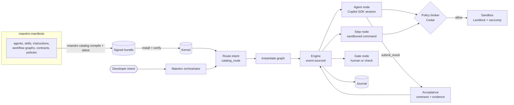
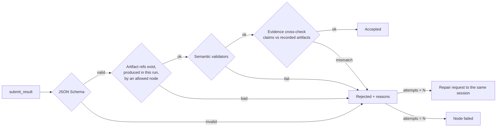

# 03 Agent orchestration

How a developer's intent becomes governed, verifiable work: the catalog, the
workflow graphs, the orchestration engine, agent sessions on GitHub Copilot and
llama.cpp, the policy broker, the sandbox and the handoff contracts. Layers
L11–L13 of the [layer map](README.md#4-layer-map).


```mermaid
flowchart LR
  subgraph manifests[maestro-manifests]
    content[agents, skills, instructions,<br/>workflow graphs, contracts, policies]
  end
  content -->|maestro catalog compile + attest| bundle[(Signed bundle)]
  bundle -->|install + verify| kernel[(Kernel)]
  kernel --> route[Route intent<br/>catalog_route]
  dev([Developer intent]) --> orch[Maestro orchestrator]
  orch --> route
  route --> inst[Instantiate graph]
  inst --> engine[Engine<br/>event-sourced]
  engine --> agent[Agent node<br/>Copilot SDK session]
  engine --> step[Step node<br/>sandboxed command]
  engine --> gate[Gate node<br/>human or check]
  agent --> broker{Policy broker<br/>Cedar}
  step --> broker
  broker -->|allow| sandbox[Sandbox<br/>Landlock + seccomp]
  agent -->|submit_result| accept[Acceptance<br/>contracts + evidence]
  accept --> engine
  engine --> journal[(Journal)]
```

**Principles.** The catalog declares; the host decides. A workflow graph is the
unit of execution, reviewed like code. Dynamic plans are graphs too, validated
by the same compiler and approved before they run. A model's output never
authorizes an effect and never certifies its own success. Three levels are never
confused: an **instruction** to a model (evaluated, not a barrier), a **runtime
configuration** (which tools a session sees) and a **deterministic control** (the
broker refusing an effect). The manifest describes all three; only the last is
enforcement, and every locked value names the component that enforces it and the
test proving it cannot be bypassed.

**S3 boundary** (owner decisions, 2026-09-28). D1–D5 are decided in the
[S3 spec](../../specs/003-catalog/spec.md#clarifications). The 08:12 decision
starts S2/S3 while S1 finishes; M1 is not an implementation-start gate.
Integrated T034/T035 and T038 live evidence gate C08/C28, and the M1 release
remains an M3 exit dependency. S3 compiles and checks declarations; S4 owns
graph execution, the authoritative broker, sandbox and runtime acceptance.
These are design boundaries, not claims that the diagram above is delivered.

## 1. The catalog (`maestro-manifests`)

### 1.1 Layout

**Owner-approved amendment, 2026-09-30:** owner-first, with strict segregation.
This is the target `maestro-source/2` layout, not a claim that the checker has
migrated. Publish C02's seed only after the migration checks in
[S3 tasks](../../specs/003-catalog/tasks.md#owner-first-migration-2026-09-30).

```text
maestro-manifests/
├── core/
│   ├── capability.toml
│   ├── agents/{maestro.agent.md,maestro.maestro.toml}
│   ├── skills/knowledge-evidence/SKILL.md
│   ├── instructions/{knowledge.instructions.md,knowledge.maestro.toml}
│   ├── mcp/maestro.toml
│   └── model-cards/<approved-card>.toml
├── capabilities/engineering/qa/             # example, not C02 seed content
│   ├── capability.toml
│   ├── agents/{reviewer.agent.md,reviewer.maestro.toml}
│   ├── skills/test-planning/SKILL.md
│   ├── instructions/{quality.instructions.md,quality.maestro.toml}
│   ├── mcp/test-runner.toml
│   └── knowledge/collections/qa-public/collection.toml
├── capabilities/engineering/rust/
│   ├── capability.toml
│   └── instructions/{rust.instructions.md,rust.maestro.toml}
├── capabilities/engineering/delivery/       # C21b, not C02
│   ├── capability.toml
│   ├── workflows/feature-delivery/workflow.md
│   └── agents/                             # only required delivery roles
├── capabilities/orchestration/application-workflow/
│   ├── capability.toml
│   └── knowledge/collections/              # private CTM mount awaits S6
├── presets/{knowledge-client.toml,rust-service.toml,qa.toml}
├── bootstrap/{core.toml,rust.toml}          # inventories, not presets
├── bootstrap/core/.github/copilot-instructions.md
├── bootstrap/rust/.maestro/recipes.json
├── settings/README.md                      # S1 reference, no settings authority
├── docs/standards/{engineering.md,security.md}
└── {CODEOWNERS,README.md,LICENSE}           # generated ownership rules
```

Braces mean separate files. QA illustrates adding one folder, not new seed
scope. Every owner root supports `agents/`, `skills/`, `instructions/`, `mcp/`
and `knowledge/`; omit unused directories. A kind must be registered before
nonempty content is admitted: collections await S6, model cards need approved
identities, and later workflows/contracts/policies/profiles/hooks/evals follow
their owner rather than restoring type-first roots. Do not create empty roles.

Core holds only what every install needs: Maestro, shared knowledge resources,
shared policies, the hook and Maestro's agent-session profiles. The generic
`ctm-question` workflow, answer contract and evaluation belong to
`capabilities/orchestration/application-workflow/`. The feature-delivery
workflow, roles, contracts, skills, profiles and evaluation belong to
`capabilities/engineering/delivery/`, not core; a knowledge-client selection
must not carry them. Maestro's canonical persona and system prompt live in
`core/agents/maestro.agent.md`, never hard-coded runtime text.

**Checkable segregation.** These are required checker/CI tests, not conventions
that reviewers alone enforce. [S3 D13](../../specs/003-catalog/plan.md#d13-owner-first-source-migration)
defines the contracts and named fixtures.

| Rule | Required refusal or passing neighbour | Checker task |
| --- | --- | --- |
| FR-S3-040: separate roots | Reject type-first roots, misplaced/unknown resource subtrees, nested owners and private data in public inputs; accept the exact owner/shared layout | C30, C31 |
| FR-S3-041: one self-contained owner root | Exactly one approved GitHub owner/team in each `capability.toml`; reject missing/multiple owners, namespace reuse and resource-owner mirror mismatch | C32, C34 |
| FR-S3-042: explicit dependencies only | Every resource dependency, local or cross-owner, is a typed qualified ID in `requires`; reject file paths/includes, core-to-capability edges and core labels naming capability workflows; capability-to-capability edges require explicit declarations | C33, C34 |
| FR-S3-043: removable capability | Remove one capability folder; core stays valid and byte-identical, unrelated selections still check, and every surviving dependant reference refuses with source-aware diagnostics | C33 |
| FR-S3-044: additive private overlay | Reject duplicate public/core IDs or paths even for identical bytes, owner/trust overrides and public-to-private dependencies; a missing overlay disables only its private preset | C42 (S6); C33 checks public references now |
| FR-S3-045: generated ownership | Generate anchored CODEOWNERS per owner root and shared-root rules from core's owner record; reject drift in CI | C35 |

Workflow labels are non-selecting usage metadata, never dependencies or grants.
Core resources and its owner manifest may omit or empty `workflows`; if present,
labels may name only core workflows. A core label naming a capability workflow
refuses. C33 removes reverse labels and keeps forward requirements on capability
workflows instead; graph checks derive required/unused resources from those
closures. There is no core workflow in the seed; core-labelled workflow
acceptance is fixture-only until one exists.

Resource dependencies have no file/include escape hatch. Preset `templates`
is the sole shared-root inventory selector: inventory names only, not paths;
each inventory reads explicit files only within `bootstrap/`. It is not a
resource dependency or a new resource kind. The private source lives outside
this repository, with an explicitly pinned, opt-in additive mount; public
CI/releases never fetch, package or index it. Checking and registration do not
crawl or launch an MCP server, and selection grants no runtime authority.

### 1.2 Formats: Copilot-native first

Canonical resource IDs are `kind:namespace/local-name`, for example
`agent:core/maestro` and `skill:qa/test-planning`. Exceptions are owner closure
roots `capability:core`/`capability:qa` and global `preset:knowledge-client`.
Reserve `core`; capability leaf namespaces are globally unique even across
domains, so a domain move preserves IDs. Each segment retains the lowercase
hyphenated grammar and 64-character limit. Local names may repeat under
different owners; full IDs, source paths and namespaces may not. No basename
aliases are accepted. Every selection includes reviewed `capability:core`
exactly once, requiring reviewed `agent:core/maestro`; core never requires an
optional capability. Presets require exact capability roots, not globs.

Source `name` remains local and matches its stem/directory. Host projection
rewrites names, paths and references together (`qa/test-planning` becomes
`qa-test-planning`), reserving native agent alias `maestro` for core. Reject
length/normalization collisions and user shadows; joining with a hyphen is not
injective. C40/C07/C08 re-probe hosts, never assume slash support. Agent MCP
references use `mcp-servers: ["qa/test-runner"]` and tool
`qa/test-runner/run_tests` (split at the last slash); both must resolve to the
checked server/tool and the declared `mcp:qa/test-runner` requirement.

| Resource | Format | Maestro additions |
| --- | --- | --- |
| Agent | Copilot custom agent profile `.agent.md`: YAML frontmatter (`name`, `description`, `tools`, `mcp-servers`, optional `model`) + Markdown body | Integrated [C01 evidence](../../specs/003-catalog/research/hosts.md) (`0be954b`) confirms `<stem>.maestro.toml` sidecars: Copilot CLI 1.0.88 warns and ignores agent `metadata:`. Each catalog agent's stem must equal its `name:` for one-to-one pairing. Keys: `id`, `version`, `owner`, `maturity`, required skills and instructions, policies, contracts, allowed profiles, discovery card |
| Skill | Agent Skills `SKILL.md`: frontmatter `name`, `description`, optional `license`, `metadata`, `allowed-tools` | Same keys under the Agent Skills specification's `metadata` field; C01's unknown-key control is silent, not proof of support. A host warning on skill metadata reopens the ADR-0005 sidecar decision |
| Instructions | Owner-relative `instructions/<name>.instructions.md` with `applyTo` globs | Paired `<name>.maestro.toml` for strict common metadata and qualified requirements |
| Prompt | Copilot `.prompt.md` | — |
| Workflow graph | `workflow.md`: graph spec in YAML frontmatter, human documentation in the body | Maestro-specific (§2) |
| Contract | JSON Schema 2020-12 + named semantic validators | — |
| Policy | Cedar policies + a Cedar schema | — |
| Model card | Owner-relative `model-cards/<local-name>.toml`; seed cards under `core/` | Common resource metadata, a model-card `version` field and the exact nested kernel v2 `CardIdentity`; canonical JSON/fingerprint remain kernel-owned |
| Owner closure | One `capability.toml` at `core/` or a capability leaf | Namespace, one approved owner/team, schema, maturity, rows, namespaced workflow labels and exact `requires`; resource owners are checked/generated mirrors |
| MCP server | One owner-relative `mcp/<server>.toml` | Server definition and allowed tools; register by adding the file and a qualified `requires` reference, never a Rust branch or implicit launch |
| Preset | Global `presets/<name>.toml` | Exact capability requirements and optional `templates` inventory names; no source file paths or directory globs |

**Version boundary:** `maestro-source/2`, changed descriptor versions,
`maestro-cli/catalog-check/2`, `maestro-project/2` and
`maestro-authoring-lock/2` move together. Reject old/mixed layouts with a migration
diagnostic; old source locks require a fresh preview, never silent rebinding.
Kernel `maestro-model-card/2` identity and the preference schema do not change.

The agent body keeps a fixed structure (Purpose, Responsibilities, Inputs,
Working sequence, Outputs, Boundaries) that the linter checks. The separation of
concerns is explicit: the `.agent.md` says what the role means; its metadata
says its contracts, tools, dependencies, owner and readiness; policy says what
it may do; the workflow says when it acts.

**Maturity** is an evidence stage, never a permission: `placeholder` →
`authored` → `reviewed` → `qualified` → `retired`. Qualification binds evidence
(an assigned owner, resolved references, compatible contracts, passing
evaluations, support in the selected runtime and model profile) to the exact
component. S3 compiles declared closures at `reviewed`, the highest pre-S4
stage: the declared stage plus a named owner on content admitted through OA1's
protected-branch CODEOWNERS review. C03 checks the declaration/owner, C15 the
protected publication; a local check is not proof of completed remote review.
Every member must meet that threshold; placeholder/authored/retired members refuse. Bundle, lock and preview/explain record/show each stage. S4
raises execution admission to `qualified`; a label alone qualifies nothing.
A reviewed resource with a supported native mapping is **projectable**, not
necessarily **route-eligible**: executable routing also requires the whole
closure's S4 qualification and caller/runtime/trust checks. Placeholders may
be discovered but never compiled into a closure or run. Imported skills keep
their obligations (approvals, gates); a simplified version is a named, versioned, reviewed Maestro variant,
never a hidden rewrite. Every imported skill is pinned like a dependency, with
licence, attribution and a review of any script it carries.

**Kinds grow through descriptors** ([S3 D12](../../specs/003-catalog/plan.md#d12-kind-extensibility-and-model-cards)).
A built-in `Registration` pairs a descriptor with an existing named hook; generic
check/compile/read/install code does not branch on each new kind. C03 supports
finite floats and whole structured tables passed to `KindRules`, with strict
bounds and unknown-hook/kind/version refusals. JSON resource-format support and
file-loaded descriptors arrive later; no plugin execution is implied.
Model cards use the existing kernel validator/registry, not copied identity types.
After the glossary spike shows value, glossary and source-class tables become
reviewed, versioned per-collection catalog kinds, not only kernel bindings; they
are later work, not additional M3 production kinds.

### 1.3 Check, compile, release, install

| Command | Does |
| --- | --- |
| `maestro catalog check` | Parses every file; validates frontmatter, JSON Schemas and Cedar policies against the Cedar schema; resolves every reference; rejects cycles, duplicate IDs and dangling references; compiles every workflow graph (§2.3); lints descriptions and sizes; requires reviewed evidence for S3 declared closures and S4 qualification for execution sets |
| `maestro catalog compile` | Deterministic bundle: sorted tar with fixed metadata + `bundle.json` (`bundle_id`, `version`, `source_commit`, entries with kind, path, digest, owner, maturity, requirements; the exact dependency closure of every workflow; the policy-set digest; `requires`: the runtime version range, required **features** such as `task-grants.v1` or `evidence-receipts.v1`, and tool contracts with versions; entry points). The same inputs give the same digest. Compilation never executes content: hooks, skill scripts and templates are data |
| Release (manifests CI) | On a tag: compile with the **released, pinned** `maestro` binary (checksum verified), generate an SPDX 2.3 JSON SBOM from the pinned component closure/digests using checksum-pinned toolbelt jaq 3.1.1, commit-time `creationInfo.created` and bundle-digest `documentNamespace`; follow the [S3 release-assets contract](../../specs/003-catalog/plan.md#contracts) for tag/names, `SHA256SUMS` and both attestation subjects; document verification (SEC-011) |
| `maestro catalog install <version>` | Downloads, verifies SHA-256 and the attestation (signer = the manifests release workflow), unpacks into the kernel's artifact store, records the install, indexes discovery cards (§1.4), and optionally projects to hosts (§1.5) |
| `maestro catalog update` | Same as install for the newest compatible version; refuses a bundle whose runtime contract range excludes the installed `maestro` or that requires a feature it lacks |
| `maestro catalog explain` | Declared, effective and observed views: what a resource is meant to do; what applies to this project after resolution, with the source of every setting; actual observations only where recorded. For model cards, explain the card an ask would use now, not a nonexistent stored-answer history |
| `maestro catalog register-model-card ID --collection COLLECTION` | Explicitly register an exact admitted installed declaration in the existing scoped kernel registry with all evidence already local; never implicit in install/update, never a model download or selection-record write |

The laptop never clones the manifests repository to run a bundle, and it needs
no Rust toolchain or Python. **Authoring schemas differ from the bundle schema**:
the compiler normalizes human-friendly sources into the execution format, and
the runtime validates what it loads again (a passing catalog build is not blind
trust). A bundle can never disable signature verification, invent an identity,
bypass the broker or turn agent text into a host receipt: those mechanisms are
not settings.

**Model-card boundary.** Bake-off winners arrive as owner-approved manifest changes,
not edited runtime defaults. Each machine qualifies its own backend/runtime/hardware-
bound card; M3 registration requires all identity-referenced evidence already local.
Cross-machine digest-matched local `--evidence DIR` import is post-M1 work.
Each answer carries its registry card ID, which resolves to an immutable card;
the kernel stores no answers. Catalog edits/removal cannot rewrite that identity.
Until S1's post-M1 explicit-answerer-selection fix, the latest registered answerer
for a router entry wins; re-registering an earlier card does not restore it.
M059 agent-session profiles remain separate and confer no kernel job selection
or S4 qualification. S2 G17 supplies extractor before M3; query_expander stays
unsupported until its S1 role follow-up, using the kernel's own unknown-role refusal.

**Authoring checkpoints (D1).** C02's small reviewed-source seed and C08's
init → project → knowledge search/get/ask → remove loop come before M3.
`--catalog-dir` is explicitly labelled authoring convenience: bounded checked
data, source digests and an authoring lock, never an attested install record or
an unsigned install/update option. Copied workflows, scripts and hooks remain
inert. The normal M3 path admits only verified installed bundles; neither
checkpoint removes an M3 exit criterion.

**Trust and freshness** (ADR-0015). An attestation proves who built a bundle;
governed use also requires a current timestamp record, a revocation list
checked before every load and consult (fetched frequently, applied atomically)
and a version floor, so an older or revoked bundle cannot be replayed. Offline,
the last verified records apply until they expire and the remaining window is
shown. Revocation stops new loads; it cannot unload instructions already in a
session or code already running, and the documentation says so. Catalog and
runtime have separate publisher identities; signing keys have rotation and
emergency procedures; rollback and resume never restore a revoked version.
D2 fixes verification through pinned `gh`, refresh at most five minutes apart
during use and offline expiry within 24 hours. C09 records the exact OA4
publisher bindings and rotation evidence; pending external evidence is not an
open choice about this trust design. C13a's `maestro catalog authority set`
provisions/rotates the separate roots and gh pin with exact explicit confirmation
and a journal receipt, never through `--yes` or MCP. Restore preserves current
authority or refuses pending explicit reprovisioning, never restores an old root.

**Project lock.** `.maestro/platform.lock.json` pins, for one project, the
bundle and component digests, the runtime and SDK/CLI versions, the model
profiles (model identity, quantization, chat template, server build), the
sandbox profile and the operating-system profile. A session keeps its pinned
configuration. Updates require an explicit command or the user's `updates =
"auto"` policy at a safe pre-task boundary, never changes to active-session pins.

**Startup updates** (owner, 2026-09-28 11:55). At most once per 24 hours per
installation, check newer verified production releases of Maestro and installed
catalogs with their pinned component closures. `updates = "propose"` is the
default: show verified changes and one apply command. `auto` uses the same
verification/freshness/activation path, with distinct runtime/catalog publisher
adapters, only before work and with no active affected session. Wider permissions
or changed hooks always require change-bound human approval; generic `--yes`
never supplies it. An uncertain diff proposes instead. Every apply retains a
rollback target and records a durable receipt; rollback rechecks current trust,
floors and revocation and writes a linked receipt. An irreversible state change
cannot auto-apply. Offline discovery failure leaves a valid current install
usable but never extends ADR-0015 expiry; daily discovery is not trust refresh.
No catalog/update can grant folders or modify workspace trust approvals.
C13/C14/C16 and C16c–C16f share one lifecycle, not a second updater.

### 1.4 Routing an intent to a workflow

Search discovers; the manifest defines the valid arrangement; the runtime
authorizes and executes; evidence decides completion.

1. **Eligibility first**: maturity, host platform, provider and model
   qualification, caller scopes and data classification filter the candidates
   **before** retrieval, in every search branch.
2. **Discovery cards** (one per workflow, agent and skill: summary, intents,
   technologies, outputs, `use_when`, `avoid_when`, positive and negative
   examples, owner, maturity) are the `catalog` collection of the knowledge
   kernel: same pipeline, one generation per bundle version, separate from
   knowledge collections and their access scopes. The compiler adds canonical
   ID, digest, snapshot, owner and qualification; dependencies are exact data,
   never inferred from text.
3. **Workflow first.** `catalog_route(intent)` returns a small shortlist of
   workflows with role bindings, required skills, deterministic steps, required
   checks, selection reasons, the bundle snapshot and the index generation, with
   a status: `candidates`, `no_match`, `needs_clarification`, `incompatible` or
   `temporarily_unavailable`. A mandatory reviewer is included because the
   workflow requires it, not because it scored well. The runtime rebuilds the
   plan from the verified bundle; it never executes a returned plan blindly.
4. `catalog_resolve(id)` returns exact definitions with their dependency
   closure; `catalog_search(query, kind)` browses agents, skills and
   capabilities. The model never gets raw Qdrant filters, collection names or
   administration; the caller's context handle is bound to its authenticated
   principal and carries no authority by itself.
5. "Optimal" means the **smallest qualified workflow** that covers the outcome
   within the caller's permissions, runtime capabilities and budget. Scores are
   not probabilities. Outcomes are recorded as feedback, and misses become an
   InnerSource backlog; feedback never rewrites routing policy automatically.
6. **Baseline first (D5)**: exact-ID and local lexical routing precede hybrid.
   Enable hybrid only if the seeded 95 % paired-bootstrap interval for held-out
   matchable top-1 gain has a strictly positive lower bound; otherwise ship
   the passing baseline and retain the failed comparison. Offline fallback uses only a
   cached, authorized, still-valid bundle; a resolved run never queries the
   index per step. Response caches are keyed by visibility, snapshot, trust and
   policy freshness, runtime constraints and retrieval profile.
7. The **catalog dependency graph** answers `catalog_impact(resource)` with
   exact transitive dependants and the consulted snapshot. S3 C27a owns its
   catalog edge schema and read/write adapters over S2 G27's public typed-edge
   port, after S2 G25 qualification. C12's scoped kernel records are authority;
   this separate rebuildable projection never fabricates evidence-span claims.
   Missing G25/G27 blocks impact and that M3 exit; no similarity or unapproved
   in-memory closure fallback substitutes for them.
8. Evaluation (D5): freeze 100+ independently reviewed public/synthetic intents,
   with several valid answers where appropriate, and a synthetic eligibility
   fixture with a compiled bundle before comparison, pinning all input digests.
   **OA10 approved (owner, 2026-09-28):** the absolute gate is
   **held-out matchable top-1 ≥ 90 %**, measuring the first selection rather
   than shortlist inclusion. This dated amendment to D5 replaces its original
   top-3 ≥ 90 % bar, retained as history, not current acceptance.
   Freeze at least 20 tuning/80 held-out cases, 60 held-out
   matchable cases and ten eligible synthetic workflows. Report both top-1/top-3,
   correct no-match, clarification, unnecessary context, distractors and latency
   separately. Required dependency completeness is 100 %; formulas, seed 42 and
   S1's 2,000 resamples are fixed in [S3 D5](../../specs/003-catalog/plan.md#d5-baseline-routing-and-measured-hybrid).
   C26 exposes the paired-difference entry point without changing S1's results.
   Adversarial cases include forged authority, revoked resources, contradictory skills, stale indexes, unavailable embedders and
   low-similarity mandatory reviewers. Synthetic eligibility never qualifies a
   live role: a real M3 install returns `incompatible` (not qualified until S4)
   for executable workflows.

Ranking can suggest; only the exact closure from the verified bundle and the
broker's admission allow execution.

### 1.5 Native projection (convenience mode)

`maestro catalog project --host copilot|pi` previews; `--apply` writes projectable
agents, skills, instructions, prompts and the Maestro MCP server entry into the
host's user directories (`~/.copilot/…`, Pi's agent directories). It records an
ownership manifest (paths and digests), refuses to overwrite files it does not
own, and `--remove` deletes only what it wrote. It previews before writing,
detects same-name user resources that would shadow project ones and drift from
what it installed, and reports registered, observed-working, stale and failed
states honestly. Local MCP registration covers the four initial clients: Pi,
Codex, Claude Code and GitHub Copilot CLI. S3 hook administration covers only
Copilot `preToolUse`. Pi, Codex and Claude Code hooks wait for S4 host-adapter
qualification because their trusted event/identity adapters are unqualified;
this does not defer their MCP registration. Other clients remain out of scope.

A native Copilot `preToolUse` hook calls `maestro policy check --stdin`, which
evaluates **the same Cedar policies** as the broker. Developers using Copilot CLI
directly therefore get the organization's guardrails as defence in depth. This
mode is labelled *convenience*: it has no contracts, no acceptance and no
journal. Missing hooks are reported as unprotected; unknown tools, opaque
shell, missing trusted facts, errors and timeouts deny. Model text supplies
neither identity nor approval. C28 requires live allow, deny and hook-error-to-deny
receipts from the OA2 host stage, not just synthetic event tests. Governed work
runs through the S4 engine.

### 1.6 Configuration and overrides

Every configurable key has exactly one override class, declared on its S1
registry descriptor. An unknown key is rejected by the compiler and runtime.
The key inventory comes through a port from S1's shared settings registry,
not a second `KNOWN_SETTINGS` list.
**Supervisor ruling, 21:02: S1 registry names are canonical**; for example,
`ask.output_tokens` replaces the catalog's `max_output_tokens` spelling. After the
supervisor synchronizes landed S1 APIs into S3, C17 adds only missing catalog
descriptors for this section. Landed S3 layers and authority restrictions below
remain unchanged.

| Class | Examples | Who changes it |
| --- | --- | --- |
| **Free** | Response language, verbosity, display, tone | The user, without review |
| **Bounded** | Model profile, reasoning effort, concurrency, budgets, optional MCP servers and skills, update policy | The user, among qualified and allowed values |
| **Additive** | Project conventions, business context, extra acceptance criteria, extra instructions | The user or project may add, never remove what is required |
| **Locked** | Identity, bundle integrity, access control, evidence and acceptance, secret protection, effect authorization, hook ordering | Only a reviewed catalog release |

- **Free preferences** resolve per key as **explicit flags > workspace file > user-level config > built-in defaults**
  (owner, 2026-09-28 11:25), replacing the earlier five-layer order. Only supplied
  flags override files; presets seed init choices, not another session layer.
- **Permissions** never use last-value-wins: allowed operations are the
  intersection with the parent grant; prohibitions and required checks
  accumulate; budgets take the strictest value across all layers before free
  precedence; sandbox requirements cannot weaken; secrets are references only.
  Updates narrow as `off < propose < auto`: only user preferences enable auto;
  workspace/flags can only tighten the user/default ceiling. Explain ignored
  widenings; workspace auto over user propose stays propose.
- Capability settings apply to their role or step, never globally; the order of
  search results can never change configuration.
- `maestro config explain` shows each effective value with its class, source
  rule and requester, for example "monitoring.query_logs: denied, service
  outside project scope, rule guardrails/baseline#service-scope, requested by
  the monitoring capability".

CLI discovery selects the nearest safe `.maestro/config.toml` within home,
never climbing above home. Outside home, read no workspace file until a root
is journal-trusted, then stay inside it. Never select drive/mount roots, including
`/mnt/c`. Check directory/file current-user ownership and no other-principal
write access on ADR-0018 held handles (Unix uid/mode; Windows owner SID/DACL).
Warn and skip foreign-owned, unsafe or unreadable candidates without parsing;
malformed selected safe files still refuse. Missing files use user
`preferences.toml`, then defaults. No ancestor merge or Git boundary; keep a
fixed session snapshot. MCP discovers only from explicit registered `--workspace`,
otherwise user preferences; neither cwd nor client roots selects a workspace.
Instructions report selected/fallback source without absolute paths.

The strict schema uses the well-formed BCP 47 subset: 2–3 ASCII-letter language,
optional 4-letter script, optional 2-letter or 3-digit region, canonical casing;
all other subtags refuse, no parser dependency. Only canonical tags enter model
instructions as quoted data. Tone is `brief`, `normal` or `detailed` ("Very
detailed"); updates is `off`, `propose` or user-only `auto`. Documented typed
`[overrides]` have one class. Reject unknown/duplicate keys, types and authority
fields. Neither preference file holds trust, paths or receipts; existing user
`config.toml` remains the kernel's `[access]` authority.
Full schema and ports: [S3 plan D6–D11](../../specs/003-catalog/plan.md#d6-owned-writes-and-project-bootstrap).

Language/tone change conversational prose only: every generated reply, agent
reply, ask answer and explanation uses the selected language and length/detail.
Code/comments, commits, file names, identifiers, logs and documentation are
always English and invariant under tone. Machine fields and evidence bytes are
unchanged. Built-in interface strings ship in en/fr/es; other tags use English
interface text with one visible note, without changing conversation language.
No explicit language means S1's question-language answers; UI/init default to en,
and init persists a language. Evaluation ignores session preferences. Unsupported
language detection is unchecked, not a false pass or refusal. Interface messages
have one wording per language; --help/clap reference stay English documentation.
MCP initialization delivers the session fragment to all four clients; native
projections use only its fixed English artifact/log rule and an instruction to
follow MCP session language/tone, never copied values. Written files are
byte-identical across tags/tones except config language/tone fields; internal
ownership metadata must instead contain the exact corresponding config digest. S3 tests delivery; S4 must test it in every actual launch/resume/delegation
instruction payload, not infer host obedience from a configured preference.

**Workspace path trust** (owner, 2026-09-28 12:00; amended by review ruling).
Keep answers, canonical paths and receipts solely in user-local kernel authority,
keyed by canonical root. `maestro trust add/list/remove` never rewrites workspace
preferences. Add shows the canonical path and asks default-no on a terminal;
without one require exact `--confirm-path DIR`, else status 2 with the exact
command. No --yes, --json, environment variable, MCP text, catalog or update
can approve. Refuse filesystem/drive/mount roots, HOME itself and internal
kernel directories. Fresh-home CI explicitly trusts its root before scripted init.
A shared `WorkspaceTrust` port permits ordinary reads anywhere and writes only
inside trusted folders, subject to other controls. Its immutable checked secret
deny data always blocks SSH/GPG, cloud/CLI credentials, password/keyring stores
and `.env`/`.env.*` files, even inside trust. ADR-0018 canonical ancestry/held
handles prevent links, `..`, prefix lookalikes and check/use races from escaping.
Kernel-internal XDG config/data/state writes keep kernel rules; agents/tools
gain no access through workspace trust. External host folders need explicit
once-only user trust; never automatically trust HOME.

S3 applies this policy to Maestro-controlled init/projection/install/update/
rollback effects and the Copilot preToolUse hook. Pi/Codex/Claude tool enforcement
remains a named S4 hook obligation, including agent-shell trust commands with
correct --confirm-path arguments and actual denial/allowed-neighbour tests.
Repeating a path does not authenticate process origin. Decline allows only a
separately confirmed preferences-config write plus kernel-local metadata;
no template/install effects and no machine paths in workspace config.

**Updates:** off disables startup discovery, never mandatory trust admission;
explicit check still works. Daily offline-safe discovery uses the shared verifier.
Catalog auto requires user-level consent, safe idle leases and change-bound
approval for widened permissions/hooks. Runtime is propose-only in S3; automatic
activation/rollback waits for installer work. MCP never applies either target
and uses the client-delivery port for a fixed ID/target/version notice only,
never release-note text or install commands in instructions.

**Shipped defaults** (starting points, measured before being tuned):

| Setting | Default | Class |
| --- | --- | --- |
| Conversational language; tone | Question language unless explicitly set; UI/init `en`; tone `normal`, never artifact/log language | Free |
| Updates | `propose`; off available, user-only auto for catalogs under mandatory consent/idle guards; runtime and MCP never auto-apply | Bounded |
| Model profile | `balanced` (profiles `fast`, `balanced`, `deep` map to qualified models per role; several may share one model) | Bounded |
| Reasoning effort | Model default; a requested level the model does not support is a diagnostic, never ignored | Bounded |
| Raw prompt and reasoning logging | Off | Locked in the initial profile |
| Maximum output | 4,096 tokens where the profile allows | Bounded |
| Concurrent inference / workspace writers | 1 / 1 | Bounded |
| Delegation depth | 2 | Bounded |
| Tool calls per run | 40 | Bounded |
| Contract repair attempts | 2 | Bounded |
| Routing candidates | 3 | Bounded |
| MCP call timeout | 30 s, within the server profile | Bounded |
| Cross-project memory | Off | Bounded, once I1 qualifies it |
| MCP Apps, extensions, schedules | Off until activated | Bounded |
| Provider fallback | None | Locked |
| Evidence and result validation | On | Locked |
| Auto-discovered executable hooks | Off | Locked |

Budgets never cancel prohibitions: 39 remaining tool calls grant nothing.

### 1.7 Project bootstrap (`maestro init`)

Bootstrapping is deterministic software, not an agent copying files.

1. **Inspect** the project from its files, without executing any repository
   script.
2. **Select** a centrally tested preset (for example `rust-service`), which
   resolves routine project bindings.
3. **Resolve** the bundle and the base template plus the language overlays that
   apply: Rust first; another language joins when a project needs it, with its
   composed-output test.
4. **Preview** every file to create, fill or relocate, including dotfiles,
   instruction packages, policies, hooks and profiles, and every collision.
5. **Apply** only the authorized set, with interrupted-write recovery; stop on
   any collision. A three-way updater (previous generated, current, proposed)
   is specified separately before it replaces stop-on-collision.
6. **Validate** the generated target (for example strict JSON checks on every
   generated file) and record installation ownership and the project lock.

Init's terminal flow uses the Maestro brand palette with keyboard navigation,
visible focus/progress, workspace trust, language/tone, updates/allowed overrides
and final file preview. `--plain` supports screen readers; `--no-color`/`NO_COLOR`
retain all status text. Flags plus `--yes` are non-interactive; `--apply` remains
required and `--yes` grants no trust or security approval. OA9 approved `ratatui`
plus `crossterm` on 2026-09-28 under ADR-0020; measure minimum features before
adoption, with visual acceptance still pending. Plain init
serves the first owner loop without TUI/OA9. Save preferences only in
`.maestro/config.toml` through the checked writer; preserve user edits. Trust
stays kernel-local. Visual/keyboard/plain tests gate the later menu and M3.

The owner's 20:48 addition makes init and no-argument `maestro config` share the
same registry-generated every-setting editor. Each entry shows current value,
allowed values/range, one-line description and source layer; a new descriptor
appears without per-setting screen code. C05g supplies the plain flow and C05k
the ratatui renderer. Every authorized edit goes through S1 validation/journalling;
locked/authority-only entries show their restriction, never a preference bypass.
Init writes only workspace preferences; config uses S1's explicit layer selection.
Preview/cancel writes nothing, and all existing trust/consent rules still apply.

The project also keeps a small descriptor, `.maestro/project.toml`: preset,
lock, capabilities and context files; it never redefines hooks, orchestration,
authentication or destructive-operation rules. Copied workflow files stay inert
until their activation is separately authorized. Composed output (base plus
each overlay) is tested, not only each template alone. Missing prerequisites
(for example Bash on Windows) are detected and explained. The everyday interface
stays small: `maestro doctor`, `maestro init`, `maestro run`, `maestro explain`.

### 1.8 Writing the first catalog

The first catalog is written from zero (owner, 2026-09-24), from the
requirements traced in [08](08-traceability.md) and nothing else: no file of an
earlier catalog is imported, copied or opened while S3 is written.

1. Start from the two v1 workflows (`feature-delivery`, `ctm-question`) and the
   owner's roles (§2.6).
2. Add a file only when a workflow step needs it; its pull request names the 08
   rows it serves. A file that serves none is not added.
3. Write the allowed and denied fixtures of a policy before the policy.
4. After M3, one **comparison pass** reads the earlier catalog against the new
   one. Each item worth recovering enters by its own pull request, which cites
   it; the others are listed with the reason they stay out.

## 2. Workflow graphs

### 2.1 Model

| Concept | Definition |
| --- | --- |
| **Node** | `agent` (a model session in a role), `step` (a deterministic command in the sandbox), `gate` (human approval or automated check), `router` (chooses one declared edge; its choice is validated output), `map` (bounded fan-out over a list), `join` (fan-in: `all`, `any`, `quorum:n`), `subgraph` (calls another workflow) |
| **Edge** | `from → to`, optionally `when` a typed condition over `from`'s outcome and contract fields holds |
| **Loop** | A back-edge must declare `max_iterations`; the engine counts and stops |
| **State** | Typed slots holding artifact references (digest + contract) or scalars, each with a reducer: `set`, `append`, `merge` |
| **Budgets** | Tokens, wall time, tool calls and cost units per run and per node |
| **Policies** | Cedar policy sets; a node may narrow them, never widen them |

### 2.2 Example

```yaml
# workflows/feature-delivery/workflow.md frontmatter
id: feature-delivery
version: 1.2.0
inputs:  { task: string, repository: repo-ref }
outputs: contracts/delivery.schema.json
state:
  plan:     { contract: contracts/plan.schema.json,        reducer: set }
  patch:    { contract: contracts/patch.schema.json,       reducer: set }
  tests:    { contract: contracts/test-report.schema.json, reducer: set }
  reviews:  { contract: contracts/review.schema.json,      reducer: append }
nodes:
  plan:     { kind: agent, agent: planner,  writes: plan }
  code:     { kind: agent, agent: coder,    reads: [plan, tests, reviews], writes: patch,
              tools: [edit, shell] }
  test:     { kind: step,  run: "cargo nextest run --message-format libtest-json",
              parser: nextest-json, writes: tests }
  spec:     { kind: agent, agent: reviewer, skill: spec-compliance, reads: [plan, patch],
              writes: reviews, independent_of: [code] }
  security: { kind: agent, agent: reviewer, skill: security-review, reads: [patch],
              writes: reviews, independent_of: [code] }
  reviewed: { kind: join, policy: all }
  approve:  { kind: gate, human: true, shows: [patch, tests, reviews] }
edges:
  - plan -> code
  - code -> test
  - test -> code:     { when: "tests.failed > 0", max_iterations: 3 }
  - test -> spec:     { when: "tests.failed == 0 && tests.executed > 0" }
  - test -> security: { when: "tests.failed == 0 && tests.executed > 0" }
  - spec -> reviewed
  - security -> reviewed
  - reviewed -> code: { when: "any(reviews, r => r.verdict == 'changes_requested')",
                        max_iterations: 2 }
  - reviewed -> approve: { when: "all(reviews, r => r.verdict == 'approved')" }
budgets: { tokens: 600000, wall: 60m, tool_calls: 400 }
policies: [destructive-operations, protected-paths, egress-deny-by-default]
```

### 2.3 Compile-time validation

S3 C22a/C22b statically check all twelve rules below before bundling. A graph
that fails a rule is not part of a bundle; unsupported constructs are rejected,
never silently omitted. S4 executes validated graphs and enforces these
requirements at runtime; static success supplies no execution qualification.

1. Every referenced agent, skill, contract, policy and subgraph resolves in the
   bundle with reviewed evidence for S3 compilation; S4 execution raises the
   threshold to qualified (§1.2).
2. Every node is reachable from the start and can reach a terminal node.
3. Every cycle contains a back-edge with `max_iterations`.
4. Every condition parses and type-checks against the source node's contract
   (the expression language is small: comparisons, `&&`, `||`, `!`, `any`/`all`
   over arrays; no calls, no side effects).
5. A `router` node's choices are exactly its declared outgoing edges.
6. `independent_of` is satisfiable: a distinct session and a different model
   profile (or provider) from the named nodes.
7. Every tool a node may use is covered by the Cedar schema and policies.
8. Every `step` runs sandboxed; none requests an unsandboxed escape.
9. `map` fan-out and subgraph depth are bounded.
10. Budgets are present and within the organization's ceilings.
11. State slots are written by at least one node before any node reads them.
12. The workflow's output contract is produced on every successful path.

### 2.4 The engine: durable, event-sourced execution

The engine is a deep module in `maestro-runtime`: a small interface
(`start`, `status`, `wait`, `cancel`, `interrupts`, `resolve`) over a state
machine persisted in the kernel journal.

**Events** (append-only, per run): `RunCreated`, `RunStarted`, `NodeScheduled`,
`NodeStarted`, `SessionOpened`, `ToolCallRequested`, `PolicyDecided`,
`ToolCallExecuted` / `ToolCallFailed`, `ArtifactStored`, `ResultSubmitted`,
`ContractAccepted` / `ContractRejected`, `RepairRequested`, `NodeCompleted
{outcome}`, `EdgeTaken`, `InterruptRaised` / `InterruptResolved`,
`BudgetExceeded`, `RunPaused`, `RunResumed`, `RunCancelled`,
`RunCompleted {outcome}`.

| Property | Design |
| --- | --- |
| State | `state = fold(events)`: a pure function, property-tested (replaying the journal of any recorded run yields the live state); snapshots every N events |
| Scheduling | Ready set = nodes whose predecessors completed and whose conditions hold; per-run and global concurrency limits; local-model concurrency follows the router's slots and VRAM budget |
| Recovery | On restart the engine replays. An agent node in flight gets a new session rebuilt from its inputs and recorded transcript. A `ToolCallRequested` without `ToolCallExecuted` is an **uncertain effect**: idempotent tools are re-run; any other raises an interrupt for a human decision. Nothing is blindly retried. |
| Interrupts | Gates, agent elicitations (SDK elicitation and user-input handlers) and policy `ask` decisions pause the run and surface through CLI and MCP; resolution is journaled with who decided |
| Cancellation | Cooperative: sessions disconnected, sandboxed processes killed and reaped, `RunCancelled` recorded; a client timeout is not a cancellation |
| Budgets | Updated from usage events; exceeding one fails the node with `BudgetExceeded`, which edges may route to a fallback node |
| Auditability | Model messages, tool inputs and outputs, contracts and decisions are artifacts or events; a run can be reconstructed and explained after the fact |

Runs execute in the **`maestro daemon`** (a systemd user unit, S4) listening on a
Unix socket; the CLI and the MCP server are clients. MCP exposes runs as
long-running tasks (MCP 2026-07-28), so any host can start, watch and resolve
them.

Why in-house rather than Restate, Temporal or a LangGraph-style crate: the hard
parts are Maestro-specific (broker decisions, contract acceptance, uncertain
effects, reviewer independence), a laptop should not run another server, and the
journal already exists. The engine borrows the proven ideas (reducers,
checkpoints, interrupts, durable replay) — see ADR-0006.

### 2.5 The orchestrator (Maestro agent)

The Maestro agent is the front door for free-form requests in Pi, Copilot or the
CLI. It **delegates and never executes**: its tools are limited to catalog,
knowledge and run operations.

1. Understand the request and restate it.
2. `catalog_route` the intent.
3. **Match** → propose the workflow with its inputs; start after the developer
   confirms (or immediately for read-only workflows the policy marks
   `auto_start`).
4. **No match** → *dynamic plan*: compose a graph from eligible catalog nodes as
   JSON, run it through the same compiler and policy checks, show it, and start it
   only after approval. A dynamic plan can be saved as a draft workflow and
   proposed to the catalog by pull request.
5. Observe the run, relay interrupts, summarize the accepted outcome with links
   to its artifacts.

### 2.6 Roles

Author only the roles a real workflow needs; a declared role that is not
qualified never runs. Roles an earlier catalog had and no requirement here names
wait for the comparison pass (§1.8).

| Role | Responsibility | Default boundary |
| --- | --- | --- |
| Maestro | Understand the request, select a workflow, delegate, summarize accepted results | No edits, no shell, no self-approval; the Maestro agent is not the Maestro MCP service |
| Planner | Plan and acceptance criteria | Writes plans only |
| Coder | A scoped candidate change | Writes in its sandboxed worktree; cannot modify policy or acceptance evidence |
| Tester | Create and run relevant tests, report actual results | Cannot weaken the agreed test baseline |
| Builder | Run approved build recipes, record artifacts | A deterministic `step` node; a model may diagnose failures, never decide that an unexecuted build passed |
| Reviewer | Review the exact candidate; specification and standards reviews in separate contexts | Read-only; a review recommends, it does not merge or release |
| Product Owner (S5) | Draft requirements, acceptance criteria, open decisions | Never invents approval, priorities or commitments |
| Monitoring (S5) | Investigate approved telemetry | Read-only; observations kept apart from inferred diagnoses |
| Orchestration planning (S5) | Plans with dependency and effect analysis | Plan-only; applying is a separate authorized operation |

The delivery gauntlet (blind comparative critics, live progress page) is an
optional workflow, never the default.

### 2.7 Patterns the graph expresses

| Pattern | Graph shape |
| --- | --- |
| Pipeline | `a → b → c` |
| Evaluator–optimizer | `produce ↔ check` with `max_iterations` |
| Parallel specialists | fan-out to independent reviewers, `join: all` |
| Map-reduce | `map` over files or sections, then a reducing agent |
| Triage | `router` to specialized subgraphs |
| Human in the loop | `gate` nodes, elicitation interrupts |
| Supervisor | the orchestrator's dynamic plan, validated before it runs |

## 3. Agent sessions

### 3.1 Copilot SDK (`github-copilot-sdk` 1.0.14)

- One `Client` per daemon, spawning the Copilot runtime over stdio. The CLI comes
  from the pinned toolbelt (`COPILOT_CLI_PATH`); the crate's `bundled-cli`
  feature, which downloads the CLI at build time, is disabled. The experimental
  in-process transport is evaluated later.
- The Copilot runtime process itself starts **inside the run's sandbox**, so its
  built-in edit and shell tools are confined to the worktree as well as gated by
  the broker.
- The persona is **composed from identified fragments**: runtime technical
  instructions, Maestro's mandatory responsibilities, applicable organizational
  instructions, the workflow contract, conversational preferences, then task
  context marked as data (through `system_message`, organization instructions
  and the system-message transform). The digest and provenance of every loaded
  fragment are journaled, so "what did this agent actually receive" has an
  answer; deterministic controls hold even when instructions contradict.
- SDK defaults that Maestro always overrides: omitted agent tools mean *all*
  tools, so every profile lists its tools; a custom agent's model can fall back
  to the parent's, so an unavailable required model fails the node; sub-agents
  do not inherit skills, so each worker's skills are resolved explicitly;
  managed settings are not persisted, so they are re-supplied on resume; a
  missing permission handler is not deny-all, so Maestro's is always installed;
  project-discovered executable hooks and ambient configuration discovery stay
  off unless admitted. There is no raw SDK configuration passthrough; an SDK
  option Maestro has not qualified is refused or confined to a named
  experimental profile.
- The **requested, resolved and observed** model identities are all recorded;
  one inference profile per worker session; a provider change happens only at a
  controlled boundary (context transfer, data classification, rights, budget,
  new session), never by swapping a URL mid-action.
- One **session per agent-node execution**, configured by the host:

| `SessionConfig` field | Set from |
| --- | --- |
| `model`, `provider` | The node's provider profile (§3.2) |
| `system_message` | Agent body + required instructions + the session's language/tone and English-artifact/log fragment + required skills + node contract + inputs/evidence, within the context budget (§3.4); test actual launch/resume/delegation payloads on both providers |
| `available_tools` / `excluded_tools` | Node declaration ∩ policy; everything else excluded |
| `mcp_servers` | Maestro's read tools (knowledge, catalog) + approved servers from `mcp/*.toml` |
| hooks, permission handler | The broker (§4); elicitation and user-input handlers raise interrupts |

- A host tool, `submit_result(payload)`, is the **only way a node completes**;
  the payload goes to acceptance (§6). Streamed events (messages, tool calls,
  usage) are journaled.

### 3.2 Providers and profiles

| Provider | Route | Notes |
| --- | --- | --- |
| `copilot` | GitHub-managed models through the Copilot runtime | Model per role from the profiles; organizational Copilot policy applies |
| `llamacpp` | BYOK: OpenAI-compatible provider pointing at the local router (`http://127.0.0.1:8080/v1`, completions wire API) | Models are the router's catalog entries |

`profiles/models/<role>.toml` lists the allowed profiles per role and provider,
filled from bake-off results (see [05 §3](05-platform-and-operations.md#3-model-selection)).
A node picks within that list. There is **no automatic fallback** between
providers; an unavailable provider fails the node with a typed error that an edge
may route. Policy can pin nodes that handle private data to local providers.

### 3.3 Hook mapping

| SDK hook | Maestro use | Not relied on for |
| --- | --- | --- |
| `SessionStart` | Inject verified run context | Authorization |
| `UserPromptSubmitted` / `UserPromptTransformed` | Journal only | Admission (checked before `send`) |
| `PreToolUse` | Broker decision (allow / deny / ask) on normalized arguments | The only barrier: the permission handler and the sandbox also enforce |
| `PreMcpToolCall` | Bind MCP `_meta` to the authenticated run | Standalone denial |
| `PostToolUse` | Journal, capture outputs as artifacts, enforce output size limits | Undoing effects |
| `PostToolUseFailure` | Journal with classification | Erasing failures |
| `AgentStop` | If no result was submitted, one bounded nudge to call `submit_result` | Acceptance |
| `ErrorOccurred` | Classify and journal | Declaring side effects safe to retry |
| `SessionEnd` | Cleanup and usage accounting | Proof of success |

A missing, failing or slow hook never removes the broker: the permission handler
routes to the same decision, and the default is deny. Registering Rust
callbacks (`with_hooks`) is separate from native file hooks
(`enable_file_hooks`, off by default). CLI-only events (`subagentStart`,
`subagentStop`, `preCompact`, `permissionRequest`, `notification`) are not Rust
hook variants and need their own adapter and tests.

**MCP servers** are declared in `mcp/<server>.toml`: registry ID, transport,
endpoint or executable digest, credential reference, allowed tools, timeout,
maximum result size, output contracts, resource and prompt rules and the agents
allowed to use them. A tool newly advertised by a server is not approved;
resources and prompts are checked by URI, access, MIME type, size and
provenance independently of tool hooks; disabling a resident server refuses
new calls at once and reconciles in-flight ones; `_meta` carries trace context,
never identity; MCP Apps stay disabled until a renderer and its boundary are
qualified.

### 3.4 Context assembly

The host composes each session's context under an explicit token budget for the
selected model: persona and mandatory instructions first; required skills in
full; optional skills as a list the agent can load through `load_skill`; node
inputs by contract; evidence bundles from the knowledge kernel; prior outputs
referenced by artifact handle. When the budget is short, content is compressed
**recoverably**: summaries go into the context, originals stay as artifacts the
agent can fetch. Nothing is truncated silently.

## 4. The policy broker (Cedar)

| Cedar element | Maestro mapping |
| --- | --- |
| Principal | `Agent::"<workflow>/<node>"` with attributes: role, run, provider, maturity |
| Action | `fs.read`, `fs.write`, `shell.exec`, `net.fetch`, `mcp.call`, `git.push`, `git.reset`, … |
| Resource | `Path`, `Host`, `Tool` (`server/tool`), `Repo` |
| Context | Normalized arguments (argv, cwd, environment diff), budgets used, approvals held |
| Schema | Generated from the tool registry: host tools plus MCP tool descriptions (the cedar-for-agents approach) |

**Normalization before evaluation:** a shell command is parsed with shlex into
argv; the executable is resolved through `PATH`; pipelines, subshells and
`sh -c` are opaque, so they are denied unless a policy allows them explicitly;
`sudo`, `env` tricks and interpreter one-liners are recognized as such.

**Policies (catalog content):**

| Policy | Default |
| --- | --- |
| `default-deny` | Anything not permitted is denied |
| `destructive-operations` | Deny or ask: recursive deletes outside the worktree, force pushes, hard resets of shared branches, cluster/infra destroy or apply, SQL `DROP`/`TRUNCATE`, destructive scheduler commands |
| `protected-paths` | Deny: SSH and GPG keys, keyrings, credential stores, CI secrets, `.git/config` credentials |
| `egress-deny-by-default` | Network only to hosts a workflow allowlists (e.g. crates.io for builds) |
| `mcp-allowlist` | Only approved servers and tools |

Decisions are `Allow`, `Deny {reason, policy}` or `Ask {scope}` (an interrupt).
**Approvals** bind to run, node, action, a digest of the normalized arguments and
the resources, the workspace snapshot and the policy digest, carry a use count
and an expiry, and are rechecked right before the effect. Every rule ships with
an allowed-neighbour test and a denied-case test (`maestro policy test`), run in
manifests CI.

| Rule | Design |
| --- | --- |
| Typed operations first | `workspace.read`, `workspace.apply_candidate_patch`, `sandbox.run_recipe`, `result.submit`, `observability.query_scoped`; a free-form shell is the exception, and an approved executable name is not an approved effect |
| Trusted facts | Policy evaluates a normalized request whose actor, task grant, targets, effects and approvals come from the host; "this deletion is reversible" written by a model is not a fact |
| Decision subject | A result names what it applies to and its containment boundary: rejecting an injected instruction can keep the rest of a document as data, while a destructive compound command is refused as a whole |
| Evaluation errors | Cedar skips a policy that errors; Maestro inspects diagnostics and denies the effect on any evaluation error or missing mandatory fact |
| Hard prohibitions | Not approvable by clicking "yes"; break-glass is a separately governed, narrowly scoped exception path with its own audit |
| Destructive-operation catalogue | Entries classify effect and scope (scratch writes allowed; overwrite or delete workspace content through patch promotion; modifying guardrails, runtime or credential stores denied; rewriting shared history denied; remote or production changes through a separate authorized workflow), each with a stable ID, rationale, decision, approvals, audit and positive and negative fixtures |

Detection is bounded: pattern matching plus hook ordering does not secure
arbitrary code running with the same privilege, which is why the sandbox and
the typed operations exist.

## 5. Sandbox

| Control | Mechanism |
| --- | --- |
| Filesystem | Landlock (landlock 0.4.7): read-write on the run's worktree and a private tmp; read-only on toolchains; nothing else |
| System calls | seccomp (seccompiler 0.5): deny `ptrace`, `mount`, `kexec_*`, `bpf`, `perf_event_open`, … |
| Network | Separate network namespace (bubblewrap `--unshare-net`) by default; allowlisted destinations go through a local filtering proxy that applies the egress policy |
| Resources | cgroup v2 limits through `systemd-run --user --scope`: CPU, memory, wall time; output size caps |
| Repository | Each run works in its own git worktree; the result is a patch artifact; applying it to a developer branch is a separate, gated step |

Also: protected policy, bundle and evidence storage the agents cannot write; no
inherited SSH agent, Docker socket or cloud credentials; path checks that
resist symlinks, hard links and time-of-check changes; process-tree termination
and bounded output; model-endpoint access separate from build and test
network access. Build scripts, tests, dependencies and skill scripts are
untrusted code. If the required containment is unavailable, governed execution
**refuses to start** rather than downgrading. Linux is the first qualified
platform; WSL alone, macOS (Seatbelt) and Windows (restricted tokens) get their
own qualification before any claim. The honest threat model: this constrains
agents and untrusted content, not an administrator of the laptop; remote
consequential operations still need server-side authorization.

## 6. Handoff contracts and acceptance


```mermaid
flowchart LR
  sub[submit_result] --> schema{JSON Schema}
  schema -->|valid| refs{Artifact refs exist,<br/>produced in this run,<br/>by an allowed node}
  refs -->|ok| sem{Semantic validators}
  sem -->|ok| ev{Evidence cross-check<br/>claims vs recorded artifacts}
  ev -->|ok| acc[Accepted]
  schema -->|invalid| rej[Rejected + reasons]
  refs -->|bad| rej
  sem -->|fail| rej
  ev -->|mismatch| rej
  rej -->|attempts < N| repair[Repair request to the same session]
  rej -->|attempts = N| failed[Node failed]
```

- **Semantic validators** are named Rust functions declared by the workflow, e.g.
  `test_report.executed > 0` (an exit-zero run that found no tests cannot satisfy
  a test criterion), `patch.applies_cleanly`, `review.independent`.
- **Evidence cross-check**: a model cannot self-report success. A claim that
  tests passed must match the step node's recorded test report; a claim that a
  file changed must match the patch artifact.
- **Declared non-success outcomes** (`blocked`, `partial`, `read_only_findings`)
  are legitimate results, routed by edges, never promoted to success.
- Repair attempts are bounded per node and counted in telemetry.
- **Handoffs** are accepted node outputs. The model supplies content (status,
  goal, summary, artifact and evidence references, remaining risks); the engine
  adds the trusted envelope (real sender, allowed recipient, run and step,
  delegation scope, snapshot, catalog and policy digests, validated evidence).
  A model cannot write its own role or rights.
- **Criteria stay with the host.** The frozen acceptance criteria are the
  reference; an agent submits observations against them and may *propose* a
  change, never replace them. Readiness depends on the workflow: a code change
  without its artifacts cannot move to review, a read-only investigation may
  have none. Tests run on an older snapshot stay history and do not validate a
  new candidate.
- **Evidence tiers are enforced**: receipts issued for simulation or
  qualification runs, and mock overrides, are rejected in governed runs by
  host-issued provenance, whatever the model labels them.

## 7. Memory inside runs

A run's memory is its journal and artifacts. Cross-run memory (lessons,
preferences, project facts) stays disabled until the S7-I1 memory capability
qualifies provenance, scope, retention and correction; see
[04](04-intelligence-backend.md).

## 8. MCP surface

| Tool | Slice |
| --- | --- |
| `catalog_route`, `catalog_resolve`, `catalog_search`, `catalog_impact` | S3 |
| `run_start`, `run_status`, `run_wait` (long-running task), `run_cancel`, `run_interrupts`, `run_resolve` | S4 |

## 9. Test layers

| Layer | Real component under test | Proves | Cannot prove |
| --- | --- | --- | --- |
| L1 deterministic | Graph compiler, engine fold and scheduler, Cedar policies, contracts, acceptance | Logic, invariants, replay = live (property tests) | SDK behaviour |
| L2 SDK transport | Real SDK over `Client::from_streams` with a fake JSON-RPC peer (`test-support`) | Session mapping, hooks and permission wiring | The real Copilot runtime |
| L3 real runtime, scripted model | Real Copilot runtime with a `CopilotRequestHandler` returning scripted model responses, network denied | Tool loops, `submit_result`, hooks end to end | Model quality |
| L4 real services | Sandbox enforcement, daemon crash/restart, Qdrant and Neo4j | Containment and durability | Hosted providers |
| L5 live | Authorized runs on Copilot and llama.cpp against a canary repository | Qualification cards per role and model | Untested roles, models and platforms |

Scenario files in `maestro-manifests/evals/scenarios` drive L1–L3 through a
released runner, so contributors test a workflow without building the runtime.

| Rule | Design |
| --- | --- |
| Tooling | Rust tests on Tokio, cargo-nextest (JUnit reports, **zero retries** for deterministic suites), insta for compiled configuration, prompts and exposed tools, proptest for override rules, contracts and transitions; mockall, wiremock and testcontainers only where a real seam needs them |
| Real controls | Never mock the policy, acceptance verifier or containment under test; a spy executor records would-be effects, so a denial test asserts zero executor calls and proves its stimulus reached the real guard; every denial has an allowed neighbour |
| Two frontiers | A tool hidden from the model is refused by the runtime before any hook; tool exposure and broker refusal are tested separately, the broker also by direct synthetic requests |
| Scenario format | Data, not scripts: control IDs, layer, synthetic fixture, stimulus, observation point, assertions; contributors cannot inject privileged code as a test |
| Record and replay | Separately authorized, no production credentials, secrets removed before storage, reviewed fixtures; an unmatched request, an exhausted cassette or an unconsumed required exchange fails; no fallback to the real model; per-worker causal order |
| Suites | `fast` (L1–L2, inference forbidden, network denied) on every change; `sdk-scenarios` (L3) with the real pinned runtime; `live` (L5) only as an authorized job, every attempt kept |
| Trusted baseline | The list of mandatory suites comes from the protected base branch; a pull request cannot delete the test that would refuse it |
| Statuses | Deterministic pass, runtime integration pass, model evaluation pass, system qualification pass, not run and unsupported stay distinct; mutation testing (cargo-mutants) covers the critical guards |

## 10. InnerSource flow (S5)

1. `maestro catalog new agent|skill|workflow <name>` scaffolds the resource, its
   contract, a policy test and an eval scenario.
2. The contributor opens a pull request; CODEOWNERS requests the capability
   owners and, for policy or contract changes, the platform security owners.
3. Manifests CI runs `maestro catalog check`, `maestro policy test` and the
   scenario suite with the released binary.
4. A tag produces an attested bundle; developers `maestro catalog update`.
5. Adoption and outcomes feed back through telemetry and evals, never through
   ranking people.

| Aspect | Design |
| --- | --- |
| Operating model | Platform maintainers (runtime, compiler, contracts, installation, shared agents); security maintainers (mandatory policy, trust roots, exceptional grants, containment); capability maintainers (domain correctness, integrations, evaluations, support, deprecation); application teams (requirements, project context, contributions) |
| Capability record | Maintainer and backup, maturity, supported environments, evaluation suite, deprecation policy, known limitations |
| Review by change class | A trusted check computed on the base branch: domain instructions and docs → capability owner + evaluations; new tool or wider permission → domain + security; guardrails → security + policy regressions; compiler, installer, signing or ownership → platform + security; weakened contract → compatibility review. CODEOWNERS alone accepts any listed owner, so dual approval is enforced by this check; CODEOWNERS is generated from one ownership model and protected |
| Untrusted pull requests | No signing or production credentials in evaluation jobs; privileged workflows never check out or run pull-request code |
| New executable capability | First compose approved tools; then an independently qualified out-of-process tool or extension ([07](07-extensibility.md)) released by its owner; only a new host mechanism, protocol feature or enforcement primitive needs a core release |
| Transparency | Declared, effective and observed views (§1.3); an external view is sanitized |
