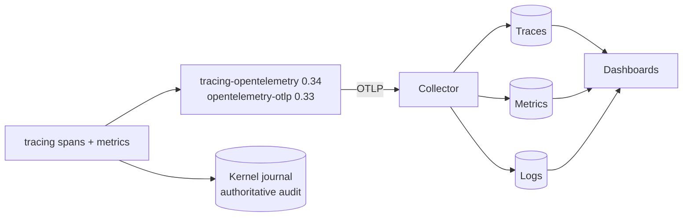

# 05 Platform and operations

Cross-cutting layers L16–L18: model selection, observability, evaluations and
benchmarks, security, supply chain, deployment, data management and CI/CD.

## 1. Reference environment

The first qualified environment is the maintainer's workstation: Linux x64 under
WSL2 (kernel 6.18, systemd enabled, Landlock available) with an RTX 5090
(32 GB VRAM) serving local models through `maestro-model-router`. Every claim about
another platform (native Linux laptops, macOS, Windows) needs its own
qualification run; nothing is inferred from this one.

Two execution profiles are qualified separately and never mixed silently:

| Profile | Meaning | Proof |
| --- | --- | --- |
| **Strict local** | Local model assets and inference, prefetched extractor and model assets, approved processes only | Tests run with unexpected egress blocked; no first-use downloads |
| **Managed Copilot** | An explicitly approved provider, account and data scope for the nodes whose policy allows it | Recorded per run; no fallback into it from the local profile |

A local endpoint is not zero egress: tools, updates and integrations have their
own network rules. Offline, a still-valid cached bundle keeps working until its
freshness records expire (ADR-0015); expired or revoked policy never keeps
write authority. Core installation and execution work with **Python absent**
(a release gate).

## 2. Services on a developer machine

| Service | Pinned by | Required from | Optional? |
| --- | --- | --- | --- |
| `maestro daemon` (systemd user unit) | `maestro` release | S4 | No (runs, capture) |
| Model router (`maestro-model-router`) | its release + model cards | S1 | No |
| Qdrant 1.19 (binary + systemd user unit) | release checksum | S1 | No |
| Neo4j 2026.x Community (tarball or image by digest) | checksum / digest | S2 | Yes: the graph route reports `unavailable` without it |
| Copilot CLI (for the SDK) | toolbelt pin | S4 | Only for the `copilot` provider |
| OpenTelemetry backend (`grafana/otel-lgtm` image by digest) | digest | S1 | Yes: telemetry is diagnostic |

`maestro setup` previews, then applies, the directories, kernel database, units,
MCP registrations (Pi, Copilot) and catalog install; `maestro doctor` checks
every dependency and prints a remediation for each failure.

## 3. Model selection

**No model is preselected.** Every role is filled by the winner of a recorded
bake-off on our own evaluation suites; the current router entries are merely the
first candidates available.

### 3.1 Roles and what decides them

| Role | Decided by | Hard constraints |
| --- | --- | --- |
| Embedder | Recall@10, MRR@10, nDCG@10 on `ctm-retrieval` and `synthetic-retrieval`; cross-lingual subset | Servable locally; FR/EN; context ≥ chunk maximum; licence allows internal use |
| Reranker | Gain over the fused order on the same suites; p95 latency for 30 pairs | < 800 ms p95 on the reference workstation |
| Answerer | Faithfulness, citation precision/recall, command exactness (100 %), refusal accuracy | JSON Schema adherence ≥ 99 % |
| Extractor (S2) | Relation precision (sampled, human-checked), evidence-quote validity rate | Throughput fits the extraction budget |
| Judge | Agreement with human labels (≥ 0.8 accuracy, κ ≥ 0.6 on ≥ 50 items) | Different model family from the systems it judges |
| Agent roles (S4) | Workflow scenario success, contract first-pass acceptance, policy violations, time and cost per accepted result | Available on the chosen provider route |

### 3.2 Candidate pools

Pools are starting points, re-verified at bake-off time for availability,
llama.cpp support and licence. A candidate that needs a non-llama.cpp runtime
(ONNX, Candle) may still win; its runtime then becomes a justified dependency.

| Role | Local candidates (GGUF through the router unless noted) | Managed route |
| --- | --- | --- |
| Embedder | BGE-M3; Qwen3-Embedding 0.6B / 4B / 8B; Harrier-OSS-v1 270M / 0.6B / 27B; EmbeddingGemma 300M; voyage-4-nano (local open weights); multilingual-e5-large-instruct; Snowflake Arctic-Embed-L v2.0; nomic-embed-text v2 | — |
| Reranker | gte-multilingual-reranker-base; bge-reranker-v2-m3; Qwen3-Reranker 0.6B / 4B / 8B (yes/no logit scoring with its template; GGUFs must be converted with the official script: many community files return null scores); mxbai-rerank v2 | — |
| Answerer / extractor / local agents | Qwen3.x releases including Qwen3.8-27B (dense and MoE), Gemma 3 and Gemma 4 families, gpt-oss 20B / 120B, Mistral Small 3.x, Devstral / Qwen3-Coder for coding roles | Models the organization's Copilot policy enables |
| Judge | The strongest available model of a different family | Same |

**Runtimes.** The router (llama.cpp) serves every role it supports. A winner
that needs another runtime brings it as a justified dependency: Text Embeddings
Inference, mistral.rs, fastembed with ONNX Runtime, or Candle. Published scores
(for example the Qwen card's retrieval column: BGE-M3 54.6, Qwen3-Embedding
0.6B 64.6, 4B 69.6, 8B 70.9) justify testing a candidate, never selecting it.

**Licences** are checked per candidate: non-commercial weights (for example
some jina and SPLADE releases) are excluded for organizational use, and Gemma
weights carry their own terms.

**"Uncensored" or abliterated variants** are community modifications that
reduce refusals; being more willing to answer is not being more correct, and
the modification can lower benchmark quality. They enter a bake-off only with
the owner's explicit approval, are judged on the same faithfulness, citation
and refusal metrics as any candidate, and are never chosen for the label.

### 3.3 Protocol

1. Freeze the suite, the generation inputs, the hardware and the llama.cpp build.
2. Run each candidate with its documented prompting (instructions, prefixes,
   templates); repeat stochastic runs three times.
3. Report per-item results, means with bootstrap confidence intervals, p50/p95
   latency, VRAM and throughput; keep every attempt, including failures.
4. Choose the best quality within the hard constraints; on a tie, the smaller or
   faster model.
5. Record the winner as a **model card**: model ID, file digest, quantization,
   adapters, tokenizer and chat template digests, system and tool formats,
   sampling, supported reasoning controls, context and output limits,
   llama.cpp build and server flags, backend, offload, memory, concurrency and
   cache settings, measured hardware limits, suite results and date. Two
   quantizations or two templates of one model are two cards; an alias or a
   `/v1/models` answer never proves which weights run.
6. Re-run when a candidate appears, a build changes or quarterly.

**Provider qualification** precedes any agent role: a full tool round trip
(system instructions → request → structured tool call → authorized execution
→ result with the right call ID → final answer → accepted result), then
fragmented streaming, French text, invalid arguments, truncation, long context,
cancellation, resume and missing usage data. It runs against the llama.cpp
endpoint directly and then through the SDK and Maestro's controls, separating a
model or template problem from an adapter problem; the Copilot route is
qualified through its supported SDK path. **Embedding qualification** is
separate: pooling, normalization, measured dimensions, document and query
templates, batch-versus-single agreement within a tolerance.

The **qualification registry** records which profile is qualified for which
role, workflow and hardware; routing combines catalog relevance, this registry
and the run's constraints. A model useful for classification is not thereby
qualified for review.

### 3.4 Provider configuration

One common registry holds provider configurations: `maestro provider add`,
`list`, `show` (credential references only, never secrets) and `remove`
(knowledge and history stay). Adding a configuration never connects, infers,
downloads or spends. Two routes exist: `copilot` (GitHub-managed routing and
models available to the account) and `llamacpp` (BYOK: OpenAI-compatible
provider type, base URL, completions wire API, explicit model). The SDK's
experimental multi-provider registry is not relied on; each worker session is
bound to one qualified profile, and runs compare providers homogeneously before
any mixed per-role arrangement, which needs an authorized context transfer.

**An embedder change is a new chunk profile** (its tokenizer budgets the chunks),
a new chunk set and a new generation; the alias switch makes it invisible to
callers.

## 4. Observability

| Output | Purpose | Loss behaviour |
| --- | --- | --- |
| **Journal** (kernel) | Authoritative audit of runs, jobs, decisions, captures | A failed mandatory write blocks the effect it records |
| **Telemetry** (OTLP) | Diagnostics, performance, dashboards | Bounded buffer; drops are counted and visible, never silent |
| **Eval reports** (artifacts) | Quality evidence for decisions | Immutable, referenced by the decision they support |

**Span taxonomy** (GenAI semantic conventions, development status, attribute
names centralized in one module so a convention change is one edit):

| Span | Key attributes |
| --- | --- |
| `knowledge.import`, `.prepare`, `.publish` | collection, generation, counts |
| `gen_ai.embeddings` | `gen_ai.operation.name=embeddings`, `gen_ai.request.model`, batch size, input tokens |
| `retrieval.search` → `retrieval.route.{dense,bm25,identifier,graph}` → `retrieval.fuse` → `retrieval.rerank` → `retrieval.assemble` | k, candidate counts, latency, degraded routes |
| `workflow.run` → `workflow.node` | workflow, version, node kind, outcome, repair count |
| `gen_ai.invoke_agent`, `gen_ai.chat` | `gen_ai.provider.name`, requested and response model, usage tokens, time to first token |
| `gen_ai.execute_tool` | tool name, policy decision, sandbox profile, exit status |
| `mcp.request` | method, tool, response size |

**Metrics:** per-stage latency histograms; token usage by provider and model;
policy decisions by rule and outcome; contract rejections by reason; first-pass
versus repaired acceptance; workflow outcomes (accepted, blocked, partial,
failed, cancelled); router queue and slot use; telemetry drops and export lag.

**Privacy:** no prompt, completion, code or argument content in telemetry by
default; opt-in content capture goes to protected storage after redaction.
Metric labels never carry run, user or document IDs.

**Failure taxonomy:** routing, retrieval, context budget, skill/instruction,
model limit, provider/template, tool/MCP, contract, evidence, policy,
sandbox/runtime, environment. Each class maps to an owner and a corrective
action, so a workflow problem is not "fixed" by changing the model.

**Coverage: every stage is measured**, in fifteen layers: installation and
bootstrap (duration, conflicts, remaining manual steps); runs and workflows
(outcomes, duration); the orchestrator (routing, re-planning, delegation, turns,
unnecessary roles); models (first event, first visible content, first complete
tool call, usage, truncation, errors); context and skills (loaded volume,
occupancy, compaction); catalog and retrieval (embedding, search and rerank
latency, no-match, recall on labelled sets, wrong-version hits); MCP and tools
(calls, errors, timeouts, retries, result sizes); policies (decisions per rule,
latency, labelled false blocks); handoffs (first-pass validity, missing fields,
repairs); evidence and results (invented references, stale snapshots, first-pass
versus repaired acceptance); builds and tests (executed relevant tests,
regressions); llama.cpp (prompt processing, generation, queues, slots, cache);
the laptop (CPU, GPU, RAM, swap, thermal and power state); telemetry itself
(loss, duplicates, backlog, export lag, overhead); and product outcomes
(consented human acceptance, rework, reopenings, escaped defects).

**Measurement rules:**

- Each value carries its provenance: observed, reported by a provider,
  estimated (with the method) or unavailable. Missing is never zero.
- Latencies stay distinct (first event, first visible content, first complete
  tool call, accepted result); an SSE chunk is not a token.
- One accounting source per model call; the SDK's per-call usage event is
  ephemeral and not replayed on resume, and context occupancy is a different
  measure.
- A Copilot request multiplier is not money; subscription allocation, dated
  monetary estimates, local infrastructure cost, human rework time and measured
  energy stay separate. llama.cpp's `/metrics` counters are shared across
  callers and never attributed to one run.
- W3C trace context links core, SDK, MCP and provider spans
  (`TraceContextProvider`); the Copilot runtime exports through its own
  telemetry configuration, the launcher controls which environment overrides
  are allowed, and GitHub's internal session telemetry is not ours.
- Metrics are tested with a test exporter: units, labels, duplicates and
  sensitive fields.

**Views:** platform health, model comparison, workflow and skill quality,
security and evidence quality. No developer ranking or covert monitoring.

## 5. Evaluations and benchmarks

| Element | Design |
| --- | --- |
| Runner | `maestro eval run <suite> [--profile …]` writes a report artifact (JSON + Markdown) and a journal event |
| Suite format | JSONL items `{id, inputs, expected, tags}` + a scorer list; suites live with their content (public in `maestro-core`/`maestro-manifests`, private in `ctm-collection`) |
| Scorers | Deterministic first (IDs, exact match, command exactness, schema adherence); judge scorers only where needed, with a qualified judge |
| Statistics | Per-item results, bootstrap confidence intervals, paired comparisons between variants, three repeats for stochastic components, all attempts kept |
| Gates | Public synthetic suites gate pull requests in CI; private suites run on the workstation (`just eval`) and their reports are attached to pull requests that touch retrieval, prompts or models |
| Benchmarks | Engine: `llama-bench` per model card. Provider: time to first token and tokens per second under the router's concurrency. Workflow: time to accepted result and cost per accepted task, failures included (zero accepted tasks is not zero cost) |

Suites by slice: retrieval, identifiers and answers (S1); graph (S2); catalog
routing (S3); workflow scenarios and policy suites (S4); memory recall and leaks
(I1); code navigation and impact (I2).

**Benchmark method.** Three levels that never stand in for one another: the
engine (`llama-bench` prompt processing and generation per card), the provider
(conformance and latency on the endpoint, then through the SDK) and the whole
workflow (same repository, task, frozen criteria, tools, grants, acceptance
policy and comparable budget; homogeneous Copilot versus llama.cpp runs first,
then per-role mixes and simplified workflows). The protected corpus covers Rust
fixes, tests, refactoring, review, French and English documentation, read-only
investigation and catalog routing, with expected refusals scored apart from
failures, and development, validation and held-out splits the evaluated agents
cannot edit. Runs record every condition, distinguish cold start, cold cache and
warm cache, alternate the order of variants, keep every attempt, failure and
timeout, and report task-clustered intervals; repetitions come from an approved
pilot (five per task to start); temperature 0 or a seed is not determinism.

| Indicator | Definition |
| --- | --- |
| Accepted-task rate | Accepted attempts / eligible attempts |
| Time to accepted result | With the failure rate beside it |
| Cost per accepted task | Cost of all attempts, retries and failures / accepted tasks (zero accepted is not zero cost) |
| Secondary | First-try contract validity, repairs, test relevance, human rework, defects found after acceptance |

Safety and compatibility are gates first; quality, time and resources are then
compared as trade-offs. There is no single magic score.

**Improvement loop:** observation → reproducible case → hypothesis → pull
request → independent benchmark and review → qualification → authorized canary
→ promotion or rollback. Agents may propose changes; they never edit their own
evaluator or promotion policy. Shadow runs work on isolated copies, never repeat
a publication or deployment, and need the same data authorization as a normal
provider call. Ablations measure the value of each skill, agent and context
source (simple workflow versus full team, long versus targeted instructions);
voluntary post-delivery feedback links rework and escaped defects to workflow,
skill and model versions, never to people.

## 6. Security

### 6.1 Threat model by trust boundary

| Boundary | Threat | Controls |
| --- | --- | --- |
| Sources → ingestion | Malicious HTML/PDF exploiting parsers; oversized inputs | Size and time limits; parsers fuzzed (cargo-fuzz nightly); extraction runs sandboxed; no execution of fetched content |
| Retrieved text → models | Prompt injection in documents, tool outputs or web pages | Content is wrapped as data with provenance (spotlighting); the system contract ranks instructions above data; **no tool authority derives from content**; output command verification; an injection eval suite |
| Models → tools | Excessive agency, destructive commands, exfiltration | Cedar default deny, normalized arguments, approvals bound to exact effects, sandbox with no network by default, budgets |
| Catalog → runtime | Malicious or careless catalog change | CODEOWNERS review, policy tests, attested bundles verified at install, drafts never run, bundles cannot introduce executables except declared, sandboxed scripts |
| Laptop → providers | Private data sent to a managed model | Provider profiles per node, data classification in policy, no provider fallback |
| MCP clients → Maestro | A rogue local client | stdio only (the host spawns it); the HTTP transport, when added, requires authentication, origin checks and DNS-rebinding protection; loopback alone is not trust |
| Secrets | Leakage into logs, prompts or repos | `keyring` (Secret Service) for tokens, KeePassXC CLI for vendor credentials (private connectors), environment scrubbing for subprocesses, redaction in logs and journal, gitleaks in CI |
| Scopes | Cross-collection or cross-project leakage | Filters inside every route; tests for guessed IDs, cache reuse and revoked grants |

### 6.2 Supply chain

- Every repository uses `rust-workflows` gates: cargo-deny (licences, sources,
  advisories), cargo-audit, gitleaks, unused dependencies, SBOMs (SPDX and
  CycloneDX), reproducible release builds, build-provenance attestations,
  verified release evidence.
- Toolchain and tools pinned (`mise.lock`), updated weekly by a bot pull request;
  actions pinned by commit; Dependabot grouped updates with auto-merge for patch
  and minor after the full gate.
- Catalog bundles are attested by the manifests release workflow and verified by
  `maestro catalog install`; the `maestro` binary is verified the same way by
  `maestro setup`. Freshness, revocation and rollback protection follow
  ADR-0015; catalog and runtime publish under separate identities.
- Transitive native dependencies (C and C++ behind Rust crates, ONNX Runtime,
  PDFium, Chromium, the Copilot CLI) are recorded in the SBOM and the profile;
  none is hidden behind a Rust crate name.

### 6.3 Threat model boundary

The controls constrain agents, untrusted content and extensions within managed
execution. They do not make a laptop tamper-proof against its administrator,
and local attestations never become production authorization: consequential
remote operations still need server-side authorization and independent CI or
release controls.

## 7. Data management

| Concern | Design |
| --- | --- |
| Backup | `maestro backup`: SQLite online backup API + artifact store archive with a manifest of digests; projections are rebuilt, not backed up |
| Restore | `maestro restore`, then projection rebuild; a restore drill is part of the S1 exit and repeats before each release |
| Retention | Per-scope retention policies; artifacts under a legal or audit hold are pinned |
| Deletion | Tombstone in the kernel → projections rebuilt without the item → unreferenced artifacts collected; the journal keeps the fact of deletion, not the content |
| Migrations | Forward-only, versioned, preceded by an automatic backup, tested on copies of real stores |

## 8. CI/CD

| Repository | CI | Release |
| --- | --- | --- |
| `maestro-core` | `rust-workflows` `ci.yml` pinned to v1.2.1 (coverage ≥ 90 %, Clippy pedantic denied, unsafe denied, mutation testing, public API compatibility, unused dependencies, SARIF); an integration workflow with Qdrant and Neo4j service containers pinned by digest; public synthetic eval suites; Scorecard; CodeQL default setup | release-please → `publish-binaries` (the `maestro` binary) → attestation → release evidence |
| `maestro-manifests` | `maestro catalog check`, `maestro policy test`, scenario suites, all with the pinned released `maestro` binary | Tag → attested bundle |
| `maestro-model-router` | `rust-workflows` `ci.yml` | release-please → binaries |
| `ctm-collection` (private) | Lint and exporter tests only | None |

All repositories follow the organization's rulesets: pull requests only, squash
merges, signed commits, conventional titles, CodeQL gate, immutable `v*` tags.
Deterministic suites run with zero automatic retries; the list of mandatory
suites comes from the protected base branch; heavy gates (native, mutation,
release) are scheduled separately from fast feedback, and a fast green result
never stands in for them.

## 9. Engineering baseline

Carried from the organization's golden workflow standards and applied from S0:

| Area | Rule |
| --- | --- |
| Toolchain | Rust 1.98.1, edition 2024, exact pins and locked dependencies, the pinned development toolbelt with digest-verified bootstrap |
| MSRV | SDK-facing crates declare at least the Copilot SDK's floor (1.94); the canonicalization library keeps a lower MSRV only while a CI job proves it |
| Lints | Clippy pedantic with warnings denied, documented public and private items, doctests; unsafe forbidden; no `unwrap`, `expect`, `panic`, `todo` or debug output in production code; lint inheritance explicit in every member |
| Size | Cognitive complexity ≤ 15, functions ≤ 100 lines and ≤ 5 parameters, files ≤ 500 counted lines (reported above 300), 100 columns for Rust, shell and Just |
| Coverage and mutation | ≥ 90 % line coverage of owned runtime code; mutation campaigns report selection and outcomes with no surviving selected mutant; a sampled campaign is never reported as exhaustive |
| Speed | Cached local check under 40 seconds is an improvement target, never a reason to drop a gate |
| Hooks | Installed, not just configured: merge markers, YAML/TOML, whitespace, formatters, spelling, ShellCheck, actionlint, zizmor, conventional commits; proved in disposable repositories |
| Principles | The four foundations, the eighteen named engineering principles and the nine mandates of the organization's engineering standard; judgement controls stay labelled as review obligations |
| Canonicalization identities | Schema 1.2.0, parser `canonicalization/0.3.0+pulldown-cmark/0.13.4+source-accounting`, `mapped-structural-chunks/1`, `canonical-context-parts/v1`, `scoped-exact-dedup/1`, `original-utf8/v1`, `canonical-structured/v1`, `source-retrieval-chunk/v1`, `prepared-document-input/v1`, unchanged unless a reviewed semantic change needs a new version |
| Licence | MIT for new material; upstream notices preserved, nothing relicensed |
