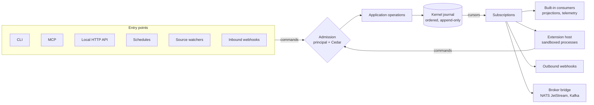

# 07 Extensibility: entry points, exit points and extensions

Owner requirement (2026-09-24): integrations **plug in and plug out**, consume
events to trigger other work, and never require a change to the core
application; the design must scale without a fixed limit.

The design gives Maestro two stable, versioned contracts and one supervised way
to run third-party code:

| Contract | Direction | What crosses it |
| --- | --- | --- |
| **Operations API** | Entry point (into Maestro) | Typed, versioned **commands** (`knowledge.publish`, `run.start`, …) under an authenticated principal |
| **Event stream** | Exit point (out of Maestro) | Typed, versioned **events** (`maestro.run.completed.v1`, …) read from the kernel journal with durable cursors |
| **Extension host** | Both | Supervised, sandboxed extension processes that subscribe to events and call operations, each with its own least-privilege principal |

The core never knows a specific integration. Adding, removing or replacing an
integration is a catalog change plus an activation, not a core release.



## 1. Principles

1. **One way in.** Every entry point turns a request into a command and goes
   through the same admission (identity, scope, Cedar) and the same application
   operations. No entry point owns logic.
2. **One way out.** Everything that happens is an event in the kernel journal.
   Built-in projections (Qdrant, Neo4j), telemetry and third-party integrations
   all consume the same stream the same way.
3. **Out of process first.** Third-party code never runs inside the core
   process. A crashing, slow or hostile extension cannot corrupt the kernel or
   block the core.
4. **Declared, reviewed, activated.** An extension is catalog content: declared
   with its subscriptions, commands, effects and resources, reviewed by its
   owners and security, released in a bundle, then **activated** separately on
   a machine. Publication never grants execution.
5. **At-least-once, idempotent, ordered per subject.** Delivery survives
   restarts; consumers deduplicate by event ID; order holds per stream key.
6. **The journal is the outbox.** The core commits an event once; delivery to
   every consumer happens afterwards, from the journal. A failing consumer never
   rolls back or delays a committed operation.

## 2. Entry points

| Entry point | Transport | Principal | Slice |
| --- | --- | --- | --- |
| CLI | Process arguments, JSON output | Local user | S1 |
| MCP server | stdio (Streamable HTTP later, authenticated) | Host session, agent node | S1 |
| Local HTTP API | axum on a Unix socket or loopback with a token; `POST /v1/commands/{name}`, `GET /v1/jobs/{id}`, `GET /v1/events` (server-sent events) | Authenticated local client | S4 |
| Schedules | Daemon timers declared in configuration (`every`, `cron`) | The schedule's service principal | S4 |
| Source watchers | Per-source synchronization policy (one-off, manual, watch) | The source's service principal | S6 |
| Inbound webhooks | HTTPS receiver with signature verification (e.g. GitHub `X-Hub-Signature-256`), mapped to a declared command | A service principal per webhook | Later, on demand |
| Extensions | Extension protocol `ops.invoke` | `Extension::"<id>"` | S4 |

**Command contract.** A command has a stable name and major version
(`run.start/1`), a JSON Schema input, an **idempotency key** bound to the
command and its frozen inputs (a retried request returns the existing job), and
a typed result or job handle. Acknowledgement is not completion: long commands
return a job ID that `jobs.wait` follows. Command schemas are generated from the
Rust types (schemars) and published in the Operations API reference.

## 3. Exit points: the event stream

### 3.1 Event envelope

Events use the **CloudEvents 1.0** envelope, so any standard tooling can read
them:

```json
{
  "specversion": "1.0",
  "id": "01J9Z0Q7…",
  "source": "maestro://workstation-7/kernel",
  "type": "maestro.knowledge.generation.published.v1",
  "subject": "collection/ctm",
  "time": "2026-09-24T14:03:11.402Z",
  "datacontenttype": "application/json",
  "dataschema": "maestro://schemas/events/knowledge.generation.published/1",
  "maestroscope": "workspace/default/collection/ctm",
  "maestrosequence": 18231,
  "traceparent": "00-4bf92f3577b34da6a3ce929d0e0e4736-00f067aa0bc902b7-01",
  "data": { "collection": "ctm", "generation": 8, "point_count": 81234 }
}
```

`maestrosequence` is the per-stream position; `traceparent` carries the W3C
trace context so a consumer's work joins the originating trace.

### 3.2 Event catalogue

| Family | Examples (all `.v1`) | Stream key |
| --- | --- | --- |
| Knowledge | `knowledge.import.completed`, `knowledge.revision.held`, `knowledge.generation.published`, `knowledge.generation.retired` | collection |
| Acquisition (S6) | `acquisition.run.completed`, `acquisition.item.withdrawn`, `acquisition.session.expired` | source |
| Catalog | `catalog.bundle.installed`, `catalog.bundle.revoked`, `catalog.extension.activated` | bundle |
| Runs | `run.started`, `run.interrupt.raised`, `run.node.completed`, `run.completed`, `run.cancelled` | run |
| Policy | `policy.decided` (denials and approvals only, redacted arguments) | run |
| Memory (S7) | `memory.checkpoint.committed`, `memory.restore.delivered` | session |
| Analysis (S8) | `analysis.job.ready`, `analysis.finding.submitted`, `analysis.contract.recorded`, `analysis.specification.promoted` | target, contract, specification |
| Provenance (S8) | `provenance.component.registered`, `provenance.obligation.raised` | component |
| Operations | `job.failed`, `health.degraded`, `backup.completed` | job, component |

Only events marked **public** in the catalogue reach extensions; internal events
(for example raw tool arguments) stay inside the core. Each public event type has
a JSON Schema generated from its Rust type.

**Versioning.** Within a major version, changes are additive only (new optional
fields). A breaking change introduces `.v2`; during a declared deprecation
window the core emits both. A CI compatibility test compares every schema with
its released predecessor.

### 3.3 Subscriptions and delivery

| Aspect | Design |
| --- | --- |
| Cursor | One durable cursor per subscription in the kernel (the B2 journal's `cursor`/`ack`) |
| Filter | Event-type patterns (`maestro.run.*`), scopes, subjects; scope filtering is enforced by the core against the subscriber's grants, not trusted from the filter |
| Start | From now, or replay from a position within retention (a new projection rebuild uses the same path) |
| Delivery | At least once; ordered per stream key; a subscriber acknowledges each event (or a batch) after processing |
| Backpressure | Bounded in-flight events per subscriber; the subscriber's lag is a metric and a health signal |
| Retries | Exponential backoff with jitter; after N failures the event moves to the subscriber's **dead-letter** list, inspectable and replayable with `maestro extension replay` |
| Isolation | Each subscriber has its own cursor; a stuck subscriber never delays another or the core |
| Redaction | Payload fields carry a classification; a subscriber receives only the classes its grant allows |

## 4. Extensions

### 4.1 What an extension can be

| Kind | Does | Example |
| --- | --- | --- |
| `subscriber` | Reacts to events | Post a summary to a chat channel when `run.completed`; open an issue when `knowledge.revision.held` |
| `notifier` | Outbound webhook with a signed payload | Notify a team service on `catalog.bundle.revoked` |
| `bridge` | Relays the stream to a broker | NATS JetStream or Kafka for team-scale consumers |
| `source-connector` | Leases frontier items and submits captures through `knowledge.capture.submit` | Private vendor connectors (ADR-0009): the frontier stays core-owned |
| `extractor` | Converts one media type to canonical Markdown under the extractor contract ([01 §3](01-knowledge-pipeline.md#3-l2-extraction-and-normalization)) | A format the core does not support |
| `tool-provider` | Exposes agent tools | An MCP server declared in `mcp/*.toml` (existing path in [03](03-agent-orchestration.md)) |
| `exporter` | Writes projections or reports elsewhere | A dashboard feed, an archive |
| `analyzer` | Leases an analysis job and submits findings about one target revision, with their evidence, coverage and limits ([09 §8](09-reverse-engineering.md#8-analyzers-are-extensions)) | A licence scanner, a code-property-graph query runner, an authorized traffic recorder |

New agent-facing tools keep using MCP servers and `step` nodes, which are
already sandboxed and policy-governed. The extension protocol serves system
integration: durable events and commands, which MCP does not provide.

### 4.2 Declaration

```toml
# maestro-manifests: extensions/run-notifier/extension.toml
id = "run-notifier"
version = "1.0.0"
owner = "@org/platform"
kind = "subscriber"
transport = "process"                    # process | webhook | bridge
command = ["run-notifier", "--stdio"]    # a released, checksum-pinned artifact
requires = { maestro-events = "^1", maestro-operations = "^1" }

[[subscribe]]
types = ["maestro.run.completed.v1", "maestro.run.cancelled.v1"]
scopes = ["workspace/*/project/*"]

[grants]
operations = ["run.status"]              # commands it may call
data_classes = ["public", "internal"]    # payload classes it may receive

[effects]
network = ["https://chat.example.org/api/"]   # egress allowlist
filesystem = []                                # none

[limits]
memory = "128MiB"
cpu = "0.2"
in_flight = 32
```

The catalog compiler validates the declaration like any resource: known event
types and majors, operations that exist, effects covered by Cedar policies,
limits within organizational ceilings. The artifact the command runs is
referenced by digest in the bundle; an unpinned executable is refused.

### 4.3 The extension host

The daemon ([03 §2.4](03-agent-orchestration.md#24-the-engine-durable-event-sourced-execution))
supervises extensions:

- **Process isolation**: each extension runs in the same sandbox as `step`
  nodes (Landlock, seccomp, network namespace with its egress allowlist,
  cgroup limits). Process separation alone is not treated as a security
  boundary.
- **Protocol**: JSON-RPC 2.0 over the process's stdio, the *Maestro Extension
  Protocol*: `initialize` (versions, capabilities), `events.deliver` /
  `events.ack` (push) or `events.poll` (pull), `ops.invoke`, `health`,
  `shutdown`. Small on purpose; any language can implement it.
- **Principal**: `Extension::"run-notifier"` in Cedar with exactly the declared
  grants; an extension cannot widen its own grants, and its outputs are
  untrusted data like any tool output.
- **Lifecycle**: start on activation, health checks, restart with backoff,
  graceful stop on deactivation; the runtime's **stop-all** stops every managed
  extension and disables schedules and watchers, and a supervisor never undoes
  it.
- **Hot plug**: activation, deactivation and upgrade happen without restarting
  the daemon or rebuilding the core.

```text
maestro extension list                      # declared in installed bundles, with state
maestro extension inspect run-notifier      # declaration, grants, effects, cursor, lag, dead letters
maestro extension activate run-notifier     # explicit, audited; creates the cursor
maestro extension deactivate run-notifier   # pauses delivery; cursor kept
maestro extension replay run-notifier --dead-letter
maestro extension remove run-notifier       # deletes the cursor after confirmation
```

### 4.4 Later options

- **WebAssembly components** (wasmtime + WIT interfaces) for small, pure,
  latency-sensitive extensions (filters, scorers, extractors): stronger
  in-process isolation than native plugins. Added only when an extension needs
  in-process speed.
- **Native dynamic libraries are excluded**: an unstable ABI and shared memory
  would let an extension crash or corrupt the core.

## 5. Scaling

| Level | Mechanism |
| --- | --- |
| Laptop | The SQLite journal and in-process delivery; hundreds of events per second are far above a single user's needs |
| Many consumers | Independent cursors; each subscriber scales on its own; the core's cost per extra subscriber is one cursor |
| Heavy consumers | A subscriber can shard its work by stream key; ordering holds per key |
| Team or cloud | A `bridge` extension relays public events to NATS JetStream (or Kafka), where any number of services subscribe with their own retention; the core is unchanged and remains the only authority |

The core never embeds a message broker; a broker is an exit point like any other.

## 6. Security

- Events are **data**; commands from extensions go through the same admission
  and Cedar evaluation as any caller.
- Outbound webhooks are signed (HMAC-SHA256 over the body and a timestamp) and
  restricted to declared destinations by the egress policy.
- Inbound webhooks verify the sender's signature before any command is created;
  an unverified request is dropped and counted.
- Activation, deactivation, grant changes and replays are journaled with the
  actor.
- A revoked bundle (see [03 §1.3](03-agent-orchestration.md#13-check-compile-release-install))
  deactivates its extensions at the next revocation check.

## 7. Delivery by slice

| Slice | Delivers |
| --- | --- |
| S1 | Journal with per-stream sequences, durable cursors and acknowledgements; built-in consumers (projections, telemetry) use them; the event catalogue starts with knowledge events |
| S4 | Extension host in the daemon, Maestro Extension Protocol, process extensions, outbound webhooks, local HTTP API with server-sent events, schedules; a reference `echo` extension in CI |
| S5 | Capabilities use subscribers (for example notifications); a contributed extension ships through the catalog |
| S6 | Source connectors as extensions; the private vendor connectors run this way |
| S8 | The `analyzer` kind and its contract; analysis and provenance events; analyzers run under an `analysis/<target>` scope and reach nothing else ([09](09-reverse-engineering.md)) |
| Later | Inbound webhooks, broker bridge, WebAssembly components, on demand |

## 8. Tests

| Test | Proves |
| --- | --- |
| Schema compatibility | No breaking change inside a major version |
| Redelivery | Killing the daemon or the extension mid-delivery loses nothing and duplicates are recognized by event ID |
| Slow and failing consumers | The core and other subscribers are unaffected; the dead-letter path works |
| Scope and redaction | A subscriber never receives events or fields outside its grants |
| Sandbox | An extension cannot reach undeclared hosts or paths |
| Hot plug | Activate, upgrade and deactivate without restarting the daemon |
| Stop-all | Every extension stops and stays stopped until an authorized start |
