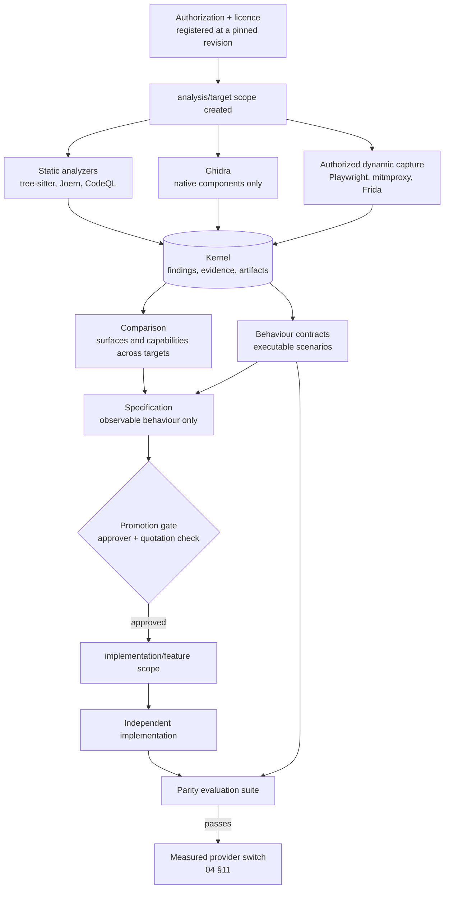

# 09 Reverse engineering and provenance

Owner requirement (2026-09-24): the reverse-engineering pipeline joins the
stack as a **later phase**, uses the knowledge core, and plugs into the
extension points as easily as a brick.

[04 §11](04-intelligence-backend.md#11-transition-from-existing-providers)
already says *what* replacing a provider requires: an evaluation suite first,
inventory without mutation, staged import, shadow reads, a measured switch. It
does not say *how* to learn what a provider does without inheriting its code,
its licence obligations or its mistakes. This document is that method, and the
capability that carries it.

It covers analysis of software Maestro is authorized to analyse: the providers
of the [04 §2](04-intelligence-backend.md#2-the-provider-analysis-distilled)
inventory, our own releases, and any component whose behaviour we must
understand to interoperate with it. It is **not** a licence to clone.

## 1. What this changes, and what it does not

The analysis that prompted this document recommends an architecture for a
unified code-and-memory product: one canonical event store, one provenance-
bearing graph, several coordinated retrieval indexes, explicit conflict
handling, a language-independent code intermediate representation, human
confirmation for destructive work, and stable MCP, HTTP, CLI and plugin
interfaces.

**Maestro already has all of it**, decided earlier and for its own reasons:

| Recommendation | Already in this design |
| --- | --- |
| Canonical immutable event store, one write path | B2 journal, [04 §3](04-intelligence-backend.md#3-the-kernel-building-blocks); one way in, [07 §1](07-extensibility.md#1-principles) |
| One graph for code, documents, memory and state, provenance mandatory | B8 facts and [02 §8.2](02-retrieval-and-knowledge-graph.md#82-graph-model): every relation carries evidence spans, validity and extraction method |
| Several coordinated indexes rather than one vector database | Routes R1–R6, [02 §3](02-retrieval-and-knowledge-graph.md#3-retrieval-routes) |
| Retrieval planner: classify, expand, filter, rerank, package | [02 §2](02-retrieval-and-knowledge-graph.md#2-query-understanding) through [§6](02-retrieval-and-knowledge-graph.md#6-evidence-assembly) |
| Corrections supersede, never overwrite; bitemporal validity | [04 §6](04-intelligence-backend.md#6-phase-i3--governed-semantic-and-temporal-knowledge) |
| Language-independent code representation from parser adapters | I2, [04 §5](04-intelligence-backend.md#5-phase-i2--code-intelligence) |
| Human confirmation, capability permissions, budgets, audit, review gates | [03 §4](03-agent-orchestration.md#4-the-policy-broker-cedar), [§5](03-agent-orchestration.md#5-sandbox), [§6](03-agent-orchestration.md#6-handoff-contracts-and-acceptance) |
| MCP, HTTP, CLI and a plugin boundary, language-neutral contracts | [07 §2](07-extensibility.md#2-entry-points), ADR-0013 |
| Rust core, adapters at the edges | [04 §1](04-intelligence-backend.md#1-scope-and-stance) |

Independent convergence is evidence that the design is sound; it is not a new
requirement, and nothing above is rebuilt. What the analysis adds is the part
Maestro did not have:

1. **Provenance as a first-class record** — which component came from where,
   under which licence, used in which way, and what that obliges us to do.
2. **A clean-room boundary** — analysis output and implementation work kept
   apart by the access tree, not by good intentions.
3. **Behaviour contracts** — executable descriptions of what a system does,
   which become the specification and the evaluation suite a reimplementation
   is measured against.
4. **An analyzer surface** — Joern, CodeQL, ScanCode, tree-sitter, Ghidra,
   Frida, mitmproxy and Playwright as interchangeable extensions, each
   submitting findings through one contract.

## 2. Stance

- **Analysis produces knowledge, never code.** An analyzer emits facts,
  evidence and contracts into the kernel. No analyzer output is ever compiled,
  copied into a source file, pasted into a prompt, or attached to a task.
- **Licence before analysis.** A component is registered with its origin,
  commit and licence before anything reads it. An unidentified licence is a
  refusal, not a warning.
- **Outcomes, not engines** ([04 §1](04-intelligence-backend.md#1-scope-and-stance)).
  Analysis tells us which outcome is worth having and how to verify it. The
  implementation is written from that specification.
- **Translation is not authorship.** Porting source into another language keeps
  the original licence and its obligations. Only an independent implementation
  written from observable behaviour is free of them, and only when the analysis
  material never reached the person or agent who wrote it.
- **Everything is authorized.** Each target names what permits the analysis: an
  open-source licence, our own ownership, or a written authorization. Absent
  that, the target is not analysed.
- **Facts carry their method.** A relation recovered from a decompiler, a
  runtime trace or an inference is never stored as if it came from source. The
  `extraction_method` of [02 §8.2](02-retrieval-and-knowledge-graph.md#82-graph-model)
  and the extractor contract of [01 §3](01-knowledge-pipeline.md#3-l2-extraction-and-normalization)
  already require this; analyzers obey the same rule.
- **Nothing is admitted automatically.** Analyzer findings are claims and
  proposals; they become accepted knowledge only through the admission of
  [04 §6](04-intelligence-backend.md#6-phase-i3--governed-semantic-and-temporal-knowledge).

## 3. The clean-room boundary

The one genuinely new invariant. Two scopes, one bridge, enforced by B1 and
Cedar rather than by discipline:

```text
analysis/<target>                 implementation/<feature>
  captures, decompiled text,        the repository, the agents that
  traces, findings, CPG exports,    write code, the review context
  provider source snapshots
            │                                   ▲
            │        specification only         │
            └──────────►  gate  ───────────────┘
                    approved, derived,
                    quoting nothing
```

| Rule | Enforcement |
| --- | --- |
| An `analysis/*` scope is never granted to a session that can write to the repository | Cedar policy with allow and deny fixtures; the grant is journaled |
| Only a **specification** crosses: observable inputs, outputs, formats, error behaviour, performance envelopes, acceptance scenarios | The bridge is a command, `analysis.specification.promote`, with an explicit approver |
| A promoted specification quotes no source, no decompiled expression, no internal identifier and no distinctive structure from the target | A promotion check refuses verbatim spans above a threshold against the analysis artifacts, and the approver signs off on the rest |
| Analysis artifacts are never attached to issues, prompts, handoffs or commits | Redaction classes of [07 §3.3](07-extensibility.md#33-subscriptions-and-delivery); analysis events carry a class no implementation principal is granted |
| The two sides keep separate evidence trails | Each promotion records the analysis claims it rests on, so an audit can ask "where did this requirement come from?" without exposing the material to the implementation side |

The boundary applies to agents exactly as to people: an agent session working in
`implementation/*` cannot retrieve `analysis/*` passages, because retrieval
filters by scope ([02 §1](02-retrieval-and-knowledge-graph.md#1-admission-and-scope))
and the grant does not exist.

**A permissively licensed component is different.** When we deliberately reuse
or port MIT or Apache-2.0 code, there is no clean room: the component is
imported, the licence and notices travel with it, and the provenance register
records it as `reused` or `ported`. The clean room exists for material we do
**not** want to inherit — proprietary components, unclear licences, and any case
where the obligation would be unacceptable to a public MIT repository.

## 4. The provenance register

One collection, `provenance`, whose records answer a single question for every
component we adopt, port or study: **what does this oblige us to do?**

| Field | Meaning |
| --- | --- |
| `component` | The unit we track: a crate, a module, an algorithm, a schema, a document |
| `origin` | Repository URL, or "independent" |
| `revision` | Exact commit or release tag, frozen; not a branch |
| `licence` | SPDX identifier, resolved from the source, not from a summary |
| `usage` | `reused`, `modified`, `ported`, `specification-only`, `independent` |
| `target` | Where it lands in our tree |
| `obligations` | Notices, attribution, modification notes, source offers, restrictions |
| `evidence` | The artifact digests and spans the determination rests on |
| `decided_by`, `decided_at` | The person who accepted the obligation |

The five usage classes are the register's point. `specification-only` and
`independent` carry no obligation and must therefore prove the clean room held;
`reused`, `modified` and `ported` carry the original licence and must prove the
notices ship. A component with no class is not a component we may build on.

A ScanCode-class analyzer produces the candidate records — licences, copyright
notices, package metadata, dependencies and their transitive tree — and every
record is a claim reviewed before it is accepted. The register feeds the
supply-chain obligations already in [05 §6.2](05-platform-and-operations.md#62-supply-chain)
and requirement N09 of [04 §10](04-intelligence-backend.md#10-quality-targets-and-gates):
SBOMs, notices and redistribution review for code, binaries, parsers, models,
tokenizers and datasets. It extends them from *our dependencies* to *anything we
learned from*.

**Licence claims recorded so far are unverified.** The source analysis reported
MIT for Utopia OS, CodeGraph and MemPalace, Apache-2.0 with a `NOTICE` file for
Graphify, and could not identify Semantica at all. Those statements were not
established against the repositories, so they enter the register as claims to
re-establish at R1, at a pinned revision, with the licence file as evidence.
Maestro's own repositories are public and MIT: an Apache-2.0 `NOTICE`
obligation, a copyleft licence or an unidentified licence changes what we may
ship, so the determination is made before any component is adopted, never after.

## 5. Static analysis

| Analyzer | Produces | Used for |
| --- | --- | --- |
| **tree-sitter** | Symbols, definitions, references, imports per language | Already the basis of the I2 code collection; the same adapters serve analysis targets |
| **Joern** | A code property graph joining syntax, calls, control flow and data flow, queryable across languages | Comparing several codebases on the same questions: where knowledge is written, which paths reach a store, where authorization is checked, how ingestion reaches recall |
| **CodeQL** | A queryable database per codebase with precise data-flow queries | Narrow questions Joern answers imprecisely: whether untrusted content reaches a prompt, whether one scope's identifier can reach another's query |
| **Ghidra** | Disassembly and decompiled pseudocode | Native components only (§6) |

Joern and CodeQL are **research instruments**, not runtime dependencies. They
run inside the analysis scope, under the sandbox of
[03 §5](03-agent-orchestration.md#5-sandbox), on a pinned revision, and their
output is normalized before it enters the kernel. Neither is required to build
or run Maestro, and neither ships in a release.

Findings are normalized to the entity and relation vocabulary Maestro already
has ([02 §8.2](02-retrieval-and-knowledge-graph.md#82-graph-model)), extended
with the analysis entities a comparison needs:

```text
Target        one analysed system at one revision
Component     a module, crate or package inside a target
Surface       an externally observable entry point: CLI command, HTTP route,
              MCP tool, library entry, file format
Capability    an outcome a surface delivers, comparable across targets
Finding       an analyzer's observation, with its analyzer, version and query
Obligation    a licence requirement attached to a component
```

`Surface` and `Capability` are deliberately the vocabulary of the provider
inventory in [04 §2](04-intelligence-backend.md#2-the-provider-analysis-distilled),
which counted 1,432 surfaces by hand. The analyzers make that inventory
reproducible: a re-run at a new revision produces a diff instead of a rewrite.

**CodeQL's terms differ between public and private repositories.** Its use is
recorded per target in the register, and a target whose terms do not permit the
analysis is analysed with Joern and tree-sitter alone.

## 6. Native binaries

Ghidra has one bounded job: a compiled component we lawfully possess whose
source we do not have, and whose behaviour we must understand to interoperate
with it or to verify it.

| Use it when | Do not use it when |
| --- | --- |
| Only an executable or shared library exists | The source is published |
| A packaged application contains a native component that is not otherwise available | The logic is Python or JavaScript |
| An undocumented local format or protocol must be read | The behaviour lives on a remote server |
| A released binary must be checked against its published source | The goal is names, comments, tests, rationale or configuration |
| A legacy component's source is lost | The goal is to translate an application into another language |

What compilation destroys does not come back: identifiers, comments, module
boundaries, generic types, tests, build configuration, history, and everything
that was never in the client. A decompiler recovers *an* implementation, not
*the* implementation, and answers none of the questions that matter — which
design is stronger, which algorithm performs better, which behaviour is
essential rather than accidental.

Ghidra therefore runs headless, inside the analysis scope, as one analyzer among
others. Its output is decompiled text: the most strongly quarantined class in
the register, never promoted, never quoted, never shown to an implementation
session.

## 7. Behaviour contracts

The most valuable output of the whole pipeline, because it is the one that
becomes a gate.

A behaviour contract describes what an authorized system does, from the outside,
as executable checks:

```text
Store a memory.
Restart the process.
Search with a paraphrase.          → the memory is returned
Correct the memory.
Search again.                      → the correction is returned
Ask as of the earlier date.        → the previous version is returned
Delete the project.
Search again.                      → nothing is returned
```

| Instrument | Captures | Becomes |
| --- | --- | --- |
| **Playwright** | End-to-end journeys through a user interface or an API | Scenario suites, the acceptance scenarios a replacement must pass |
| **mitmproxy** | Authorized HTTP, HTTPS and WebSocket conversations | An independent API specification: routes, request and response shapes, status codes, error envelopes |
| **Frida** | Function calls, arguments and return values in an authorized native process | Which code path answers which action, when Ghidra shows structure but not use |

Contracts derived this way feed the evaluation suites that
[04 §11](04-intelligence-backend.md#11-transition-from-existing-providers) step 2
already demands, and the parity gates of
[04 §10](04-intelligence-backend.md#10-quality-targets-and-gates). This closes
the loop: **a provider is replaced when the native capability passes the
contract derived from the provider itself**, measured, not asserted.

Captured material is evidence, not product. Credentials, tokens, personal data
and proprietary server responses are quarantined at capture and never become
fixtures; a contract keeps the shape of a response, never a payload we were not
given rights to.

## 8. Analyzers are extensions

Each instrument is an **extension** of a new kind, `analyzer`, added to the kinds
of [07 §4.1](07-extensibility.md#41-what-an-extension-can-be). Nothing about the
core changes when one is added, replaced or removed: that is the requirement
this design answers.

An analyzer:

- runs out of process, sandboxed, with its own Cedar principal, like every
  extension ([07 §4.3](07-extensibility.md#43-the-extension-host));
- receives work by leasing analysis jobs (B4), the way a source connector leases
  frontier items;
- submits findings through one command, `analysis.finding.submit`, with the
  analyzer's name, version, query or configuration, the target revision, and the
  evidence digests its finding rests on;
- is granted the `analysis/<target>` scope and nothing else, so an analyzer
  cannot read the repository, reach the network beyond its declared allowlist,
  or write canonical knowledge.

```toml
# maestro-manifests: extensions/joern-analyzer/extension.toml
id = "joern-analyzer"
version = "1.0.0"
owner = "@org/platform"
kind = "analyzer"
transport = "process"
command = ["joern-analyzer", "--stdio"]
requires = { maestro-events = "^1", maestro-operations = "^1" }

[[subscribe]]
types = ["maestro.analysis.job.ready.v1"]
scopes = ["analysis/*"]

[grants]
operations = ["analysis.finding.submit", "jobs.heartbeat"]
data_classes = ["analysis"]

[effects]
network = []
filesystem = ["analysis-workspace"]

[limits]
memory = "8GiB"
cpu = "4"
in_flight = 1
```

**The analyzer contract**, in the shape of the extractor contract of
[01 §3](01-knowledge-pipeline.md#3-l2-extraction-and-normalization): every
analyzer returns the same result regardless of the instrument behind it —
findings as typed entities and relations, the evidence each rests on, the
analyzer and configuration versions, coverage (what it examined), limits (what
it could not examine), and the method (`source`, `bytecode`, `binary`,
`runtime`, `network`, `inferred`). One qualified analyzer is selected per
question class; instruments are alternatives behind this contract, never
consecutive stages whose findings silently merge.

A missing edge is never proof of absence. Coverage and limits are stored beside
every finding for exactly this reason, and a comparison that cites a finding
cites its coverage too.

New event types, all `.v1`, joining the catalogue of
[07 §3.2](07-extensibility.md#32-event-catalogue):

| Event | Stream key |
| --- | --- |
| `analysis.job.ready`, `analysis.job.completed` | target |
| `analysis.finding.submitted` | target |
| `analysis.contract.recorded` | contract |
| `analysis.specification.promoted` | specification |
| `provenance.component.registered`, `provenance.obligation.raised` | component |

Only `provenance.*` events carry a class an implementation principal may
receive. `analysis.*` events stay inside the analysis scope.

## 9. What the knowledge core gets

The pipeline writes into the kernel that already exists, and reads back through
the retrieval that already exists. No second store, no second pipeline — the
rule of [04 §1](04-intelligence-backend.md#1-scope-and-stance) holds here too.

| Kernel block | What analysis puts in it |
| --- | --- |
| B1 scopes | `analysis/<target>` and `provenance` scopes, granted explicitly |
| B2 journal | Every analysis job, finding, contract, promotion and obligation |
| B3 artifacts | Captures, CPG exports, traces, recordings, decompiled text, each addressed by digest and classified |
| B4 jobs | One analysis run per target and revision, resumable, with coverage receipts |
| B5 documents | A target's own documentation and specifications as a source, canonicalized like any other |
| B7 evidence | The span behind every finding, so a claim about a target can be traced to the line that produced it |
| B8 facts | Targets, components, surfaces, capabilities, findings and obligations, with validity: a finding is true of a revision, not forever |

And it reads back: once analysis is in the kernel, the existing routes answer
questions across every analysed system at once, with citations —

```text
Which of these systems separates capture from admission, and how?
Which surfaces exist in three of them and none of ours?
Which components would oblige us to ship a NOTICE?
What did this capability look like at the revision we measured?
```

— through the same `knowledge_search`, `knowledge_ask` and graph tools of
[02 §9](02-retrieval-and-knowledge-graph.md#9-mcp-tools-knowledge), filtered by
scope, so an implementation session simply never sees them.

## 10. Legal boundary

**This is not legal advice**, and the answer differs by jurisdiction. A licence
and intellectual-property review gates any distribution of a component this
pipeline informed. What follows is the boundary the design assumes:

- Canada's Copyright Act, section 30.61, permits certain copying for the sole
  purpose of obtaining interoperability information; section 41.12 adds a narrow
  interoperability exception for circumventing a technological protection
  measure on a lawfully obtained program. Both are limited, and neither permits
  a feature-for-feature clone.
- In the United States, 17 U.S.C. §1201(f) is similarly narrow: elements needed
  for interoperability of an independently created program, with lawful access.
- EU software law permits studying a program's behaviour, and decompilation
  where indispensable for interoperability, while restricting use of the result
  to produce software substantially similar in protected expression; patents,
  trademarks, trade secrets, unfair competition and contract law are untouched
  by it.

In practice, ranked from safest:

| Activity | Position |
| --- | --- |
| Learning a concept, then implementing it independently | Safe, and the intended path |
| Reimplementing a documented API or an interoperable format | Safe when the specification is derived from observable behaviour |
| Reusing permissively licensed code with its notices | Safe, and recorded as `reused` or `modified` |
| Porting source into another language | Derivative: the original licence and its obligations travel with it |
| Translating decompiled output line by line | Refused |
| Circumventing activation, licensing, authentication or DRM | Refused, separately from copyright |
| Copying names, logos, artwork, documentation, error messages, sample data, prompts, keys or user data | Refused |

Copyright is not the only exposure: a clean implementation can still meet a
patent, trademark, trade-secret, privacy or contract problem. That is why the
register records obligations rather than licences alone, and why promotion has a
named approver.

## 11. The process, end to end



1. **Register** the target: authorization, origin, revision, licence, evidence.
   Nothing is read before this record exists.
2. **Open** the `analysis/<target>` scope; grant it to analyzers and to the
   analysis session, never to an implementation session.
3. **Analyse**: static first, because it keeps names, types, tests and
   structure; native and runtime only for what static analysis cannot reach.
4. **Normalize** findings into targets, components, surfaces and capabilities,
   each with coverage, limits, method and evidence.
5. **Compare** across targets, on the same questions, and record which outcome
   is worth having and why. Disagreements stay visible.
6. **Derive behaviour contracts** from authorized observation, and make them
   executable.
7. **Write the specification**: inputs, outputs, formats, errors, performance
   envelopes, acceptance scenarios. No quotation, no internal identifier, no
   distinctive structure.
8. **Promote** it through the gate, with an approver and the quotation check.
9. **Implement** independently, on the other side of the boundary, with our own
   names, structures, messages and documentation.
10. **Verify** against the contracts and the parity gates, not against the
    original code.
11. **Review** licences and obligations before distribution; keep the register
    current as revisions move.

The provenance register and the evidence trail make that sequence auditable
after the fact, which is the point: an assertion that a clean room was kept is
worth nothing; a record of who held which scope, when, and what crossed the
gate, is worth something.

## 12. Delivery

Slice **S8**, [06](06-roadmap.md#s8-provenance-and-reverse-engineering--m8),
after S7-I2, in four stages:

| Stage | Delivers | Depends on |
| --- | --- | --- |
| **R1 Provenance register** | The `provenance` collection, usage classes, the ScanCode-class analyzer, obligations attached to components, notices generated from the register | S1 |
| **R2 Static analysis** | The `analyzer` extension kind, the analyzer contract, analysis jobs and scopes, Joern and CodeQL analyzers, normalization to surfaces and capabilities, the comparison report | S4, S7-I2 |
| **R3 Behaviour contracts** | Authorized capture through Playwright and mitmproxy, contracts as executable suites, parity suites generated from them; Frida and Ghidra analyzers for native components | S4, R2 |
| **R4 Clean-room promotion** | The `analysis/*` boundary in Cedar with allow and deny fixtures, `analysis.specification.promote`, the quotation check, the promotion audit trail | R2 |

R1 is the stage most likely to be pulled forward: the moment a provider
replacement starts under S7, its component must already be registered. If that
happens, R1 ships with the phase that needs it and S8 keeps the rest.

## 13. Tests

| Test | Proves |
| --- | --- |
| Scope isolation | An implementation principal cannot read an `analysis/*` passage, event or artifact, through any route or cache |
| Promotion refusal | A specification quoting analysis material is refused, and the refusal names the span |
| Register completeness | A component without an origin, revision, licence and usage class blocks the build that would ship it |
| Obligation coverage | Every `reused`, `modified` or `ported` component's notices appear in the release, verified against the register |
| Analyzer contract | Two analyzers answering the same question produce comparable findings with their own coverage and limits, and neither is silently merged into the other |
| Coverage honesty | A finding whose analyzer did not examine a path reports that path as unexamined, not as absent |
| Capture hygiene | Credentials, tokens and personal data captured by a dynamic analyzer are quarantined and never reach a fixture |
| Revision binding | A finding is invalidated when its target revision moves, and an `as_of` query returns what was true at the measured revision |

## 14. Explicitly not built

- A decompiler, a code-property-graph engine, a licence scanner or an
  instrumentation toolkit of our own. Each is an instrument behind the analyzer
  contract, replaceable and never shipped.
- Automatic translation of any analysed code into Maestro's source tree.
- An analyzer with write access to canonical knowledge, or to anything outside
  its own analysis scope.
- Circumvention of activation, licensing, authentication or protection measures,
  for any purpose.
- Analysis of a target without a recorded authorization and a resolved licence.
- A second provenance record: the register is the one place, and the SBOM and
  notices are generated from it.
