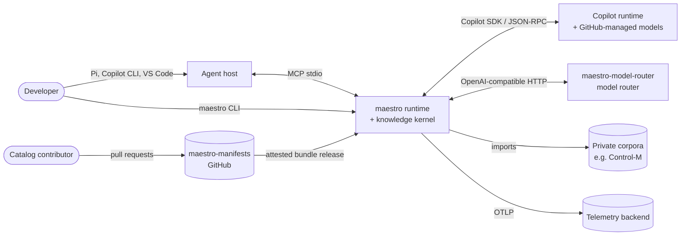
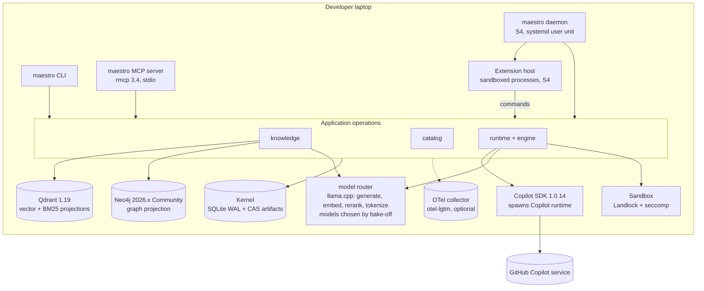

# Maestro architecture

**Status:** design of record, 2026-09-23, completed 2026-09-24. It replaces the
earlier plans in this repository (the 2026-09-22 unified delivery plan, the
provider product specs and the ingestion specs) as the plan of record, but it
**does not discard their content**: every requirement, user decision and
technology they contain is traced in [08](08-traceability.md) as kept, adapted,
deferred or dropped with a stated reason. Owner decisions recorded there bind
this design.

**Scope:** the whole platform: the agent catalog (`maestro-manifests`), the
runtime and orchestration (`maestro-core`), the knowledge pipeline (RAG and
knowledge graph), and the building blocks of the future intelligence backend
(memory, code intelligence, temporal knowledge, workbench).

**How to read:** this page gives the system at a glance, the technology matrix
and the invariants. Each layer has its own document:

| Document | Covers |
| --- | --- |
| [01 Knowledge pipeline](01-knowledge-pipeline.md) | Acquisition, extraction, normalization, canonicalization, deduplication, chunking, representations, indexing |
| [02 Retrieval and knowledge graph](02-retrieval-and-knowledge-graph.md) | Query understanding, retrieval routes, fusion, reranking, evidence assembly, grounded generation, GraphRAG |
| [03 Agent orchestration](03-agent-orchestration.md) | Catalog, workflow graphs, the orchestration engine, Copilot SDK and llama.cpp sessions, policy broker, sandbox, handoff contracts |
| [04 Intelligence backend](04-intelligence-backend.md) | The provider analysis distilled, the kernel building blocks, memory and continuity, code intelligence, temporal knowledge, workbench |
| [05 Platform and operations](05-platform-and-operations.md) | Observability, evaluations and benchmarks, security, supply chain, deployment, data management, CI/CD |
| [06 Roadmap](06-roadmap.md) | Slices S0–S7, exit criteria, estimates, tracks, risks |
| [07 Extensibility](07-extensibility.md) | Entry points, the event stream (exit points), extensions that plug in and out without core changes |
| [08 Traceability](08-traceability.md) | Every earlier requirement and decision, with its status and location in this design |
| [ADRs](../adr/README.md) | The hard-to-reverse decisions and their trade-offs |
| [Constitution](../../.specify/memory/constitution.md) | The non-negotiable principles and gates |
| [Glossary](../../CONTEXT.md) | The domain vocabulary every document and identifier uses |

## 1. What Maestro is

Maestro is an organizational agent platform that removes the plumbing from
agentic development while keeping every action governed and every answer
traceable.

1. **A catalog** (`maestro-manifests`): agents, skills, instructions, prompts,
   workflow graphs, policies and handoff contracts, authored in the formats
   GitHub Copilot reads natively, owned section by section through CODEOWNERS
   and released as attested, immutable bundles. Anyone may propose a change;
   owners approve it.
2. **A runtime** (`maestro-core`): one binary, `maestro`, that installs the
   catalog, routes a developer's intent to a workflow graph, and executes that
   graph with GitHub Copilot and local llama.cpp models under a host-owned
   policy broker, a sandbox, typed handoff contracts and a durable journal.
3. **A knowledge kernel** (`maestro-core`): the authoritative store and the
   pipeline that turns sources into canonical documents, chunks, vectors and a
   knowledge graph, and serves source-backed evidence through MCP. Control-M
   documentation is its first collection; the agent catalog is its second.
4. **The intelligence backend** (later slices): memory and continuity across
   sessions, code intelligence and governed temporal knowledge, built on the same
   kernel instead of a second store, with a native Rust desktop workbench.
   Existing providers (MemPalace, codebase-memory, graphify, …) stay in service
   until a native capability matches them on an evaluation.
5. **Open edges**: every entry point turns requests into the same commands, and
   every outcome is an event on a durable stream, so integrations plug in and
   out as sandboxed extensions without changing the core
   ([07](07-extensibility.md)).

## 2. System context



Trust boundaries: the developer and the catalog owners are trusted principals;
catalog content is reviewed data; sources, retrieved passages, model outputs and
tool outputs are **untrusted data**. Only the host (the `maestro` process)
decides what executes.

## 3. Containers



One process image serves three entry points (CLI, MCP, daemon, which also
serves the local HTTP API and schedules). All of them call the same application
operations; no transport owns logic. The daemon's extension host runs
subscribers and connectors that read the journal's event stream through durable
cursors and call operations as their own principals. The kernel is the only
authority. Qdrant and Neo4j hold **projections** that can be deleted and rebuilt
from the kernel at any time.

## 4. Layer map

| # | Layer | Responsibility | Home (crate/module) | Key technology | Slice |
| --- | --- | --- | --- | --- | --- |
| L1 | Acquisition | Fetch authorized sources into immutable captures | `maestro-knowledge::acquire` (+ private connector extensions) | reqwest 0.13, Spider over CDP, robots (RFC 9309), sitemaps | S1 import, S6 native |
| L2 | Extraction | Captures → faithful Markdown with provenance | `maestro-knowledge::extract` | htmd 0.5, dom_smoothie 0.18, Xberg or docling.rs per media type, calamine | S6 (S1 imports Markdown) |
| L3 | Canonicalization | Markdown → typed, replayable canonical document | `maestro-canonicalization` | pulldown-cmark 0.13.4 | S0 (existing) |
| L4 | Deduplication | Exact groups; near-duplicate version groups | `maestro-canonicalization`, `maestro-knowledge::prepare` | SHA-256, MinHash | S1 |
| L5 | Chunking | Structural chunks with mapped spans, budgeted in the selected embedder's tokens | `maestro-canonicalization` | router `/tokenize` of the selected embedding model | S1 |
| L6 | Representations | Dense, sparse, entity and (later) late-interaction vectors | `maestro-knowledge::represent` | Embedder selected by bake-off, Qdrant BM25 | S1 |
| L7 | Indexing | Generation-versioned projections, atomic alias switch | `maestro-knowledge::index` | Qdrant 1.19 + qdrant-client 1.19 | S1 |
| L8 | Knowledge graph | Entities, relations, claims with evidence; graph projection | `maestro-knowledge::graph` | Neo4j 2026.x + neo4rs; petgraph 0.8 | S2 |
| L9 | Retrieval | Routes, fusion, rerank, evidence bundles | `maestro-knowledge::search` | RRF, reranker selected by bake-off | S1, S2 |
| L10 | Generation | Grounded, cited answers with deterministic guards | `maestro-knowledge::answer` | Generator selected per role by bake-off; JSON-schema output | S1 |
| L11 | Catalog | Parse, compile, sign, install and route the catalog | `maestro-catalog` | Copilot `.agent.md`/`SKILL.md`, jsonschema 0.57 | S3 |
| L12 | Orchestration | Workflow graphs as durable, event-sourced state machines | `maestro-runtime::engine` | petgraph, kernel journal | S4 |
| L13 | Execution | Agent sessions, providers, hooks, broker, sandbox, contracts | `maestro-runtime` | github-copilot-sdk 1.0.14, cedar-policy 4.13, landlock 0.4 | S4 |
| L14 | Memory and continuity | Session capture, checkpoints, restore bundles, facts | `maestro-kernel`, `maestro-memory` | kernel journal, graph projection | S7-I1 |
| L15 | Code intelligence | Code collections, symbol graph, impact | `maestro-code` | tree-sitter 0.27, SCIP later | S7-I2 |
| L16 | Observability and evals | Traces, metrics, eval suites, benchmarks | `maestro-kernel::telemetry`, `maestro-eval` | opentelemetry 0.33, GenAI conventions | S1 → |
| L17 | Security | Threat model, policy, secrets, supply chain | cross-cutting | Cedar, Landlock, rust-workflows gates, attestations | S0 → |
| L18 | Operations | Install, services, backup, doctor | `maestro` | systemd user units, XDG paths | S1 → |
| L19 | Extensibility | Entry points, public event stream, extension host | `maestro-kernel::journal`, `maestro-runtime::extensions` | CloudEvents 1.0 envelope, JSON-RPC 2.0 extension protocol | S1 (stream), S4 (host) |

## 5. Technology matrix

Versions are the current stable releases on 2026-09-23. Every pin is qualified
in the slice that introduces it; a version here is a starting point, not a claim
that the combination has been tested.

| Component | Choice | Role | Alternatives considered | Why this choice | Risk / qualification |
| --- | --- | --- | --- | --- | --- |
| Language/toolchain | Rust 1.98.1, edition 2024, MSRV 1.94 | Everything first-party | — | Org standard; the Copilot SDK requires 1.94 | Workspace MSRV checked by rust-workflows |
| CI | `Orchestration-Maestro/rust-workflows` v1.2.1 | Gates, releases, attestations | — | Production-proven on release-canary | Pinned by commit with tag comment |
| Authority store | SQLite (rusqlite 0.40.2, bundled), WAL | Scopes, journal, jobs, facts, catalog state | Postgres, SurrealDB 3.2 | Embedded, zero-ops on a laptop, transactional, one file to back up | Single writer: short transactions, no I/O inside them |
| Artifact store | Content-addressed files (SHA-256, zstd 0.14 optional) | Originals, canonical JSON, bundles, reports | Object store | Immutable, verifiable, deduplicated, rsync-able | fsync + atomic rename; verify on read |
| Vector + lexical index | Qdrant 1.19 server + qdrant-client 1.19.0 | Dense, BM25 sparse, payload filters, aliases | Qdrant Edge 0.8 (embedded), LanceDB 0.39, tantivy 0.26 | Mature hybrid queries, server-side BM25, aliases for atomic generations | Edge evaluated before the laptop rollout (ADR-0003) |
| Graph projection | Neo4j 2026.x Community + neo4rs 0.9 | Traversal, paths, Leiden communities, centrality | LadybugDB (lbug 0.20, embedded), SurrealDB 3.2, FalkorDB, SQLite + petgraph | Mature Cypher and graph algorithms; user-selected pairing with Qdrant | JVM footprint; Bolt compatibility of neo4rs with 2026.x; LadybugDB spike (ADR-0004) |
| Canonicalization | `maestro-canonicalization` (in repo) | Canonical documents, dedup, chunking | — | Already built, tested and fixture-backed | Strict lints and file-size limits applied in S0 |
| Token counting | llama.cpp `/tokenize` of the **selected** embedding model, through the router | Chunk budgets that the embedder will honour | Native `llama-tokenize` subprocess (kept for parity), HF `tokenizers` 0.23 | Same vocabulary as the embedder, no machine paths, no process per count | Ordered-ID parity test against the native counter; a new embedder means a new chunk profile (ADR-0008) |
| Models (every role) | **None preselected.** Each role (embedder, reranker, generator, extractor, judge, agent roles) is filled by the winner of a recorded bake-off on our eval suites | Quality, latency, VRAM and licence decide | See [model selection](05-platform-and-operations.md#3-model-selection) for the candidate pools | "Use the best one", measured on our data, not on a leaderboard | Winners bound in model cards (GGUF hash, template, server build); re-run on any change (ADR-0011) |
| Sparse | Qdrant server-side `qdrant/bm25` | Exact terms, identifiers, error codes | Learned sparse (e.g. BGE-M3 sparse, SPLADE), tantivy | No model to serve; available self-hosted | Tokenizer settings qualified on technical identifiers; learned sparse enters the bake-off |
| Agent runtime | github-copilot-sdk 1.0.14 (no `bundled-cli`) | Sessions, tools, hooks, custom agents, BYOK | Custom agent loop on raw HTTP | Official, Rust, hooks + permission handler + BYOK | CLI installed through the pinned toolbelt, not downloaded at build time |
| Local inference | maestro-model-router router (llama.cpp) | OpenAI-compatible generate/embed/rerank/tokenize with VRAM budgeting | Ollama, vLLM | Ours, running, budgets VRAM across models | Imported into the org in S0 |
| MCP | rmcp 3.4.1, spec 2026-07-28 | Knowledge, catalog and run tools for any host | — | Official Rust SDK; long-running tasks | stdio first; Streamable HTTP later |
| Workflow engine | In-house, event-sourced on the kernel journal (petgraph 0.8.3) | Durable graph execution, interrupts, budgets | Restate 0.12 (server), graph-flow 0.8, Temporal | Semantics are host-specific (broker, contracts, acceptance); no extra service | Crash/replay tests are part of S4 exit (ADR-0006) |
| Policy engine | cedar-policy 4.13 | Tool/operation authorization from catalog policies | regorus 0.12 (Rego), hand-written rules | Formally verified, analyzable, schema from MCP tools (cedar-for-agents) | Policy test suite per rule (allow neighbour + deny case) |
| Sandbox | Landlock 0.4.7 + seccompiler 0.5; bubblewrap for network namespaces | Confine step nodes and shell tools | gVisor, Firecracker, containers | Kernel-enforced, no daemon, what Codex ships on Linux | Linux only at first; other OS qualified separately |
| Contracts | JSON Schema 2020-12, jsonschema 0.57, schemars 1.2 | Handoff and result validation | — | Typed, language-neutral, Copilot-compatible | Semantic checks beyond schema per workflow |
| HTML | Site selectors + htmd 0.5.5 handlers; dom_smoothie 0.18 readability only if it beats htmd alone | Main content, HTML → Markdown | Crawl4AI (current Python), readability.js | Rust, fast, controllable handlers | Fidelity suite: code, tables, nesting, admonitions |
| Documents | Xberg (the Kreuzberg continuation, Rust core) or docling.rs (Rust Docling port: PDFium + ONNX), one selected per media type | PDF/Office structure, tables, optional OCR | Python Docling (comparison oracle), pdf-inspector (lightweight PDF route), MinerU, Marker | Rust-first; engines are alternatives behind one extractor contract | Fidelity bake-off on real documents; model assets prefetched; offline tests |
| Crawling | Spider 2.53 driving Chrome over CDP as the fetch and render engine behind our frontier; reqwest for plain HTTP | HTTP, browser-network and rendered fetch | chromiumoxide 0.9 (fallback driver), Crawlberg, Crawl4AI (current) | One frontier owner (ours); the browser network stack where hosts fingerprint clients | Per-request policy hooks qualified; otherwise a smaller enforcing HTTP/CDP driver |
| Extensions | In-house extension host; JSON-RPC 2.0 over stdio; CloudEvents 1.0 events | Plug-in and plug-out integrations | Native dynamic libraries (rejected), MCP only (no durable delivery), embedded broker (rejected), WebAssembly components (later) | Isolation, any language, durable delivery from the journal | Schema compatibility tests; sandboxed like step nodes (ADR-0013) |
| Local HTTP API | axum | Commands, jobs, server-sent events | — | Standard, Tokio-native | Unix socket or loopback with a token; never trusted by address alone |
| Code parsing | tree-sitter 0.27 | Code collections and symbol graph | rust-analyzer/SCIP | Many languages, incremental | S7 |
| Telemetry | tracing 0.1.44, tracing-opentelemetry 0.34, opentelemetry-otlp 0.33 | Traces, metrics, logs | — | Standard; GenAI semantic conventions (development status) | Attribute names pinned in one module |
| CLI | clap 4.6 | Commands, help, JSON output | — | Standard | Contract tests on output and exit codes |
| Evals | In-house runner (`maestro eval`) | Retrieval, answer, graph, routing and workflow suites | RAGAS (Python), DeepEval | Metrics are simple; suites stay in Rust and data | Judge model qualified against human labels |
| Spec process | GitHub Spec Kit 1.0.1 (`specify`) | Constitution, spec, plan, tasks per slice | superpowers specs only | Structured, agent-friendly, Copilot integration | Evals and tests are the gates, not prose |

## 6. Invariants

These hold in every slice and are enforced by tests, not by prose.

1. **One authority, many projections.** The kernel (SQLite + artifacts) is the
   only source of truth. Qdrant collections, Neo4j graphs and caches are
   generation-stamped projections, rebuildable from the kernel; losing one loses
   no information.
2. **Provenance is never dropped.** Every chunk, vector, entity, relation, claim,
   answer and handoff can be traced to exact source bytes (digest + span) and to
   the profile that produced it.
3. **Data is not authority.** Source text, retrieved passages, model output,
   tool output and catalog prose never grant a permission. Only the host broker,
   evaluating reviewed policy against trusted facts, allows an effect.
4. **No silent degradation.** No provider fallback, no truncation, no skipped
   gate, no empty-green test. A missing capability is a typed refusal with a
   remediation.
5. **Missing is not zero.** Metrics and evaluations carry availability
   (observed / reported / estimated / unavailable); unknown is never counted as
   success or as zero cost.
6. **Deterministic where it can be.** Identities are content-derived; replays
   reproduce; the same inputs, profiles and generation give the same outputs.
7. **Local first, explicit egress.** Local models by default; the managed
   Copilot route is an explicit, per-node provider profile; network access from
   tools is denied unless a policy allows the exact destination.
8. **The core never knows an integration.** Integrations enter through the
   commands every entry point uses and leave through the public event stream;
   adding or removing one is a catalog change and an activation, never a core
   release.

## 7. Repositories

| Repository | Visibility | Owns |
| --- | --- | --- |
| `maestro-core` | public | The Rust workspace: kernel, knowledge, catalog, runtime, `maestro` binary, architecture and specs |
| `maestro-manifests` | public | Catalog content in Copilot-native formats, contracts, policies, workflow graphs, eval scenarios; release of attested bundles |
| `maestro-model-router` | public | The model router (llama.cpp supervision, VRAM budget, OpenAI-compatible endpoints) |
| `ctm-collection` | **private** | The Control-M collection: corpus export, source policy, BMC connectors, private eval questions |
| `rust-workflows`, `.github` | public | CI, releases, organization policy (existing) |

Generic engines are public; anything tied to a vendor's authenticated portals,
licensed content or private questions stays private (ADR-0009).

## 8. Workspace layout of `maestro-core`

Crates appear only when their slice delivers working behaviour.

```text
crates/
  maestro-canonicalization/    L3–L5  (existing crate, renamed from document-canonicalization in S0)
  maestro-conventions/         S0     the repository's conventions as tests CI runs
  maestro-kernel/              S1     scopes, journal, artifacts, jobs, generations, telemetry
  maestro-knowledge/           S1     collections, import, prepare, represent, index, search, answer, eval; S2 graph
  maestro-catalog/             S3     parse, compile, verify, install, route, project
  maestro-runtime/             S4     engine, sessions, providers, broker, sandbox, contracts
  maestro/                     S1     the binary: CLI + MCP server (+ daemon in S4)
docs/architecture/  docs/adr/  specs/  .specify/  CONTEXT.md
```

Dependency direction is one-way and checked by Cargo: `maestro` → (`runtime`,
`catalog`, `knowledge`) → `kernel` → nothing first-party; `knowledge` →
`maestro-canonicalization`. No crate imports a transport type from `maestro`.
