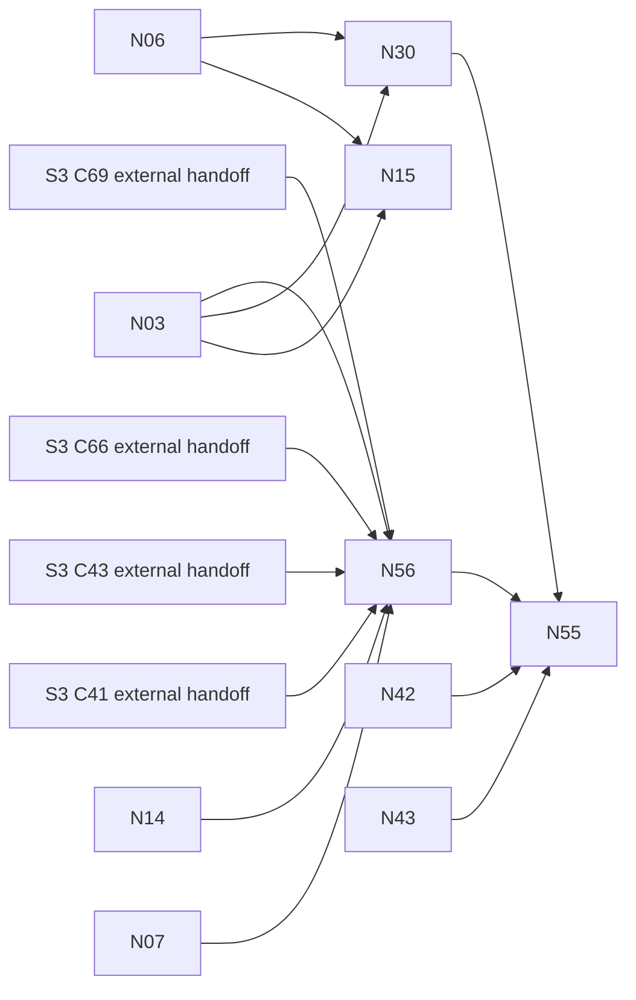

# Native Acquisition Implementation Tasks

> **For agentic workers:** use superpowers:executing-plans for the single task in
> your brief. Never start subagents or push an integration branch.

**Input:** [spec.md](spec.md) Revision 2.2, [research.md](research.md) Revision 2.2,
and [plan.md](plan.md), including its data model, schemas, ports and quickstart.
**Status:** all tasks are planned, not implemented. Only the supervisor records
integrated completion. **56 tasks, 333 estimated lane-hours**: N01–N54 are
M6-path work (321 h); N55 is later integrated adapter conformance (6 h) and N56
is the catalog-backed policy/resource adapter (6 h), both outside M6.
The 2026-09-30 catalog amendment adds **1 task / 6 h** to the 55-task / 327 h
baseline; existing IDs and estimates are unchanged.

## Global execution contract

**Owner decisions, 2026-09-30:** OA1 Q1–Q5/matrix/protocol with δ = 0.01, OA2
named-origin wiki policy, OA3 envelopes, OA4a/OA4b family/preflight policy and OA5
media scope/tool shortlist are approved, not awaiting another yes. Spider extras
are off; htmd is checked against Xberg's converter; the Xberg 1.x MIT/native
docling.rs bake-off is unchanged; tract is the layout/OCR default, dynamic offline
ORT is table-only, and every weight is pinned offline with its licence checked.
N02 records the sole Python exception: out-of-process crawl4ai for unavoidable
browser work, replacing Spider's chromey route. N46 must qualify it.

Below, **Approval blockers** names remaining exact grants, unselected components,
artifact/feature audits and qualification evidence, not a request to reapprove
those rules. Actual source/account/origin receipts remain mandatory. **OA4c and OA4d are
pending. Alias is approved, 2026-09-30:** automatically learned source-defined
term aliases with supporting spans, reviewable/reversible candidates, no product
list or silent merge, S2 `ALIAS_OF`-compatible identity seam. Search query expansion
is a later S1 item only. N29 includes the candidate records/tests; its estimate is
increased by 2 h (planning judgment, not measured duration), with totals recomputed.

1. Each task is one independently reviewable commit with its named test cycle.
   Read the current lane rules and moving S1 seams before touching code. If the
   named unit exceeds its estimate, report a split before widening scope.
2. Red first: add the specific failing test below, run it and retain the failure;
   implement the smallest passing behavior. Existing-correct behavior uses a
   controlled disabled-guard red proof, never an unobserved assertion.
3. Checks: focused tests while editing, then workspace tests, formatting,
   org-configured Clippy on Linux/Windows/macOS targets, strict public/private
   rustdoc, guide, architecture, duplication and licence checks before push.
   Every Cargo command uses `capped`, `CARGO_BUILD_JOBS=3` and locked inputs.
   Dependency changes add vet/minimal-feature/native-link measurements.
4. Normal signed commit hooks run. Push only a lane branch for supervisor review;
   never self-integrate. CI owns coverage (≥90% overall, ≥95% changed lines) and
   mutation checks (zero missed, zero timeouts); no local mutants/full CI run.
5. No private source/connector/question, secret, personal path or private report
   enters this repository. `$PRIVATE_EVIDENCE` is an owner-approved protected
   binding outside it, not a literal public directory. Private evidence tasks
   commit generic harness/docs publicly and retain actual receipts privately.

### Paths, test names and parallel markers

All paths are relative to maestro-core unless explicitly `$PRIVATE_EVIDENCE`.
Brace lists name exact files; migration tasks take the next free sequential
filename at landing. New module-door/lib/Cargo/test-main registrations and the
generated guide accompany the task that first needs them, not empty scaffolding.
Serialize shared root lock/config, CLI registrations, migration registration,
module doors and guide edits at landing. Rebase dependent tasks onto landed APIs.

Each implementation task adds the listed negative/positive cases to its own
`tests/it/nNN_*.rs` module, registered in the crate's one integration binary.
N56 instead colocates its trait-object contract tests under the CLI adapter:
`maestro` is a binary crate, so no new public test API or library is needed.
Kernel tests may use a dedicated acquisition integration binary if its existing
layout requires it. The command shown filters the **test name prefix**, not a
nonexistent test target; require at least one executed test. Test fixture helper
binaries are independently authored Rust and run only under the qualified test
boundary. Production never receives a loopback/unsafe-host bypass for fixtures.

`[P]` means a ready task can run alongside the ready peers named below after
**all** its listed predecessors have landed; it does not remove dependencies.
A task consumes the plan contracts produced by its predecessors and produces the
behavior/API named in its Green step. Only N55/N56 assume S3/S4 delivery:
N56 has the exact S3 handoffs below; N55 follows N56 and S4 host/schedule delivery.
N15/N30 keep only N03/N06 and explicitly use local/test-only substitutes now.

Estimates are planning judgments, not measurements, and include coding, focused
checks and one evidence cycle, not reviewer/CI queues, owner wait, provisioning,
upstream feature fixes or repeated failed qualification. N51–N53 budget the first
family cycle; for F approved families add **20 × (F−1) lane-hours** for their
repeated comparison/retrieval/cutover cycles. The inventory F is deliberately
unknown until owner approval. N54's final combined-generation evaluation is
included in its estimate; waiting for models/approvals is not disguised as work.

## Phase 1: Setup

Land decided amendments and measured adoption decisions; no code before N01.

- [ ] N01 Land the four architecture amendments and row ownership in `docs/architecture/{01-knowledge-pipeline.md,06-roadmap.md,08-traceability.md}` (3 h).

### N01 — Land the four architecture amendments and row ownership

**After:** S1 contracts available; no M1 release prerequisite. **Approval blockers:** None for synthetic work.

**Files:** `docs/architecture/{01-knowledge-pipeline.md,06-roadmap.md,08-traceability.md}`; `specs/006-native-acquisition/{plan.md,tasks.md}`.

**Requirements:** FR-S6-008, FR-S6-017, FR-S6-040, FR-S6-043, FR-S6-046, FR-S6-060, FR-S6-061; SC-S6-012.

1. **Red:** Compare every spec traceability row and the four amendment locations with the pinned S1 text; retain the before-state showing S4 waits and review-only registry wording.
2. **Green:** Apply the four decided amendments and reconcile all 08 keys listed in plan Phase 1; also update 01 §2.2.2 and 06/08's native-cutover wording for the 2026-09-30 crawl4ai-only browser exception instead of Spider/chromey. N02 records its ADR-0020 artifacts/role. Leave the private-network prohibition for the separate approved N48 amendment and exact-origin grants. Record enforcing N-task owners, not completion claims.
3. **Check and commit:** Run the documented fixture/probe command, recording the exact invocation and output; for Markdown run `rumdl check --disable MD013,MD041 specs/006-native-acquisition` plus normal hooks. All four amendments land before code; all 62 FRs/15 SCs retain owners; no S3/S4 delivery prerequisite or unapproved private-network permission remains in S6 wording. Run the applicable global gates, retain evidence and make one signed commit.

- [ ] N02 Measure dependencies and record the crawl4ai exception in `docs/adr/0020-rust-libraries-with-named-dependency-exceptions.md` (6 h).

### N02 — Measure dependencies and record the crawl4ai exception

**After:** N01. **Approval blockers:** Approved shortlist may be audited; exact artifacts/features/licences and any unselected library/native/model exception still need records before adoption. OA4c remains pending for private files.

**Files:** `docs/adr/0020-rust-libraries-with-named-dependency-exceptions.md`; `specs/006-native-acquisition/research.md`; `Cargo.toml`; `Cargo.lock`; `maestro-quality.toml`; `supply-chain/audits.toml`.

**Requirements:** FR-S6-013, FR-S6-024, FR-S6-027, FR-S6-056, FR-S6-060; SC-S6-006, SC-S6-011, SC-S6-012.

1. **Red:** Capture the actual integration lock and candidate feature trees; demonstrate download-binaries, duplicate HTML/CDP stacks and native-links conflicts where present, never reuse historical counts.
2. **Green:** Resolve the 2026-09-30 approved shortlist in a disposable offline/provisioned probe. Record packages, duplicate versions, links, licences, model terms and platform controls. Record the named **crawl4ai browser-render-only ADR-0020 exception**: Python out of process only for unavoidable JavaScript/Chromium, pinned adapter/Python/browser closure, licence/attribution review, no frontier/conversion/model/publication role, no downloads, and removal when a qualified Rust browser adapter meets the same controls. Spider extras/chrome/chromey stay off. Keep the Xberg 1.3.0/native docling 1.78.0 bake-off unchanged; tract is default layout/OCR, dynamic ORT table-only, weights pinned offline/licence-checked. Unselected dependencies/patches still need approval.
3. **Check and commit:** Run the documented fixture/probe command, recording the exact invocation and output; for Markdown run `rumdl check --disable MD013,MD041 specs/006-native-acquisition` plus normal hooks. Research has observed deltas or explicit blockers for each needed library; no unapproved adoption. Every later dependency addition repeats the measurement against its current lock. Run the applicable global gates, retain evidence and make one signed commit.

## Phase 2: Foundations

Strict configuration, kernel authority/frontier and protected receipts block every story.

- [ ] N03 Implement strict source policy and local baseline resolution in `crates/maestro-acquisition/{Cargo.toml,src/lib.rs,src/ports.rs,src/policy/schema.rs,src/policy/resolve.rs}` (6 h).

### N03 — Implement strict source policy and local baseline resolution

**After:** N01. **Approval blockers:** None for synthetic work.

**Files:** `crates/maestro-acquisition/{Cargo.toml,src/lib.rs,src/ports.rs,src/policy/schema.rs,src/policy/resolve.rs}`; `crates/maestro-knowledge/src/collection.rs`.

**Requirements:** FR-S6-001, FR-S6-002, FR-S6-003, FR-S6-008, FR-S6-013, FR-S6-050, FR-S6-061; SC-S6-001, SC-S6-012.

**Test file:** `crates/maestro-acquisition/tests/it/n03_implement_strict_source_policy_and_local_baseline_resolution.rs`; test names begin `n03_`.

1. **Red:** Feed nested duplicate/unknown keys, oversized/deep JSON, unresolved digests, missing exclusion registry, review-only/unqualified profiles and contradictory selectors; assert zero transport/session starts. Add acquisition-profile cases: invalid transport/adapter ref, wrong digest, unsupported capability, browser-render without readiness, HTTP with readiness, unbounded/inconsistent timeout/poll/stability bounds and executable/script predicates. Each refuses before launch.
2. **Green:** Create the first working crate with typed v1 schemas from plan, including Source.acquisition_profile, maestro-acquisition-profile/1 and bounded Readiness/ReadyCondition, collection-link version compatibility and PolicySource direct-file adapter. Resolve exact acquisition/extraction refs and immutable local or synthetic catalog baselines through one validator; no connector activation or hidden default transport.
3. **Check and commit:** Run `capped cargo test -p maestro-acquisition --locked n03_ -- --nocapture`. Strict schema round trips are deterministic; old S1 collection declarations still import but cannot acquire; registry evidence binds exact immutable digests. Run the applicable global gates, retain evidence and make one signed commit.

- [ ] N04 Persist frontier leases and fenced submissions in `crates/maestro-kernel/src/acquisition/{mod.rs,frontier.rs,lease.rs}` (6 h).

### N04 — Persist frontier leases and fenced submissions

**After:** N03. **Approval blockers:** None for synthetic work.

**Files:** `crates/maestro-kernel/src/acquisition/{mod.rs,frontier.rs,lease.rs}`; `crates/maestro-kernel/src/store/migration.rs`; `crates/maestro-kernel/migrations/`.

**Requirements:** FR-S6-009, FR-S6-014, FR-S6-047; SC-S6-002, SC-S6-015.

**Test file:** `crates/maestro-kernel/tests/it/n04_persist_frontier_leases_and_fenced_submissions.rs`; test names begin `n04_`.

1. **Red:** Race two source writers and two equivalent request/context leases; submit after lease expiry and restart with pending work. Assert a single current epoch and no stale accepted result.
2. **Green:** Add the next sequential migration, kernel frontier uniqueness and fencing using existing jobs/journal/artifacts. Separate authorization/representation contexts, preserve pending attempts and expose bounded lease/ack calls.
3. **Check and commit:** Run `capped cargo test -p maestro-kernel --locked n04_ -- --nocapture`. Exactly one source writer and one in-flight equivalent request/context; different contexts never coalesce; crash/lease-loss leaves durable resumable work. Run the applicable global gates, retain evidence and make one signed commit.

- [ ] N05 [P] Establish owner-only grants and the read-only authority port in `crates/maestro-acquisition/src/policy/authority.rs` (8 h).

### N05 — Establish owner-only grants and the read-only authority port

**After:** N03. **Approval blockers:** OA4a/OA4b for real source/account/robots grants; host authority setup separately authorized.

**Files:** `crates/maestro-acquisition/src/policy/authority.rs`; `crates/maestro/src/acquisition/authority.rs`; `crates/maestro/src/cli/{args.rs,run.rs}`; `docs/how-to/acquisition-authority.md`.

**Requirements:** FR-S6-001, FR-S6-018, FR-S6-053; SC-S6-001, SC-S6-003.

**Test file:** `crates/maestro/tests/it/n05_establish_owner_only_grants_and_the_read_only_authority_port.rs`; test names begin `n05_`.

1. **Red:** Use actual pipeline/connector identities to attempt grant create/edit/delete; forged manifest/model approvals and generic yes must fail. Owner-authenticated exact scope/target/expiry command must succeed and audit.
2. **Green:** Provide separately protected authority-store writer and platform-authenticated local IPC, plus read-only decisions for acquisition. Setup verifies real identity separation; no same-user writable-store fallback. Expiry/revocation closes future dispatch.
3. **Check and commit:** Run `capped cargo test -p maestro --locked n05_ -- --nocapture`. Actual unprivileged principals cannot mutate grants on qualified hosts; absent authenticated separation blocks live grants, never simulates a pass. Run the applicable global gates, retain evidence and make one signed commit.

- [ ] N06 [P] Store scoped receipts and content-free progress events in `crates/maestro-kernel/src/acquisition/{receipt.rs,privacy.rs}` (4 h).

### N06 — Store scoped receipts and content-free progress events

**After:** N04. **Approval blockers:** None for synthetic work.

**Files:** `crates/maestro-kernel/src/acquisition/{receipt.rs,privacy.rs}`; kernel migration/registration.

The authorized kernel view lands here; N14 registers the CLI inspect binding once, with working acquisition.

**Requirements:** FR-S6-015, FR-S6-016, FR-S6-062; SC-S6-002, SC-S6-013, SC-S6-014.

**Test file:** `crates/maestro-kernel/tests/it/n06_store_scoped_receipts_and_content_free_progress_events.rs`; test names begin `n06_`.

1. **Red:** Tag synthetic URLs, samples, reports and errors with private canaries; attempt cross-scope handle reads and notifier/log/public export. Crash between artifact and progress event writes.
2. **Green:** Persist unique scoped receipts and paged inventories through kernel artifacts; redact by typed allow-list, publish fixed status plus opaque handles only. Authorized local views recheck current grants, including transitive references.
3. **Check and commit:** Run `capped cargo test -p maestro-kernel --locked n06_ -- --nocapture`. Zero canary content/URLs escape any public/log/notifier sink; denied handles reveal nothing; every attempted run retains non-overwritten truthful receipt. Run the applicable global gates, retain evidence and make one signed commit.

## Phase 3: US1 — public documentation MVP (P1)

Independent test: public allowed/denied/robots/redirect/attachment fixture completes manual capture with S3/S4 absent; denied destinations see zero effects.

- [ ] N07 [P] [US1] Parse URL identity and denial precedence in `crates/maestro-acquisition/src/policy/{identity.rs,decision.rs}` (4 h).

### N07 — Parse URL identity and denial precedence

**After:** N03. **Approval blockers:** None for synthetic work.

**Files:** `crates/maestro-acquisition/src/policy/{identity.rs,decision.rs}`.

**Requirements:** FR-S6-004, FR-S6-005; SC-S6-001.

**Test file:** `crates/maestro-acquisition/tests/it/n07_parse_url_identity_and_denial_precedence.rs`; test names begin `n07_`.

1. **Red:** Exercise allowed/denied adjacent path boundaries, encoded separators, unknown/repeated queries, user information, fragments and seed/redirect/resume/cache-bypass attempts.
2. **Green:** Produce typed fetch identity separately from display/signed-transfer references; enforce caller then network/robots denial then promotion then cache-bypass order. Persist versioned old/new identity mappings, never silent normalization.
3. **Check and commit:** Run `capped cargo test -p maestro-acquisition --locked n07_ -- --nocapture`. Every denied path produces zero requests; unknown semantics refuse rather than merge; promotions and cache bypass cannot override denial. Run the applicable global gates, retain evidence and make one signed commit.

- [ ] N08 [US1] Classify and pin every destination address in `crates/maestro-acquisition/src/transport/{address.rs,connect.rs}` (6 h).

### N08 — Classify and pin every destination address

**After:** N07. **Approval blockers:** None for synthetic work.

**Files:** `crates/maestro-acquisition/src/transport/{address.rs,connect.rs}`; `crates/maestro-acquisition/tests/fixtures/address-table.json`.

**Requirements:** FR-S6-006, FR-S6-051; SC-S6-001, SC-S6-004.

**Test file:** `crates/maestro-acquisition/tests/it/n08_classify_and_pin_every_destination_address.rs`; test names begin `n08_`.

1. **Red:** Generate denied cases for every pinned IANA prefix and spec additional class, IPv4 embeddings/tunnels/zone IDs, check-connect rebinding, pool change, ambient proxy and cross-origin credential forwarding.
2. **Green:** Use reviewed digest-pinned address data plus multicast/metadata/reserved rules. Admit each resolved candidate and connect only to the selected checked address with hostname TLS validation; disable ambient proxy/second DNS and strip origin-bound credentials on origin change.
3. **Check and commit:** Run `capped cargo test -p maestro-acquisition --locked n08_ -- --nocapture`. All denied destinations see zero network effects; permitted adjacent public destinations work. Private unicast remains denied until N48 and grant approval. Run the applicable global gates, retain evidence and make one signed commit.

- [ ] N09 [US1] Implement bounded admitted HTTP transport in `crates/maestro-acquisition/src/transport/{http.rs,stream.rs}` (6 h).

### N09 — Implement bounded admitted HTTP transport

**After:** N04, N05, N07, N08. **Approval blockers:** None for synthetic work.

**Files:** `crates/maestro-acquisition/src/transport/{http.rs,stream.rs}`.

**Requirements:** FR-S6-006, FR-S6-013, FR-S6-014, FR-S6-015, FR-S6-051, FR-S6-059; SC-S6-001, SC-S6-002, SC-S6-005.

**Test file:** `crates/maestro-acquisition/tests/it/n09_implement_bounded_admitted_http_transport.rs`; test names begin `n09_`.

1. **Red:** Force redirect loops, oversized encoded/expanded bodies, timeout without cancellation, decompression ratio breaches, credentialed cross-origin hops and retry after revoked authority.
2. **Green:** Reuse reqwest with manually admitted redirects and checked-address connection; stream bytes with cumulative decode budgets before allocation. Return typed content/auth/challenge/partial failures, cancel owned work and recheck current authority per dispatch.
3. **Check and commit:** Run `capped cargo test -p maestro-acquisition --locked n09_ -- --nocapture`. No raw or compressed body exceeds its budget; HTTP decoding participates in cumulative accounting; timeout never falsely marks underlying work stopped. Run the applicable global gates, retain evidence and make one signed commit.

- [ ] N10 [P] [US1] Conform robots and aggregate origin pacing in `crates/maestro-acquisition/src/transport/{robots.rs,pacing.rs}` (4 h).

### N10 — Conform robots and aggregate origin pacing

**After:** N02, N07. **Approval blockers:** OA5 for unselected robots library; OA4b for each live override; enforce the approved OA3 pacing envelope.

**Files:** `crates/maestro-acquisition/src/transport/{robots.rs,pacing.rs}`.

**Requirements:** FR-S6-007; SC-S6-001, SC-S6-015.

**Test file:** `crates/maestro-acquisition/tests/it/n10_conform_robots_and_aggregate_origin_pacing.rs`; test names begin `n10_`.

1. **Red:** Use RFC 9309 matching cases, unreadable rules, missing/expired scoped override, simultaneous HTTP/browser demand and Retry-After longer than allowed backoff. Mix origin_interval_ms floors 1,000/100 ms with origin_concurrency ceilings 1/4 across host/grant/collection/source/run; require 1,000 ms and 1 regardless of order, including resume and live tightening. A min-composed floor must fail this test.
2. **Green:** Integrate the approved minimal parser behind the existing policy contract; one origin permit ledger spans all transports. Compose ceilings with min and interval/server-delay floors with max. Enforce robots before request, finite retries and pacing; if required delay exceeds backoff/elapsed ceiling, leave work pending rather than shorten it.
3. **Check and commit:** Run `capped cargo test -p maestro-acquisition --locked n10_ -- --nocapture`. No ignore-all switch, override inference or origin overshoot; robots override requires OA4b receipt, inaccessible rules fail closed. Run the applicable global gates, retain evidence and make one signed commit.

- [ ] N11 [P] [US1] Account aggregate resources and interactive priority in `crates/maestro-acquisition/src/transport/budget.rs` (6 h).

### N11 — Account aggregate resources and interactive priority

**After:** N04. **Approval blockers:** Enforce the approved OA3 envelope; exact live grants and GPU-job authorization remain necessary.

**Files:** `crates/maestro-acquisition/src/transport/budget.rs`; `crates/maestro-acquisition/src/lifecycle/resources.rs`.

**Requirements:** FR-S6-014, FR-S6-049; SC-S6-015.

**Test file:** `crates/maestro-acquisition/tests/it/n11_account_aggregate_resources_and_interactive_priority.rs`; test names begin `n11_`.

1. **Red:** Admit individually valid runs whose sum exceeds CPU/RAM/GPU/staging limits, exhaust reserved disk during streaming, and start interactive work while ingestion holds a batch. Mix free_reserve_bytes floors 30/10 GiB with staging_bytes ceilings 20/10 GiB: require 30 GiB reserve and 10 GiB cap in every precedence order. Test 2/1 GiB GPU reserve floors, zero GPU cap, resume tightening and incompatible floor/ceiling combinations; weaker min-composed reserves must fail.
2. **Green:** Implement the plan's field-kind table: min for every ceiling, max for each at-least floor, no absent/unbounded defaults. Shared/per-run reservations track actual usage and checkpoint/pause before effective reserve floors are crossed. GPU headroom subtracts its max-composed reserve, clamps at zero and then applies its min-composed ceiling; never evict interactive models. Incompatible or unenforceable bounds hold; cancellation releases owned reservations.
3. **Check and commit:** Run `capped cargo test -p maestro-acquisition --locked n11_ -- --nocapture`. Combined usage cannot exceed approved limits; reserved free space is maintained; pending work exposes budget reason and interactive floors are measured later in N40. Run the applicable global gates, retain evidence and make one signed commit.

- [ ] N12 [US1] Commit immutable captures and reconciled run outcomes in `crates/maestro-acquisition/src/capture/{envelope.rs,commit.rs}` (6 h).

### N12 — Commit immutable captures and reconciled run outcomes

**After:** N06, N09, N10, N11. **Approval blockers:** None for synthetic work.

**Files:** `crates/maestro-acquisition/src/capture/{envelope.rs,commit.rs}`; `crates/maestro-kernel/src/acquisition/capture.rs`.

**Requirements:** FR-S6-015, FR-S6-016, FR-S6-047; SC-S6-002.

**Test file:** `crates/maestro-acquisition/tests/it/n12_commit_immutable_captures_and_reconciled_run_outcomes.rs`; test names begin `n12_`.

1. **Red:** Crash after artifact persistence before stage ack; duplicate submit, substitute digest/length, mislabeled DOM versus wire body, and secret-bearing headers/signed URL canaries.
2. **Green:** Validate lease/staging handle and envelope, atomically retain scoped immutable capture linkage, acknowledge only verified content and reuse digest-identical captures. Count distinct items per stage separately from attempts; incomplete/blocked/failed returns non-success.
3. **Check and commit:** Run `capped cargo test -p maestro-acquisition --locked n12_ -- --nocapture`. Replay creates no duplicate accepted occurrence; every item has capture or reason; provenance representation labels and safe header allow-list are exact. Run the applicable global gates, retain evidence and make one signed commit.

- [ ] N13 [US1] Durably enumerate public links and bounded partitions in `crates/maestro-acquisition/src/discovery/{links.rs,partition.rs}` (6 h).

### N13 — Durably enumerate public links and bounded partitions

**After:** N12. **Approval blockers:** None for synthetic work.

**Files:** `crates/maestro-acquisition/src/discovery/{links.rs,partition.rs}`.

**Requirements:** FR-S6-010, FR-S6-011, FR-S6-012; SC-S6-002.

**Test file:** `crates/maestro-acquisition/tests/it/n13_durably_enumerate_public_links_and_bounded_partitions.rs`; test names begin `n13_`.

1. **Red:** Change links without changing visible text; truncate/unstabilize a partition, return empty nonterminal batches, replay cursors and fail one discovered item.
2. **Green:** Use approved Spider with defaults/extras off as a bounded leased crawl adapter over N09's admitted transport, never an independent network route or authoritative queue. Durably enqueue every eligible link before acknowledging discovery, retain revision/validator/permission/link/representation keys and complete partition evidence. Keep pending checkpoint distinct from accepted snapshot; advance watermarks only for committed complete windows.
3. **Check and commit:** Run `capped cargo test -p maestro-acquisition --locked n13_ -- --nocapture`. R1/R2/R4/R6 are reproduced then fixed; no text-only shortcut, keyword-search enumeration or false complete watermark. Run the applicable global gates, retain evidence and make one signed commit.

- [ ] N14 [US1] Expose public preview and manual sync MVP in `crates/maestro/src/acquisition/{mod.rs,command.rs,output.rs}` (6 h).

### N14 — Expose public preview and manual sync MVP

**After:** N13. **Approval blockers:** OA4a exact grant for a real public source; enforce approved OA3 limits. Synthetic fixture flow needs no live grant.

**Files:** `crates/maestro/src/acquisition/{mod.rs,command.rs,output.rs,inspect.rs}`; `crates/maestro/src/cli/{args.rs,run.rs}`; `docs/how-to/acquisition.md`.

**Requirements:** FR-S6-001, FR-S6-002, FR-S6-008, FR-S6-013, FR-S6-016; SC-S6-001, SC-S6-002, SC-S6-012.

**Test file:** `crates/maestro/tests/it/n14_expose_public_preview_and_manual_sync_mvp.rs`; test names begin `n14_`.

1. **Red:** Run the synthetic public site with allowed/denied neighbours, robots, redirect and attachment while S3/S4 are absent; invalid manifest must cause zero starts.
2. **Green:** Bind preview/sync/inspect to the single admission/frontier flow. Preview shows decisions without fetching or credential calls; sync runs public built-in adapter and preserves truthful partial status. Register only the working CLI operations.
3. **Check and commit:** Run `capped cargo test -p maestro --locked n14_ -- --nocapture`. US1 MVP independently completes allowed captures and explains all discarded/pending work; no host, private connector, browser or embedding claim. Run the applicable global gates, retain evidence and make one signed commit.

## Phase 4: US2 — preserve documents through embedding (P1)

Independent test: every required media cohort has exact source-backed fidelity/hold evidence; mapped accepted content traverses unchanged S1 preparation/publication contracts.

- [ ] N15 [P] [US2] Route content through one extensible profile registry in `crates/maestro-acquisition/src/extraction/{registry.rs,detect.rs}` (6 h).

### N15 — Route content through one extensible profile registry

**After:** N03, N06. **Approval blockers:** OA5 for unselected detector/plug-in; observed qualification under the approved OA1 targets.

**Start boundary:** N03's `DirectFiles`/`ResourceSource` plus N06's scoped receipts are the complete predecessor set. Start now on those landed contracts and test-only synthetic catalog fixtures; no N56, N55, S3 catalog install or C41/C43/C66/C69 edge. The extraction-profile registry is a consumer of immutable resources, not a second catalog registry or admission authority.

**Files:** `crates/maestro-acquisition/src/extraction/{registry.rs,detect.rs}`; `crates/maestro-acquisition/src/ports.rs`.

**Requirements:** FR-S6-023, FR-S6-041, FR-S6-050, FR-S6-056; SC-S6-006, SC-S6-012, SC-S6-013.

**Test file:** `crates/maestro-acquisition/tests/it/n15_route_content_through_one_extensible_profile_registry.rs`; test names begin `n15_`.

1. **Red:** Use misleading extensions, conflicting magic/container hints, encrypted/malformed files, unqualified profile and a new synthetic Rust parser capability without changing callers. Run the same resolve/select contract over `DirectFiles`, a test-only synthetic catalog resource source and a disabled registry: disabled returns RegistryUnavailable(disabled), with zero fetch/extractor/model starts and no default profile; forged substitute digests/qualification refuse. Synthetic admission proves the port contract only, never signed-release trust.
2. **Green:** Implement ProfileRegistry.resolve/select as defined in plan, over N03's existing `ResourceSource`, with immutable checked handles and deterministic bounded detector/structure evidence. Inject local/test-only substitute/disabled adapters without consumer edits; core verifies returned refs/protected fields. Retain safe bounded partial text/metadata/assets under an explicit unknown outcome, never arbitrary trusted fallback or side effects during selection. N56 later supplies real catalog resources through the same port, not a new registry implementation.
3. **Check and commit:** Run `capped cargo test -p maestro-acquisition --locked n15_ -- --nocapture`. Local and substitute adapters have identical checked outcomes; disabled fails closed. All media, including images/audio/video, get accountable outcomes when enabled; missing gold or capabilities cannot make a profile qualified. Run the applicable global gates, retain evidence and make one signed commit.

- [ ] N16 [US2] Define extraction, fidelity and cumulative decode contracts in `crates/maestro-acquisition/src/extraction/{contract.rs,fidelity.rs,decode.rs}` (6 h).

### N16 — Define extraction, fidelity and cumulative decode contracts

**After:** N09, N15. **Approval blockers:** None for synthetic work.

**Files:** `crates/maestro-acquisition/src/extraction/{contract.rs,fidelity.rs,decode.rs}`.

**Requirements:** FR-S6-024, FR-S6-025, FR-S6-026, FR-S6-028, FR-S6-059; SC-S6-005, SC-S6-006.

**Test file:** `crates/maestro-acquisition/tests/it/n16_define_extraction_fidelity_and_cumulative_decode_contracts.rs`; test names begin `n16_`.

1. **Red:** Use equal-count but reordered/different cells, changed negation/code, missing source measurements and nested decoding that exceeds a cumulative rather than per-step limit.
2. **Green:** Implement typed mapped output, correspondence/content receipts and extensions of N09's shared cumulative decoder accounting across parser IPC; distinguish unknown from zero. Convert findings to existing S1 quality outcomes, requiring named warn-only rules and retaining all held receipts.
3. **Check and commit:** Run `capped cargo test -p maestro-acquisition --locked n16_ -- --nocapture`. Counts alone never prove fidelity; lost literals/assets or unknown required measurements hold. Expanded bytes, ratio, depth, members, entities, pixels, time and memory all have enforcing hooks. Run the applicable global gates, retain evidence and make one signed commit.

- [ ] N17 [US2] Qualify Linux parser-process containment in `crates/maestro-acquisition/src/isolation/{mod.rs,port.rs,linux.rs}` (8 h).

### N17 — Qualify Linux parser-process containment

**After:** N02, N16. **Approval blockers:** OA5 for containment dependencies; separately approved host setup.

**Files:** `crates/maestro-acquisition/src/isolation/{mod.rs,port.rs,linux.rs}`; `crates/maestro-acquisition/tests/fixtures/hostile_child.rs`.

**Requirements:** FR-S6-014, FR-S6-027, FR-S6-054, FR-S6-055, FR-S6-056, FR-S6-059; SC-S6-003, SC-S6-005, SC-S6-006, SC-S6-012.

**Test file:** `crates/maestro-acquisition/tests/it/n17_qualify_linux_parser_process_containment.rs`; test names begin `n17_`.

1. **Red:** Run a hostile synthetic Rust child attempting sockets/DNS, filesystem escape, excessive allocation/CPU, forked descendants and crash; include swapped launch bytes and owned cancellation.
2. **Green:** Implement the common isolation port and Linux namespace/Landlock/seccomp/cgroup adapter with pinned launch verification. Admit only scoped read handles and bounded output, deny external retrieval/entity resolution, enforce cumulative decode budget across IPC and reap descendants.
3. **Check and commit:** Run `capped cargo test -p maestro-acquisition --locked n17_ -- --nocapture`. Real kernel controls deny every forbidden effect and prevent parser crash propagating; absence of a required mechanism blocks launch, never weakens isolation. Run the applicable global gates, retain evidence and make one signed commit.

- [ ] N18 [P] [US2] Qualify Windows parser-process containment in `crates/maestro-acquisition/src/isolation/windows.rs` (8 h).

### N18 — Qualify Windows parser-process containment

**After:** N17. **Approval blockers:** OA5 for platform dependency adoption and authorized Windows test setup.

**Files:** `crates/maestro-acquisition/src/isolation/windows.rs`.

**Requirements:** FR-S6-014, FR-S6-027, FR-S6-054, FR-S6-055, FR-S6-056, FR-S6-059; SC-S6-003, SC-S6-005, SC-S6-006, SC-S6-012.

**Test file:** `crates/maestro-acquisition/tests/it/n18_qualify_windows_parser_process_containment.rs`; test names begin `n18_`.

1. **Red:** Execute N17 hostile-child contract on Windows with actual restricted identity, filesystem/network denial and process-tree/resource limits; cross-compilation alone is not a pass.
2. **Green:** Implement the Windows isolation adapter against N17 port and real OS controls; document exact supported setup, verify launch pin and stop/reap semantics. Secret-memory capability reports unsupported unless genuinely enforced.
3. **Check and commit:** Run `capped cargo test -p maestro-acquisition --locked n18_ -- --nocapture`. Actual Windows evidence covers every contract effect; unsupported environments refuse without a permissive fallback. Run the applicable global gates, retain evidence and make one signed commit.

- [ ] N19 [P] [US2] Qualify macOS parser-process containment in `crates/maestro-acquisition/src/isolation/macos.rs` (8 h).

### N19 — Qualify macOS parser-process containment

**After:** N17. **Approval blockers:** OA5 for platform dependency adoption and authorized macOS test setup.

**Files:** `crates/maestro-acquisition/src/isolation/macos.rs`.

**Requirements:** FR-S6-014, FR-S6-027, FR-S6-054, FR-S6-055, FR-S6-056, FR-S6-059; SC-S6-003, SC-S6-005, SC-S6-006, SC-S6-012.

**Test file:** `crates/maestro-acquisition/tests/it/n19_qualify_macos_parser_process_containment.rs`; test names begin `n19_`.

1. **Red:** Execute N17 hostile-child contract on macOS, including direct socket/resolver attempts, process-tree escape and memory/time limits; a child process alone must not pass.
2. **Green:** Implement the macOS isolation adapter using measured approved platform controls and exact supported setup, with pinned binaries and fail-closed capability probes.
3. **Check and commit:** Run `capped cargo test -p maestro-acquisition --locked n19_ -- --nocapture`. Actual macOS containment and cancellation evidence exists for claimed environments; absent controls are explicit blockers. Run the applicable global gates, retain evidence and make one signed commit.

- [ ] N20 [P] [US2] Preserve technical HTML with one qualified conversion path in `crates/maestro-acquisition/src/extraction/html.rs` (6 h).

### N20 — Preserve technical HTML with one qualified conversion path

**After:** N02, N16, N17. **Approval blockers:** N02 exact HTML-library audit; observed profile qualification under approved OA1 targets.

**Files:** `crates/maestro-acquisition/src/extraction/html.rs`; `crates/maestro-acquisition/tests/fixtures/html/`.

**Requirements:** FR-S6-024, FR-S6-025, FR-S6-026, FR-S6-028; SC-S6-006.

**Test file:** `crates/maestro-acquisition/tests/it/n20_preserve_technical_html_with_one_qualified_conversion_path.rs`; test names begin `n20_`.

1. **Red:** Use nested/span tables, layout-table wrappers, short prerequisites, exact whitespace/code, links/assets and login/challenge shells; demonstrate any selector/readability loss first.
2. **Green:** Integrate selectors plus the approved htmd direction, checked against Xberg's built-in converter on the same fixed technical-HTML gold, without flattening or converter chains. Preserve correspondence into Markdown and original DOM locators; optional readability selection is a distinct recorded gated attempt, not silent fallback.
3. **Check and commit:** Run `capped cargo test -p maestro-acquisition --locked n20_ -- --nocapture`. Q1 exact literals/cell associations pass on frozen cohort; unsafe loss or sign-in shell is held with original bytes. Run the applicable global gates, retain evidence and make one signed commit.

- [ ] N21 [P] [US2] Run the offline native document bake-off in `specs/006-native-acquisition/research.md` (8 h).

### N21 — Run the offline native document bake-off

**After:** N02, N16, N17. **Approval blockers:** N02 exact candidate/model/exception audits; freeze evidence under approved OA1 targets. OA4c remains pending before comparison on private files.

**Files:** `specs/006-native-acquisition/research.md`; `crates/maestro-acquisition/tests/fixtures/documents/`; `docs/adr/0020-rust-libraries-with-named-dependency-exceptions.md`.

**Requirements:** FR-S6-024, FR-S6-027, FR-S6-036, FR-S6-060; SC-S6-006, SC-S6-011.

1. **Red:** Freeze PDF/Office/scan fixtures before outcomes; build and execute with network denied and models preprovisioned. Show hidden download-binaries or Tesseract feature edges fail the proposed pure-Rust/offline profile.
2. **Green:** Run the owner-approved unchanged Xberg 1.3.0 MIT/native docling 1.78.0 bake-off: minimal native PDF/Rust layout/OCR against docling pdf-text and only separately approved ML comparisons. Use tract by default for layout/OCR; any dynamic ORT use is table-only with no downloads, and each pinned offline weight needs its own licence check. Record exact code/cell/order losses, dependency/native/model closures and select one path per profile, not aggregate marketing scores.
3. **Check and commit:** Run the documented fixture/probe command, recording the exact invocation and output; for Markdown run `rumdl check --disable MD013,MD041 specs/006-native-acquisition` plus normal hooks. Observed per-profile result and owner decision, or honest held status; no Python path counts as native. ORT feature patch/adoption needs explicit approval. Run the applicable global gates, retain evidence and make one signed commit.

- [ ] N22 [US2] Implement mapped PDF and separately authorized OCR in `crates/maestro-acquisition/src/extraction/pdf.rs` (8 h).

### N22 — Implement mapped PDF and separately authorized OCR

**After:** N21. **Approval blockers:** N02 audited PDF/OCR/model artifacts and observed qualification under approved OA1 targets.

**Files:** `crates/maestro-acquisition/src/extraction/pdf.rs`.

**Requirements:** FR-S6-023, FR-S6-024, FR-S6-025, FR-S6-027, FR-S6-059; SC-S6-006.

**Test file:** `crates/maestro-acquisition/tests/it/n22_implement_mapped_pdf_and_separately_authorized_ocr.rs`; test names begin `n22_`.

1. **Red:** Exercise text/scanned/multicolumn PDF, wrong command symbol, reordered cells, missing page coordinates, encrypted page and oversized/crashing PDF streams.
2. **Green:** Bind the selected Rust PDF adapter to N16/N17, retain source pages/regions when supplied, safe partial text when not qualified, and separate OCR derived attempt with uncertainty. Disable implicit network/model/runtime retrieval.
3. **Check and commit:** Run `capped cargo test -p maestro-acquisition --locked n22_ -- --nocapture`. Required PDF cohort passes Q1 or holds explicitly; OCR CER and exact critical literals meet approved Q1 without fabricated coordinates. Run the applicable global gates, retain evidence and make one signed commit.

- [ ] N23 [P] [US2] Implement Office and spreadsheet structure preservation in `crates/maestro-acquisition/src/extraction/{office.rs,spreadsheet.rs}` (8 h).

### N23 — Implement Office and spreadsheet structure preservation

**After:** N21. **Approval blockers:** N02 audited Office/spreadsheet artifacts and observed qualification under approved OA1 targets.

**Files:** `crates/maestro-acquisition/src/extraction/{office.rs,spreadsheet.rs}`.

**Requirements:** FR-S6-023, FR-S6-024, FR-S6-025, FR-S6-026, FR-S6-059; SC-S6-006.

**Test file:** `crates/maestro-acquisition/tests/it/n23_implement_office_and_spreadsheet_structure_preservation.rs`; test names begin `n23_`.

1. **Red:** Use DOCX/PPTX headings/lists/embedded assets, spreadsheet merged cells/formulas versus cached values, encrypted members, macros/external relationships and Office expansion bombs.
2. **Green:** Bind selected engine/calamine behind extractor contract; preserve cell/slide/paragraph lineage and explicit loss. Do not calculate formulas, run macros or refresh external links; every container step shares cumulative limits.
3. **Check and commit:** Run `capped cargo test -p maestro-acquisition --locked n23_ -- --nocapture`. All frozen Office/spreadsheet assertions pass or hold; unknown formatting/coordinates are disclosed, formulas and displayed values never conflated. Run the applicable global gates, retain evidence and make one signed commit.

- [ ] N24 [P] [US2] Normalize Markdown, text and structured records directly in `crates/maestro-acquisition/src/extraction/{markdown.rs,text.rs,structured.rs}` (6 h).

### N24 — Normalize Markdown, text and structured records directly

**After:** N16, N17. **Approval blockers:** OA5 for any unselected format parser; observed qualification under approved OA1 targets.

**Files:** `crates/maestro-acquisition/src/extraction/{markdown.rs,text.rs,structured.rs}`.

**Requirements:** FR-S6-023, FR-S6-024, FR-S6-026, FR-S6-028, FR-S6-041; SC-S6-006, SC-S6-013.

**Test file:** `crates/maestro-acquisition/tests/it/n24_normalize_markdown_text_and_structured_records_directly.rs`; test names begin `n24_`.

1. **Red:** Use code indentation/line endings, multilingual short text, structured null/number/array order, malformed XML/entities and unknown image/audio/video neighbours.
2. **Green:** Reuse direct S1 Markdown parsing; typed JSON/YAML/XML/CSV normalization retains field/value/order locations, not invented prose. Registry entries for noninterpreted media retain assets/metadata/safe text with explicit partial state.
3. **Check and commit:** Run `capped cargo test -p maestro-acquisition --locked n24_ -- --nocapture`. No converter round trip, whitespace compaction or invented media description; unqualified content cannot become accepted because text is nonempty. Run the applicable global gates, retain evidence and make one signed commit.

- [ ] N25 [P] [US2] Validate downloads and safely admit archive members in `crates/maestro-acquisition/src/capture/{download.rs,archive.rs}` (8 h).

### N25 — Validate downloads and safely admit archive members

**After:** N12, N16, N17. **Approval blockers:** OA5 archive/codec dependencies; OA4a/OA4c for live assets.

**Files:** `crates/maestro-acquisition/src/capture/{download.rs,archive.rs}`.

**Requirements:** FR-S6-021, FR-S6-022, FR-S6-023, FR-S6-059; SC-S6-005, SC-S6-006.

**Test file:** `crates/maestro-acquisition/tests/it/n25_validate_downloads_and_safely_admit_archive_members.rs`; test names begin `n25_`.

1. **Red:** Use empty/relative/expired signed URLs, ignored Range, changed validator mid-transfer, truncation, digest mismatch, nested traversal/symlinks, expansion/member/depth/pixel bombs and installer contents.
2. **Green:** Separate stable asset identity from protected transient transfer URL; stream/verify before atomic promotion, re-mint only same representation. Inspect selected archive members under shared cumulative budgets with parent/member provenance and no execution; installers remain asset-only without separate ingress.
3. **Check and commit:** Run `capped cargo test -p maestro-acquisition --locked n25_ -- --nocapture`. No append across representations, corrupt accepted assets, unauthorized member extraction or partial promotion after limit breach. Run the applicable global gates, retain evidence and make one signed commit.

- [ ] N26 [P] [US2] Factor S1 mapped ingestion without changing corpus/1 in `crates/maestro-knowledge/src/import/{entry.rs,ingest.rs,mod.rs}` (6 h).

### N26 — Factor S1 mapped ingestion without changing corpus/1

**After:** N16. **Approval blockers:** None for synthetic work.

**Files:** `crates/maestro-knowledge/src/import/{entry.rs,ingest.rs,mod.rs}`; `crates/maestro-kernel/src/acquisition/link.rs`.

**Requirements:** FR-S6-024, FR-S6-029, FR-S6-030; SC-S6-007.

**Test file:** `crates/maestro-knowledge/tests/it/n26_factor_s1_mapped_ingestion_without_changing_corpus_1.rs`; test names begin `n26_`.

1. **Red:** Run mapped PDF table/image fixture through existing import and show missing typed blocks/assets; pin corpus/1 document/revision IDs, conflict/hold behavior and unknown-coordinate case. Native regression: identical Markdown, source metadata, blocks, permissions and profile; only semantic asset inventory changes missing→available (then available bytes change). Require a new immutable revision, both stored inventories resolvable and unchanged replay for equal inventory. Also reject forged core-reserved inventory metadata; reordered inventory/operational-only changes must not churn IDs.
2. **Green:** Factor the existing integrity/identity/revision/disposition/journal path into ingest_mapped; wire CanonicalizeInput fields and link raw capture/fidelity separately. Compute the sorted semantic inventory digest and bind it through core-reserved SourceMetadata.extra["maestro.native_assets/1"] before canonicalization; validate available asset bytes. corpus/1 never adds that key and retains byte-for-byte IDs; Markdown original_digest and prepared-input identity remain distinct. Both paths use the same transaction.
3. **Check and commit:** Run `capped cargo test -p maestro-knowledge --locked n26_ -- --nocapture`. Asset-only revisions no longer hit the unchanged branch; old evidence is immutable, equal semantic inventory is idempotent, and block/page/cell/asset mappings survive. corpus/1 golden IDs/source_ref bytes hold; no parallel importer/canonical store or implicit alias migration. Run the applicable global gates, retain evidence and make one signed commit.

- [ ] N27 [US2] Connect accepted outputs to S1 preparation and publication in `crates/maestro-acquisition/src/lifecycle/ingest.rs` (6 h).

### N27 — Connect accepted outputs to S1 preparation and publication

**After:** N20, N26. **Approval blockers:** Observed OA1 qualification; approved model resources for real embedding within OA3 limits.

**Files:** `crates/maestro-acquisition/src/lifecycle/ingest.rs`; `crates/maestro-knowledge/src/import/ingest.rs`.

**Requirements:** FR-S6-028, FR-S6-029, FR-S6-030, FR-S6-031, FR-S6-032, FR-S6-033; SC-S6-007, SC-S6-008.

**Test file:** `crates/maestro-acquisition/tests/it/n27_connect_accepted_outputs_to_s1_preparation_and_publication.rs`; test names begin `n27_`.

1. **Red:** Replay identical accepted captures, same content/different permissions, metadata-only updates, profile/tokenizer change, oversize indivisible units and failed embedding/publication.
2. **Green:** Call existing S1 quality/preparation/cache/embedding/generation ports only. Preserve exact-group occurrences, non-destructive near groups, complete primary span coverage and prepared token limits including context/special tokens; permission changes propagate without needless embeddings.
3. **Check and commit:** Run `capped cargo test -p maestro-acquisition --locked n27_ -- --nocapture`. Q2/Q3 pass; failed batches remain resumable and old verified generation stays current; unqualified/held extracts never enter prepare. Run the applicable global gates, retain evidence and make one signed commit.

- [ ] N28 [US2] Qualify the complete media matrix and offline boundary in `crates/maestro-acquisition/tests/it/media_qualification.rs` (6 h).

### N28 — Qualify the complete media matrix and offline boundary

**After:** N18, N19, N22, N23, N24, N25, N27. **Approval blockers:** OA1/OA5 qualification and model/assets; no private data needed.

**Files:** `crates/maestro-acquisition/tests/it/media_qualification.rs`; `specs/006-native-acquisition/research.md`.

**Requirements:** FR-S6-023, FR-S6-024, FR-S6-025, FR-S6-026, FR-S6-027, FR-S6-028, FR-S6-029, FR-S6-031, FR-S6-036, FR-S6-059; SC-S6-005, SC-S6-006, SC-S6-007, SC-S6-012.

**Test file:** `crates/maestro-acquisition/tests/it/n28_qualify_the_complete_media_matrix_and_offline_boundary.rs`; test names begin `n28_`.

1. **Red:** Freeze each required media/profile cohort and explicit unsupported neighbours; remove one correspondence/limit enforcement in a controlled red proof where behavior already exists.
2. **Green:** Run Q1–Q3 against fixed gold, with a bomb for every expansion/ratio/depth/member/entity/pixel/time/memory class and parser crash through acquisition plus extraction. Cover HTTP, Office, PDF, nested archives and images, offline provisioned assets and all claimed OS adapters.
3. **Check and commit:** Run `capped cargo test -p maestro-acquisition --locked n28_ -- --nocapture`. Every required cohort passes or is a named M6 blocker; no removed failing stratum, count-only fidelity or skipped platform reported as passing. Run the applicable global gates, retain evidence and make one signed commit.

## Phase 5: US3 — configure and adapt safely (P1)

Independent test: two unrelated synthetic sources yield complete evidence/unknown proposals; every automatic class and matrix/forbidden-field refusal, conflict and postcheck rollback is exercised.

- [ ] N29 [P] [US3] Infer evidence-backed profiles and term aliases in `crates/maestro-acquisition/src/adaptation/{sample.rs,infer.rs,aliases.rs}` (8 h).

### N29 — Infer evidence-backed profiles and term aliases

**After:** N15, N16, N24. **Approval blockers:** OA4c for real private samples; approved OA3 envelope must be enforced. Term-alias scope approved 2026-09-30; no S2 delivery dependency.

**Files:** `crates/maestro-acquisition/src/adaptation/{sample.rs,infer.rs,aliases.rs}`.

**Requirements:** FR-S6-041, FR-S6-042, FR-S6-043, FR-S6-062; SC-S6-013.

**Test file:** `crates/maestro-acquisition/tests/it/n29_infer_evidence_backed_profiles_from_bounded_samples.rs`; test names begin `n29_`.

1. **Red:** Use two unrelated synthetic layouts and insufficient/ambiguous samples; require every inference field to have observations or explicit unknown. Include source-defined acronyms/expansions and spelling variants with exact defining spans, conflicting expansions in different scopes and a similar-looking term with no definition. Only supported aliases become candidates; guessed aliases, a hard-coded product list, automatic approval/merge and cross-scope evidence must fail. Review/reversal retains old evidence and source-reference IDs.
2. **Green:** Sample through normal access/rate/resource admission; reuse parser/whatlang/S1 grouping signals. Produce immutable profile references and typed rule proposals with pinned evidence/uncertainty. Automatically learn term-alias candidates only from explicit source definitions; store plan's maestro-term-alias-candidate/1 records and append explicit review/reversal evidence through scoped kernel artifacts. Preserve ambiguity and an S2 reviewed ALIAS_OF-compatible identity seam; no graph/permission/identity merge and no hand-written per-product list. Name the approved-record seam for later S1 query expansion but implement no search changes.
3. **Check and commit:** Run `capped cargo test -p maestro-acquisition --locked n29_ -- --nocapture`. All fields are accounted for; aliases have resolvable defining spans, reversible reviewed state and scoped ambiguous neighbours. Candidate inference never counts as approval, a sixth automatic-change class or query expansion. Samples cannot widen scope and private canaries retain transitive tags. Run the applicable global gates, retain evidence and make one signed commit.

- [ ] N30 [P] [US3] Implement proposal and activation manifest write port in `crates/maestro-acquisition/src/adaptation/{manifest.rs,writer.rs}` (6 h).

### N30 — Implement proposal and activation manifest write port

**After:** N03, N06. **Approval blockers:** None for synthetic work.

**Start boundary:** Keep the smallest existing edge set: N03 immutable policy/resource resolution and N06 scoped report artifacts. Start now on `DirectFiles` and test-only synthetic catalog fixtures; no N56, N55 or S3 delivery edge. A synthetic catalog baseline tests the write contract, not installation/signature/ownership admission. N56 supplies the real read adapter later; N55 owns integrated catalog-baseline/write-port conformance.

**Files:** `crates/maestro-acquisition/src/adaptation/{manifest.rs,writer.rs}`.

**Requirements:** FR-S6-008, FR-S6-043, FR-S6-057, FR-S6-061, FR-S6-062; SC-S6-012, SC-S6-014.

**Test file:** `crates/maestro-acquisition/tests/it/n30_implement_proposal_and_activation_manifest_write_port.rs`; test names begin `n30_`.

1. **Red:** Race expected baseline/active digests; crash on either side of atomic replacement, substitute/revoke the test-only synthetic catalog baseline, and attempt trusted-bundle mutation. Run these cases with `DirectFiles` and the synthetic source through the existing ports while S3 is absent; rejected/missing baseline evidence must hold, never fall back to trusted local content.
2. **Green:** Implement ConfigurationWriter over immutable baseline plus local overlay with durable recovery marker and atomic pointer commit. Store report/evidence before exposure; notify after commit. `DirectFiles` and immutable synthetic catalog baselines share one write contract and current scope checks. Accept baseline resolution through existing ports, not catalog imports; production signed-review admission belongs to N56, never a fixture approval or writable copy of its release.
3. **Check and commit:** Run `capped cargo test -p maestro-acquisition --locked n30_ -- --nocapture`. No stale activation, hidden rule store, trusted-bundle writes or silent overlay rebind; recovery exposes complete old or new state only. Run the applicable global gates, retain evidence and make one signed commit.

- [ ] N31 [US3] Detect drift with durable persistence accounting in `crates/maestro-acquisition/src/adaptation/drift.rs` (4 h).

### N31 — Detect drift with durable persistence accounting

**After:** N29, N30. **Approval blockers:** None for synthetic work; enforce the approved OA3 sample/drift/persistence/rate envelope.

**Files:** `crates/maestro-acquisition/src/adaptation/drift.rs`.

**Requirements:** FR-S6-044, FR-S6-058; SC-S6-014.

**Test file:** `crates/maestro-acquisition/tests/it/n31_detect_drift_with_durable_persistence_accounting.rs`; test names begin `n31_`.

1. **Red:** Inject new structures, below/above rate shifts, fewer than minimum observations, changes in cohort mix, opposite proposals, restarts and concurrent runs.
2. **Green:** Report pinned same-cohort numerators/denominators/uncertainty; persist completed-run history and collection-wide activation budget. New type flags immediately; non-safety activation waits approved consecutive runs, safety holds immediately.
3. **Check and commit:** Run `capped cargo test -p maestro-acquisition --locked n31_ -- --nocapture`. No threshold loosening, discarded hard items or restart reset can evade persistence/rate checks. Run the applicable global gates, retain evidence and make one signed commit.

- [ ] N32 [P] [US3] Enforce the closed automatic-change allow-list in `crates/maestro-acquisition/src/adaptation/change.rs` (4 h).

### N32 — Enforce the closed automatic-change allow-list

**After:** N30. **Approval blockers:** None for synthetic work.

**Files:** `crates/maestro-acquisition/src/adaptation/change.rs`.

**Requirements:** FR-S6-043, FR-S6-045, FR-S6-046, FR-S6-050; SC-S6-014.

**Test file:** `crates/maestro-acquisition/tests/it/n32_enforce_the_closed_automatic_change_allow_list.rs`; test names begin `n32_`.

1. **Red:** Deny every non-adaptable field group listed in SC-S6-014, including indirect profile substitution, mixed proposals, existing exclusion expiry/removal, unknown fields and unauthorized N/A.
2. **Green:** Compare typed changes and resolved protected effective values; admit only the five exact classes and only new narrowing exclusion entries. Hold whole mixed/forbidden proposal even when quality scores pass; expired new exclusion holds re-admission.
3. **Check and commit:** Run `capped cargo test -p maestro-acquisition --locked n32_ -- --nocapture`. No profile renaming, lookup precedence or expiry can widen authority/admission; definitions and tolerances remain separately approved. Run the applicable global gates, retain evidence and make one signed commit.

- [ ] N33 [US3] Evaluate the fixed mandatory matrix against pinned cohorts in `crates/maestro-acquisition/src/adaptation/gates.rs` (6 h).

### N33 — Evaluate the fixed mandatory matrix against pinned cohorts

**After:** N27, N32. **Approval blockers:** An approved suite/baseline and observed evidence under the approved OA1 targets/matrix/protocol.

**Files:** `crates/maestro-acquisition/src/adaptation/gates.rs`.

**Requirements:** FR-S6-036, FR-S6-038, FR-S6-045; SC-S6-010, SC-S6-014.

**Test file:** `crates/maestro-acquisition/tests/it/n33_evaluate_the_fixed_mandatory_matrix_against_pinned_cohorts.rs`; test names begin `n33_`.

1. **Red:** For every change class fail each of six matrix columns in turn, omit baseline/gold/suite/control cohort and forge N/A. A no-retrieval-suite collection must hold.
2. **Green:** Bind existing Q1/Q2/Q3/lifecycle/S1 evaluation results to candidate/baseline/cohort/profile/suite digests; union rows for combined proposals. Separate pass/fail/inconclusive and require independent content-sensitive review; no alternative scoring engine.
3. **Check and commit:** Run `capped cargo test -p maestro-acquisition --locked n33_ -- --nocapture`. All mandatory cells and unchanged controls required, empty cohorts never pass; threshold/matrix/gold changes need separate approval. Run the applicable global gates, retain evidence and make one signed commit.

- [ ] N34 [US3] Automatically activate passing proposals with CAS in `crates/maestro-acquisition/src/adaptation/activate.rs` (6 h).

### N34 — Automatically activate passing proposals with CAS

**After:** N31, N32, N33. **Approval blockers:** Observed mandatory OA1 gate evidence; enforce the approved OA3 envelope.

**Files:** `crates/maestro-acquisition/src/adaptation/activate.rs`.

**Requirements:** FR-S6-046, FR-S6-047, FR-S6-057, FR-S6-061, FR-S6-062; SC-S6-014, SC-S6-015.

**Test file:** `crates/maestro-acquisition/tests/it/n34_automatically_activate_passing_proposals_with_cas.rs`; test names begin `n34_`.

1. **Red:** Race collection proposals, change grants or baseline during gates, and run a harvest pinned to the previous config while activation commits.
2. **Green:** Recheck current trust/authority, allow-list, persistence and receipt bindings at safe boundary; use N30 compare-and-swap to commit complete diff/evidence/rollback reference automatically. Keep in-flight processing pinned and revocations immediate.
3. **Check and commit:** Run `capped cargo test -p maestro-acquisition --locked n34_ -- --nocapture`. Eligible passing changes apply without extra manual confirmation; stale/forbidden/inconclusive work remains wholly held with private report. Run the applicable global gates, retain evidence and make one signed commit.

- [ ] N35 [US3] Gate first post-activation publication and safe rollback in `crates/maestro-acquisition/src/adaptation/postcheck.rs` (4 h).

### N35 — Gate first post-activation publication and safe rollback

**After:** N34. **Approval blockers:** Mandatory OA1 evidence and current rollback-target authorization; approved OA3 limits remain enforced.

**Files:** `crates/maestro-acquisition/src/adaptation/postcheck.rs`.

**Requirements:** FR-S6-033, FR-S6-058; SC-S6-008, SC-S6-014.

**Test file:** `crates/maestro-acquisition/tests/it/n35_gate_first_post_activation_publication_and_safe_rollback.rs`; test names begin `n35_`.

1. **Red:** Fail or make inconclusive the first completed post-activation matrix run, revoke the previous profile/content, restart and attempt rapid opposite activation.
2. **Green:** Repeat mandatory matrix against saved pre-activation baseline before publication; retain old index, restore previous still-authorized config or hold for owner. Persist pending postcheck and block further adaptation; rollback bypasses rate delay, never current revocation.
3. **Check and commit:** Run `capped cargo test -p maestro-acquisition --locked n35_ -- --nocapture`. No candidate publication precedes passing postcheck; no flip-flop, stale rollback or revived access. Run the applicable global gates, retain evidence and make one signed commit.

## Phase 6: US4 — refresh, resume, withdraw and repair (P1)

Independent test: five lifecycle modes equal uninterrupted reference, and overlapping runs preserve current access, accepted updates and pinned readers.

- [ ] N36 [P] [US4] Complete full and incremental lifecycle windows in `crates/maestro-acquisition/src/lifecycle/{full.rs,incremental.rs}` (6 h).

### N36 — Complete full and incremental lifecycle windows

**After:** N13. **Approval blockers:** None for synthetic work.

**Files:** `crates/maestro-acquisition/src/lifecycle/{full.rs,incremental.rs}`.

**Requirements:** FR-S6-010, FR-S6-011, FR-S6-012; SC-S6-002, SC-S6-009.

**Test file:** `crates/maestro-acquisition/tests/it/n36_complete_full_and_incremental_lifecycle_windows.rs`; test names begin `n36_`.

1. **Red:** Compare full revalidation/new discovery and overlapping/skewed incremental windows; simulate capped/unsplittable partitions, edited/deleted replies and metadata/permission/link-only changes.
2. **Green:** Use source revision semantics and oldest outstanding work first; commit only fully covered partitions. Keep incomplete windows pending with actual coverage, never invent remote snapshot semantics.
3. **Check and commit:** Run `capped cargo test -p maestro-acquisition --locked n36_ -- --nocapture`. R2/R4/R5/R6 regressions pass; full revalidates all known in-scope items and incremental does not hide updates. Run the applicable global gates, retain evidence and make one signed commit.

- [ ] N37 [US4] Resume, cancel and fence failed dependencies in `crates/maestro-acquisition/src/lifecycle/resume.rs` (4 h).

### N37 — Resume, cancel and fence failed dependencies

**After:** N36. **Approval blockers:** None for synthetic work.

**Files:** `crates/maestro-acquisition/src/lifecycle/resume.rs`.

**Requirements:** FR-S6-009, FR-S6-010, FR-S6-014, FR-S6-016, FR-S6-047; SC-S6-002, SC-S6-015.

**Test file:** `crates/maestro-acquisition/tests/it/n37_resume_cancel_and_fence_failed_dependencies.rs`; test names begin `n37_`.

1. **Red:** Kill after capture before acknowledgement, expire lease, cancel owned children and tighten current policy. Fail prerequisite while stale derivative exists.
2. **Green:** Reapply current authority/admission on pending work, reuse only verified completed stages, preserve durable attempt state and refuse stale epochs. An explicitly selected verified prior revision is reported, never implicit fallback.
3. **Check and commit:** Run `capped cargo test -p maestro-acquisition --locked n37_ -- --nocapture`. Resumed result equals uninterrupted reference without duplicate occurrence; failed prerequisites never masquerade as completed stages. Run the applicable global gates, retain evidence and make one signed commit.

- [ ] N38 [P] [US4] Withdraw and narrow permissions without false deletion in `crates/maestro-acquisition/src/lifecycle/withdraw.rs` (4 h).

### N38 — Withdraw and narrow permissions without false deletion

**After:** N27, N36. **Approval blockers:** OA4a/OA4c retention/deletion/current source authority.

**Files:** `crates/maestro-acquisition/src/lifecycle/withdraw.rs`.

**Requirements:** FR-S6-030, FR-S6-033, FR-S6-034; SC-S6-007, SC-S6-008.

**Test file:** `crates/maestro-acquisition/tests/it/n38_withdraw_and_narrow_permissions_without_false_deletion.rs`; test names begin `n38_`.

1. **Red:** Contrast temporary authentication outage/partial enumeration with proven deletion/exclusion/permission narrowing; read a pinned older generation and attempt rollback.
2. **Green:** Use existing S1 lifecycle invalidation/current grants for occurrences, caches and publication eligibility. Retain historical evidence only under approved retention and current access; no invented deletion timer.
3. **Check and commit:** Run `capped cargo test -p maestro-acquisition --locked n38_ -- --nocapture`. Temporary absence is not deletion; proven withdrawal and narrower permissions take effect even on pinned old generations. Run the applicable global gates, retain evidence and make one signed commit.

- [ ] N39 [US4] Repair integrity and rebuild affected derivatives in `crates/maestro-acquisition/src/lifecycle/repair.rs` (4 h).

### N39 — Repair integrity and rebuild affected derivatives

**After:** N25, N27, N38. **Approval blockers:** None for synthetic work.

**Files:** `crates/maestro-acquisition/src/lifecycle/repair.rs`.

**Requirements:** FR-S6-012, FR-S6-034, FR-S6-035; SC-S6-005, SC-S6-008.

**Test file:** `crates/maestro-acquisition/tests/it/n39_repair_integrity_and_rebuild_affected_derivatives.rs`; test names begin `n39_`.

1. **Red:** Delete/corrupt source and derived artifacts while upstream identity is unchanged, change profile/tokenizer and deny reacquisition.
2. **Green:** Verify dependency/artifact digests before unchanged result, reacquire only under current authority, regenerate affected outputs from retained captures and retain separate extraction attempts. Block descendants when a prerequisite cannot be restored.
3. **Check and commit:** Run `capped cargo test -p maestro-acquisition --locked n39_ -- --nocapture`. Repair fixes missing bytes without rewriting original evidence or restoring revoked content; unchanged identity cannot hide loss. Run the applicable global gates, retain evidence and make one signed commit.

- [ ] N40 [US4] Fence concurrent collection publication and preserve readers in `crates/maestro-acquisition/src/lifecycle/publish.rs` (6 h).

### N40 — Fence concurrent collection publication and preserve readers

**After:** N11, N27, N35, N37, N39. **Approval blockers:** Approved model/GPU measurement window and exact live grants; enforce approved OA3 concurrency limits.

**Files:** `crates/maestro-acquisition/src/lifecycle/publish.rs`; `crates/maestro-knowledge/src/index/publish.rs`.

**Requirements:** FR-S6-033, FR-S6-047, FR-S6-048, FR-S6-049; SC-S6-008, SC-S6-015.

**Test file:** `crates/maestro-acquisition/tests/it/n40_fence_concurrent_collection_publication_and_preserve_readers.rs`; test names begin `n40_`.

1. **Red:** Run shared-origin sources and same-collection candidates while search/ask hold generation pins; kill a run, race a manifest update and let a stale candidate reach publication.
2. **Green:** Serialize publication with S1 compare-current generation plus exact source-revision-set verification. Reconcile/rebuild stale staging rather than overwrite accepted updates; measure actual aggregate budgets and interactive latency under contention.
3. **Check and commit:** Run `capped cargo test -p maestro-acquisition --locked n40_ -- --nocapture`. Zero duplicate equivalent requests, budget overshoot, partial reads or lost accepted updates; existing S1 interactive floor holds. Run the applicable global gates, retain evidence and make one signed commit.

- [ ] N41 [P] [US4] Acquire repositories with exact commit integrity in `crates/maestro-acquisition/src/discovery/repository.rs` (6 h).

### N41 — Acquire repositories with exact commit integrity

**After:** N25, N39. **Approval blockers:** OA4a/OA4c for real repository access.

**Files:** `crates/maestro-acquisition/src/discovery/repository.rs`.

**Requirements:** FR-S6-010, FR-S6-021, FR-S6-035; SC-S6-005.

**Test file:** `crates/maestro-acquisition/tests/it/n41_acquire_repositories_with_exact_commit_integrity.rs`; test names begin `n41_`.

1. **Red:** Keep ref/commit unchanged while deleting/corrupting local tree; inject traversal/link archive members, undeclared submodules/large-file references and concurrent accepted-tree replacement.
2. **Green:** Bind approved owner/repository/ref to resolved commit, verify selected tree/member integrity even unchanged, and replace accepted trees atomically. Route docs through existing registry; code remains source text/assets, never executed.
3. **Check and commit:** Run `capped cargo test -p maestro-acquisition --locked n41_ -- --nocapture`. R11 repair case passes; no automatic submodule/LFS fetch or semantic code indexing. Run the applicable global gates, retain evidence and make one signed commit.

- [ ] N42 [P] [US4] Add local recurring triggers and stop controls in `crates/maestro/src/acquisition/timer.rs` (4 h).

### N42 — Add local recurring triggers and stop controls

**After:** N14, N37. **Approval blockers:** OA4a exact active source grant; enforce approved OA3 cadence/envelope.

**Files:** `crates/maestro/src/acquisition/timer.rs`; `crates/maestro-acquisition/src/lifecycle/schedule.rs`; `docs/how-to/acquisition.md`.

**Requirements:** FR-S6-008, FR-S6-013, FR-S6-040; SC-S6-011, SC-S6-012.

**Test file:** `crates/maestro/tests/it/n42_add_local_recurring_triggers_and_stop_controls.rs`; test names begin `n42_`.

1. **Red:** Invoke manual/one-off/watch policy through fake clock and real timer process with S3/S4 absent; deactivate/stop and deliver a duplicate/stale trigger.
2. **Green:** Implement ScheduleTrigger around the same admitted sync operation, explicit approved cadence and source lease. Stop disables owned timers/watchers, retains pending state and never kills foreign processes; future S4 adapter receives same request contract.
3. **Check and commit:** Run `capped cargo test -p maestro --locked n42_ -- --nocapture`. Timer refresh needs no S4 host and cannot add authority or duplicate writer; stop is not automatically undone. Run the applicable global gates, retain evidence and make one signed commit.

## Phase 7: US5 — private connectors and wikis (P2)

Independent test: two accounts/collections and two declarative wiki mappings prove real containment, protected sessions and current admission; exact private-origin positive requires OA2.

- [ ] N43 [US5] Implement the pinned extension protocol subset in `crates/maestro-acquisition/src/connector/{protocol.rs,host.rs}` (6 h).

### N43 — Implement the pinned extension protocol subset

**After:** N06, N17. **Approval blockers:** None for synthetic work.

**Files:** `crates/maestro-acquisition/src/connector/{protocol.rs,host.rs}`.

**Requirements:** FR-S6-017, FR-S6-054, FR-S6-056; SC-S6-003, SC-S6-012, SC-S6-013.

**Test file:** `crates/maestro-acquisition/tests/it/n43_implement_the_pinned_extension_protocol_subset.rs`; test names begin `n43_`.

1. **Red:** Use malformed/oversized/unknown JSON-RPC, wrong protocol major/principal/lease, unpinned or swapped binary and duplicate capture/extraction submission.
2. **Green:** Implement initialize/ops.invoke/health/shutdown and optional scoped cursor operations as plan defines. Verify pinned artifact before each launch, admit staging handles not paths, validate all untrusted output, bound in-flight messages and own stop/reap.
3. **Check and commit:** Run `capped cargo test -p maestro-acquisition --locked n43_ -- --nocapture`. Shared protocol works with local host now and synthetic replacement host without caller edits; no general event runtime or dynamic libraries. Run the applicable global gates, retain evidence and make one signed commit.

- [ ] N44 [US5] Enforce live connector isolation and brokered egress in `crates/maestro-acquisition/src/connector/isolation.rs` (6 h).

### N44 — Enforce live connector isolation and brokered egress

**After:** N05, N18, N19, N43. **Approval blockers:** OA4b explicit live connector activation; OA5 artifacts/platform components.

**Files:** `crates/maestro-acquisition/src/connector/isolation.rs`.

**Requirements:** FR-S6-017, FR-S6-053, FR-S6-054, FR-S6-055, FR-S6-056; SC-S6-003, SC-S6-012.

**Test file:** `crates/maestro-acquisition/tests/it/n44_enforce_live_connector_isolation_and_brokered_egress.rs`; test names begin `n44_`.

1. **Red:** Run hostile connector sockets/DNS/ambient proxy and grant-store mutation attempts under actual per-principal isolation; a permitted core transport call must succeed.
2. **Green:** Bind N17–N19 containment to connector principal, declared effects, resource budget and core broker IPC. Deny every direct network channel, recheck grants at each operation and deactivate/reap on revoked authority.
3. **Check and commit:** Run `capped cargo test -p maestro-acquisition --locked n44_ -- --nocapture`. Real process controls enforce network/authority separation on claimed hosts; missing controls block that adapter, not wait for or impersonate S4. Run the applicable global gates, retain evidence and make one signed commit.

- [ ] N45 [US5] Bind isolated accounts and protected session lifecycle in `crates/maestro-acquisition/src/connector/{session.rs,credentials.rs}` (8 h).

### N45 — Bind isolated accounts and protected session lifecycle

**After:** N44. **Approval blockers:** OA4b exact account/preflight; OA4c data handling; OA5 vault/native components.

**Files:** `crates/maestro-acquisition/src/connector/{session.rs,credentials.rs}`.

**Requirements:** FR-S6-018, FR-S6-019, FR-S6-051; SC-S6-003.

**Test file:** `crates/maestro-acquisition/tests/it/n45_bind_isolated_accounts_and_protected_session_lifecycle.rs`; test names begin `n45_`.

1. **Red:** Exercise two collections/accounts, reusable/expired session, wrong account, owned-profile conflict, MFA/legal challenge, secret canaries and unavailable dump/swap protection.
2. **Green:** Probe session before credential access, use run/account/origin-bound opaque handles and separately approved secret IPC only where protection is enforceable. Keep secrets out of argv/env/files/logs/dumps/swap; read-only approved vault adapter, no cookie cipher port or foreign-profile modification.
3. **Check and commit:** Run `capped cargo test -p maestro-acquisition --locked n45_ -- --nocapture`. First protected preflight enforces one target, 180 seconds, two reads, one login cycle and zero retries; anonymous source never asks for credentials; challenge pauses. Run the applicable global gates, retain evidence and make one signed commit.

- [ ] N46 [US5] Qualify one browser route with all egress channels controlled in `crates/maestro-acquisition/src/transport/browser.rs` (8 h).

### N46 — Qualify one browser route with all egress channels controlled

**After:** N02, N10, N12, N45. **Approval blockers:** N02's record/audit of the approved crawl4ai exception and platform qualification; exact OA4b session grants; enforce approved OA3 envelope.

**Files:** `crates/maestro-acquisition/src/transport/browser.rs`; `adapters/crawl4ai/{render.py,requirements.lock}`.

**Requirements:** FR-S6-006, FR-S6-013, FR-S6-014, FR-S6-019, FR-S6-051, FR-S6-052, FR-S6-060; SC-S6-001, SC-S6-003, SC-S6-011, SC-S6-012.

**Test file:** `crates/maestro-acquisition/tests/it/n46_qualify_one_browser_route_with_all_egress_channels_controlled.rs`; test names begin `n46_`.

1. **Red:** Test WebSocket/service worker/prefetch/WebRTC/independent DNS, redirected subresources, cross-origin credentials, delayed readiness, login shells and owned browser cancellation on each claimed OS. Change only approved acquisition-profile refs to select HTTP/browser-request/browser-render and a synthetic substitute/disabled adapter; callers stay identical. Reject unsupported Chromium capabilities, mismatched profile/artifact digests and script readiness. Test predicate success, stability-window reset and timeout with no partial success/fallback. Inject crawl4ai extraction/frontier/model calls and another non-Rust browser adapter: both must refuse.
2. **Green:** Bind **crawl4ai (Python, out of process)** behind AdmittedTransport using the checked-address broker, aggregate origin budget and owned-process controls. The pinned minimal shim handles only declared browser operations/readiness, never crawling state, conversion, inference or publication. Disable unrelated crawl4ai features and downloads; Spider chrome/chromey is off. Resolve the strict digest-bound transport/readiness profile, evaluate bounded declarative predicates and block channels that cannot traverse admission. Request/render outputs retain distinct capture labels.
3. **Check and commit:** Run `capped cargo test -p maestro-acquisition --locked n46_ -- --nocapture`. Configuration-only adapter/readiness substitution and disabled-adapter refusals pass without caller changes; every denied channel has zero destination effects. The named render-only exception passes inventory validation, broader Python roles fail; unsupported controls/capabilities block qualification rather than weaken admission. Run the applicable global gates, retain evidence and make one signed commit.

- [ ] N47 [P] [US5] Map two wiki products with configuration only in `crates/maestro-acquisition/src/connector/wiki.rs` (6 h).

### N47 — Map two wiki products with configuration only

**After:** N36, N44. **Approval blockers:** OA4a/OA4b/OA4c for real wiki; fixture work can proceed.

**Files:** `crates/maestro-acquisition/src/connector/wiki.rs`; `crates/maestro-acquisition/tests/fixtures/wiki/`.

**Requirements:** FR-S6-011, FR-S6-012, FR-S6-020, FR-S6-023, FR-S6-026; SC-S6-004, SC-S6-006.

**Test file:** `crates/maestro-acquisition/tests/it/n47_map_two_wiki_products_with_configuration_only.rs`; test names begin `n47_`.

1. **Red:** Two independent synthetic API layouts include full continuation objects, empty nonterminal batches, page/block hierarchy, attachments/revisions, permission narrowing and deletion; omit permission semantics in a negative case.
2. **Green:** Implement bounded declarative field/path mapping and explicit supported cursor/deletion/content semantics. Feed typed records through existing extraction/lifecycle ports; endpoint selection still needs admission and contains no script.
3. **Check and commit:** Run `capped cargo test -p maestro-acquisition --locked n47_ -- --nocapture`. Second product requires manifest/fixtures only; unknown mappings fail closed and page ACLs are not guessed from collection access. Run the applicable global gates, retain evidence and make one signed commit.

- [ ] N48 [P] [US5] Add separately approved exact-origin private-network access in `docs/architecture/{01-knowledge-pipeline.md,08-traceability.md}` (4 h).

### N48 — Add separately approved exact-origin private-network access

**After:** N08, N44. **Approval blockers:** OA2 policy amendment approved 2026-09-30; land it here with enforcement. Exact OA4a/OA4b owner-authenticated origin grant and expiry still block live access.

**Files:** `docs/architecture/{01-knowledge-pipeline.md,08-traceability.md}`; `crates/maestro-acquisition/src/policy/private_origin.rs`.

**Requirements:** FR-S6-006, FR-S6-020; SC-S6-001, SC-S6-004.

**Test file:** `crates/maestro-acquisition/tests/it/n48_add_separately_approved_exact_origin_private_network_access.rs`; test names begin `n48_`.

1. **Red:** Exercise approved private-unicast range and adjacent denied range, expired grant, changed DNS/redirect/subresource and metadata/loopback/link-local destinations.
2. **Green:** Record the 2026-09-30 OA2 decision and amend exact 01/08 prohibition to the named-origin contract. Enforce destination-range/approver/reason/expiry binding on every connection and recheck; no general private-network switch or override of other denied classes.
3. **Check and commit:** Run `capped cargo test -p maestro-acquisition --locked n48_ -- --nocapture`. Production positive case is unavailable before OA2 plus exact owner-authenticated grant; every other denied class remains denied. Run the applicable global gates, retain evidence and make one signed commit.

## Phase 8: US6 — retire one producer with evidence (P2)

Independent test: frozen family fixture/live/retrieval results, single native writer, one scheduled refresh and a current-policy rollback; all families still required for M6.

- [ ] N49 [US6] Freeze the qualification inventory and twelve defect proofs in `crates/maestro-acquisition/tests/it/legacy_regressions.rs` (4 h).

### N49 — Freeze the qualification inventory and twelve defect proofs

**After:** N28, N36, N37, N38, N39, N41, N42, N47. **Approval blockers:** OA1 frozen targets and OA4a family inventory.

**Files:** `crates/maestro-acquisition/tests/it/legacy_regressions.rs`; `crates/maestro-acquisition/tests/fixtures/qualification.json`.

**Requirements:** FR-S6-036, FR-S6-037; SC-S6-009.

**Test file:** `crates/maestro-acquisition/tests/it/n49_freeze_the_qualification_inventory_and_twelve_defect_proofs.rs`; test names begin `n49_`.

1. **Red:** Check R1–R12 from research §7.2 against executable tests and saved red evidence; deliberately omit a defect/media/language/structure/lifecycle stratum and require inventory validation failure.
2. **Green:** Freeze support matrix, deterministic sample rules, thresholds/profiles and public gold before candidate comparison. Link all twelve historical regression failures and source-grounded corrections; missing or failing strata remain blockers.
3. **Check and commit:** Run `capped cargo test -p maestro-acquisition --locked n49_ -- --nocapture`. All twelve defects, required media and five lifecycle operations have tests; public fixtures are independently authored and private input is never exported. Run the applicable global gates, retain evidence and make one signed commit.

- [ ] N50 [US6] Compare fixture producers against source-grounded gold in `crates/maestro-acquisition/src/lifecycle/compare.rs` (6 h).

### N50 — Compare fixture producers against source-grounded gold

**After:** N49. **Approval blockers:** None for synthetic work.

**Files:** `crates/maestro-acquisition/src/lifecycle/compare.rs`; `crates/maestro-acquisition/tests/it/parity.rs`.

**Requirements:** FR-S6-036, FR-S6-037, FR-S6-060; SC-S6-009, SC-S6-011.

**Test file:** `crates/maestro-acquisition/tests/it/n50_compare_fixture_producers_against_source_grounded_gold.rs`; test names begin `n50_`.

1. **Red:** Use synthetic legacy/native outputs with a known legacy loss, missing/extra item and source revision changing between observations; raw byte equality must not excuse a defect.
2. **Green:** Build bounded item/fact/structure diff reports over matched captures and all lifecycle modes. Retain every discrepancy, classify producer versus source-time difference, require independent source-grounded disposition and reject non-Rust producer/extractor/connector inventories or browser roles beyond the exact FR-S6-060 crawl4ai exception, regardless of parity.
3. **Check and commit:** Run `capped cargo test -p maestro-acquisition --locked n50_ -- --nocapture`. Frozen fixture gold passes Q4 with zero unexplained differences; Python may remain comparison-only or in the named, audited crawl4ai render-only role; no other Python path counts toward M6. Run the applicable global gates, retain evidence and make one signed commit.

- [ ] N51 [US6] Run authorized stratified family live comparison in `crates/maestro/src/acquisition/qualify.rs` (6 h).

### N51 — Run authorized stratified family live comparison

**After:** N50, N46. **Approval blockers:** OA1/OA4a/OA4b/OA4c exact family/scope/private sample and retention; no reads before receipts.

**Files:** `crates/maestro/src/acquisition/qualify.rs`; `docs/how-to/acquisition-qualification.md`; `$PRIVATE_EVIDENCE/families/<family-id>/live-comparison.json`.

**Requirements:** FR-S6-037; SC-S6-009.

**Test file:** `crates/maestro/tests/it/n51_run_authorized_stratified_family_live_comparison.rs`; test names begin `n51_`.

1. **Red:** Public command tests reject absent/expired sample approval, omitted strata and counts that sum attempts as distinct items. Do not use private content to create a public red proof.
2. **Green:** Implement approval-checked local comparison runner, then one authorized family cycle: deterministic min(30,population) and min(5,stratum population), bounded by approved item/time/byte/retention envelope. Hold for larger authorization if required strata do not fit. Cover five lifecycle modes with safe fixtures for unsafe live mutations.
3. **Check and commit:** Run `capped cargo test -p maestro --locked n51_ -- --nocapture`. Every sampled item/difference has independently reviewed disposition; withheld access/source changes are explicit blockers. Evidence stays private; public changes contain generic runner/tests only. Run the applicable global gates, retain evidence and make one signed commit.

- [ ] N52 [P] [US6] Run frozen S1 retrieval equality or non-inferiority in `crates/maestro-knowledge/src/eval/acquisition.rs` (8 h).

### N52 — Run frozen S1 retrieval equality or non-inferiority

**After:** N33, N50. **Approval blockers:** OA1 protocol/δ = 0.01 approved 2026-09-30; exact suite/baseline and pending OA4c private comparison remain necessary, plus approved model/GPU resources.

**Files:** `crates/maestro-knowledge/src/eval/acquisition.rs`; `crates/maestro-knowledge/tests/it/acquisition_eval.rs`; `$PRIVATE_EVIDENCE/families/<family-id>/retrieval.json`.

**Requirements:** FR-S6-038; SC-S6-010.

**Test file:** `crates/maestro-knowledge/tests/it/n52_run_frozen_s1_retrieval_equality_or_non_inferiority.rs`; test names begin `n52_`.

1. **Red:** Use synthetic metric vectors for exact equality, worse lower/upper bounds, empty stratum, missing suite/gold, changed baseline and lost-question disposition that tries to remove an item.
2. **Green:** Extend S1 evaluator with pinned arms and approved identity mapping, unchanged any-hit/group semantics, route/final metrics, strata and latency. Implement approved paired protocol exactly; independent source-grounded loss review cannot override failed metrics. Run one authorized family pair and rerun both arms if baseline changes.
3. **Check and commit:** Run `capped cargo test -p maestro-knowledge --locked n52_ -- --nocapture`. Q5 passing result or honest held status, with complete seeds/repetitions/cohorts/configuration; private suites/reports never reach public CI. Run the applicable global gates, retain evidence and make one signed commit.

- [ ] N53 [US6] Fence one family producer switch and exercise rollback in `crates/maestro-acquisition/src/lifecycle/cutover.rs` (6 h).

### N53 — Fence one family producer switch and exercise rollback

**After:** N40, N42, N51, N52. **Approval blockers:** OA4d family retirement plus all relevant OA1/OA3/OA4/OA5 receipts.

**Files:** `crates/maestro-acquisition/src/lifecycle/cutover.rs`; `docs/how-to/acquisition-cutover.md`; `$PRIVATE_EVIDENCE/families/<family-id>/cutover.json`.

**Requirements:** FR-S6-039, FR-S6-040, FR-S6-060; SC-S6-011.

**Test file:** `crates/maestro-acquisition/tests/it/n53_fence_one_family_producer_switch_and_exercise_rollback.rs`; test names begin `n53_`.

1. **Red:** Attempt switch with missing independent review, owner approval, failed gate, non-Rust producer/hidden fallback, stale baseline or second writer; simulate revoked rollback content.
2. **Green:** After gates and explicit OA4d, atomically assign one active producer epoch, stop legacy production, observe one native scheduled refresh and one authorized rollback exercise. Retain two verified generations only under approved retention/current revocation.
3. **Check and commit:** Run `capped cargo test -p maestro-acquisition --locked n53_ -- --nocapture`. One family receipt proves exactly one writer, actual Rust producer/extractor/connector inventory plus named native-component exceptions, refresh and rollback; no other family is claimed retired. Run the applicable global gates, retain evidence and make one signed commit.

## Phase 9: Final acceptance and later adapter coordination

N54 closes M6 only on complete evidence. N55/N56 do not gate M6 and cannot turn catalog installation into acquisition authority. IDs remain stable: N56 implements the read adapter before N55 exercises integrated conformance.

- [ ] N54 Audit combined M6 evidence and final quality gates in `specs/006-native-acquisition/{research.md,tasks.md}` (6 h).

### N54 — Audit combined M6 evidence and final quality gates

**After:** N28, N35, N40, N43, N44, N45, N46, N47, N48, N53. **Approval blockers:** All applicable OA1–OA5 receipts; owner confirms final family inventory.

**Files:** `specs/006-native-acquisition/{research.md,tasks.md}`; `docs/architecture/08-traceability.md`; `docs/how-to/acquisition.md`.

**Requirements:** FR-S6-036, FR-S6-038, FR-S6-039, FR-S6-040, FR-S6-060, FR-S6-062; SC-S6-009, SC-S6-010, SC-S6-011, SC-S6-012, SC-S6-013, SC-S6-014, SC-S6-015.

1. **Red:** Remove one family receipt, platform result, live stratum, combined Q5 result or mutation shard from a synthetic completion inventory; M6 must remain blocked.
2. **Green:** Check all approved families plus final combined native generation Q5, actual three-OS qualification and independent reviews, coverage/mutant completeness, secret-free evidence and existing private vulnerability/signed-release/SBOM controls. Recompute FR/SC/task totals; report blockers without lowering thresholds.
3. **Check and commit:** Run the documented fixture/probe command, recording the exact invocation and output; for Markdown run `rumdl check --disable MD013,MD041 specs/006-native-acquisition` plus normal hooks. M6 only with every approved family native, zero Python producers/extractors/connectors and only the named crawl4ai render exception, approved scoped rollback evidence, ≥90% overall/≥95% changed-line coverage, zero missed mutants/timeouts and complete three-platform tests. No planning checkbox is proof. Run the applicable global gates, retain evidence and make one signed commit.

- [ ] N55 [P] Coordinate later catalog and host adapters outside M6 in `crates/maestro-acquisition/src/connector/s4.rs` (6 h).

### N55 — Coordinate later catalog and host adapters outside M6

**After:** N30, N42, N43, N56. **Approval blockers:** S4 host/schedule delivery; N56 carries the S3 handoffs. No new source authority.

**Files:** `crates/maestro-acquisition/src/connector/s4.rs`; `crates/maestro-acquisition/src/lifecycle/s4_schedule.rs`; `crates/maestro/tests/it/n55_catalog_baseline_write_conformance.rs`.

**Requirements:** FR-S6-008, FR-S6-017, FR-S6-040, FR-S6-061; SC-S6-012.

**Test files:** `crates/maestro-acquisition/tests/it/n55_coordinate_later_catalog_and_host_adapters_outside_m6.rs`; `crates/maestro/tests/it/n55_catalog_baseline_write_conformance.rs`; test names begin `n55_`.

1. **Red:** Run host/schedule conformance with substitutes. At the composition boundary, feed N56's installed catalog baseline to N30's unchanged writer: exercise proposal/activation round trips, conflicting expected digests, a changed/untrusted/revoked baseline and an attempted trusted-bundle write. Require exact baseline/overlay identities, held stale activations and zero source-fetch/credential/connector-activation effects during resolution/writes.
2. **Green:** Wire the real S4 protocol/schedule adapters when that slice exposes them and exercise the existing N56 adapter with N30. Preserve local overlay/write authority and explicit requalification before baseline rebinding. N56 alone owns catalog adapter code; S3 owns its JSON consumers, installer and trust machinery. This task edits no S3 documents, adds no catalog dependency to acquisition and builds no second host or trusted-bundle copy.
3. **Check and commit:** Run `capped cargo test -p maestro-acquisition -p maestro --locked n55_ -- --nocapture`, with nonzero counts for host/schedule and catalog/write conformance. Synthetic substitute contracts already gate N03/N15/N30/N42/N43; actual later adapters remain pending until their handoffs exist. Their delay never blocks M6. Run the applicable global gates, retain evidence and make one signed commit.

**Acceptance:** N30 consumers work unchanged with N56; a baseline change cannot silently rebind overlays or mutate a trusted release. S4 conformance remains separately qualified; N55 retains its 6 h estimate and does not duplicate N56's implementation.

- [ ] N56 [P] Resolve catalog-backed policy and resources in `crates/maestro/src/acquisition/catalog.rs` (6 h).

### N56 — Resolve catalog-backed policy and resources

**After:** N03, N07, N14. **S3 external handoffs:** C41 S6 collection descriptor contract; C43 S6 source-rule admission and provenance contract; C66 Knowledge sources and manifest-owned URL rules; C69 Signed independent and private packages. **Approval blockers:** Those installed catalog/read/admission contracts and recorded ownership approvals; real private-package use still needs its own local access authority. Synthetic packages require no private-source read. **Estimate:** 6 lane-hours.

**Files:** `crates/maestro/src/acquisition/catalog.rs`; `crates/maestro/src/acquisition/catalog/tests.rs`; composition registration/binding only in `crates/maestro/src/acquisition/{mod.rs,command.rs}` and existing internal dependencies in `crates/maestro/Cargo.toml`. Do not change consumer port signatures or add a catalog dependency to `maestro-acquisition`; C66 consumes its core wire types.

**Requirements:** FR-S6-001, FR-S6-002, FR-S6-003, FR-S6-005, FR-S6-008, FR-S6-040, FR-S6-050, FR-S6-061, FR-S6-062; SC-S6-001, SC-S6-012, SC-S6-013.

**Test file:** `crates/maestro/src/acquisition/catalog/tests.rs`, colocated in the binary crate. Names: `n56_shared_policy_resource_contract`, `n56_unsigned_unpinned_tampered_unreviewed_refuse`, `n56_owner_scope_expiry_revocation_refuse`, `n56_private_package_visibility_isolated`, `n56_resolution_has_no_effects_or_fallback`.

**Interfaces:** `CatalogSource` implements existing `ResourceSource::read(&Ref, &Principal<'_>) -> Result<ImmutableResource, Refusal>` and `PolicySource::resolve(&Declaration, &Principal<'_>) -> Result<CheckedPolicy, Refusal>`. Reuse S3's installed reader/current admission boundary and acquisition's `policy::resolve::validate`; no new public port, approval store or rule parser.

1. **Red:** Parameterize one shared contract over `&dyn PolicySource` and `&dyn ResourceSource`, running both `DirectFiles` and `CatalogSource` against identical independently authored N03/N07 fixture bytes. Check exact read bytes/refs for policy/decisions/promotions/migrations, missing-resource refusal, equal checked-policy outputs and URL decisions, strict-schema and digest/qualification refusals at the shared validator. Add real catalog-admission cases for unsigned release, missing pin, substituted policy or companion bytes, absent/fabricated owner or maintainer approval, unsupported version, wrong source owner, cross-scope access, expiry and revocation after installation. Each rejected root or transitive resource prevents a checked policy. Synthetic private packages prove denied reads reveal no metadata/content and unavailable private selection leaves public resolution working; inspect log/public-output canaries. Counters/spies prove zero source-fetch, credential, connector/model starts, grant writes or trusted-bundle writes, and no fallback to `DirectFiles` after catalog refusal.
2. **Green:** Implement read-only `CatalogSource` at the `maestro` composition boundary, the only adapter that knows both catalog and acquisition. From a caller-bound installed, signed, digest-pinned release, resolve the collection's exact source-owned policy and referenced closure under `knowledge/sources/<name>/`, including decisions/promotions and `maestro-url-identity-migration/1`. Use S3 inventory/ownership mappings without rewriting wire IDs, reserializing bytes, path/glob lookup or last-wins fallback. Verify protected ownership approvals bound to release/resource digests and current scope/access/expiry/revocation before exposing each resource; a `reviewed` label or policy self-assertion is not evidence. Preserve bounded original bytes and separate admission evidence; `resolve` delegates to existing `validate`. Keep local `DirectFiles`, caller admission and N30 overlays unchanged. Private inventories use C69 packages, never an expanded C42 mount; S3 retains schema publication and fixture/checkpoint ownership.
3. **Check and commit:** Run `capped cargo test -p maestro --locked n56_ -- --nocapture` and `capped cargo test -p maestro-acquisition --locked n03_ -- --nocapture`, then the `n07_` filter in the same crate. Record nonzero shared-contract and catalog-refusal counts; fixtures must exercise S3's real installed reader/admission, not self-assert trusted summaries. Run the applicable global gates, retain evidence and make one signed commit. Actual private grants or pending external handoffs stay blocked, never replaced by a claimed synthetic pass.

**Acceptance:** `CatalogSource` passes the same shared contract tests as `DirectFiles`, run against `&dyn PolicySource` and `&dyn ResourceSource`, with no consumer edits. It refuses any unsigned, unpinned, tampered or unreviewed resource, enforces ownership/current scope and preserves exact policy/decision/promotion/migration digests. Resolution performs no acquisition, credential/activation, grant or trusted-bundle-write effects. No per-site engine rules, parallel trust authority or private content in public fixtures is added. N56 is an external-handoff adapter, not a prerequisite for N15, N30 or M6.

## Dependency graph, parallel execution and estimates

The `After` lists and N56's explicitly named **S3 external handoffs** above are
the authoritative DAG. IDs remain stable, not topological: N55 now follows N56.
Story presentation does not serialize ready stories. N15/N30 keep only N03/N06;
N03 provides the local policy/resource seam and N06 the scoped evidence seam.
No S3 delivery edge reaches either task or the N54 M6 closure. A blocked
private-origin grant or qualification cannot be silently removed from N54:
OA2's policy is approved, but missing origin/effect evidence still holds M6.

Amended edges (the other `After` lists are unchanged):

C66 consumes the already-landed N03/N07 types, never the N56 adapter. S3 owns
its upstream graph (C41 also follows C66; C43 follows C41/C42); C42 remains an
unchanged indirect handoff dependency. This graph treats the four delivered S3
contracts as external inputs and charges none of their hours to S6. S4 delivery
remains N55's external coordination blocker, not an unnamed S6 task.

| Work group | Tasks | Hours |
| --- | --- | --- |
| Setup/foundations | 6 | 33 |
| US1 | 8 | 44 |
| US2 | 14 | 98 |
| US3 | 7 | 38 |
| US4 | 7 | 34 |
| US5 | 6 | 38 |
| US6 | 5 | 30 |
| Final acceptance N54 | 1 | 6 |
| Later conformance N55 | 1 | 6 |
| Catalog adapter N56 | 1 | 6 |
| **Total** | **56** | **333** |

| Story | Ready parallel example |
| --- | --- |
| US1 | After N03/N04, N05 authority and N07 URL policy can run independently; N10 robots and N11 aggregate budgets overlap after their listed gates. |
| US2 | N15 can start on N03/N06 with local/synthetic resources, no catalog wait. N18 Windows and N19 macOS share a landed N17 port but edit separate adapters; N20 HTML, N21 document probe, N24 text/structured and N26 S1 seam can run after their own predecessors. |
| US3 | N30 can start on N03/N06 with DirectFiles/synthetic baselines, no N56/S3 wait. N29 inference and N30 are independent after their respective inputs; N31 drift and N32 allow-list follow N30 in distinct files. |
| US4 | N38 withdrawal and N42 timers overlap after their dependencies; N41 repository work need not wait for N40 publication tests. |
| US5 | N47 wiki and N48 private-origin adapter can run beside N45 sessions once N44 lands, but N48 live activation remains approval-blocked. |
| US6 | N51 live parity and N52 retrieval run after N50 when separately authorized; avoid contending latency-sensitive model measurements. |

**Public-docs MVP:** N01–N14, 77 lane-hours;
unlimited-worker precedence lower bound **43 h**:
`N01 → N03 → N07 → N08 → N09 → N12 → N13 → N14`.

**M6 precedence critical path:** **95 h** for the first-family
engineering/evidence cycle under unlimited ready workers:
`N01 → N03 → N07 → N08 → N09 → N16 → N17 → N20 → N27 → N38 → N39 → N41 → N49 → N50 → N52 → N53 → N54`.

The amendment leaves the MVP at **14 tasks / 77 h** and M6-path work at
**54 tasks / 321 h**; N55/N56 add **2 tasks / 12 h** outside M6. All-task effort
is **321 + 6 + 6 = 333 h**, a **+6 h** delta. Additional family effort remains
**20 × (F−1) h**. External S3/S4 delivery has no S6 duration estimate here.

These are recomputed longest-path sums of the task estimates, not calendar
promises. Finite lane capacity, shared-file landings, external approvals, native
platform provisioning, model queues and additional family cycles extend elapsed
time. Start the public-docs path first; stop at N14 for a capture MVP, then N20/N26/
N27 provide the first mapped public HTML-to-S1 path. No early checkpoint is M6.

## Complete FR and SC coverage

Every row maps to at least one task; every task names at least one requirement
and criterion. Mapping does not mean implementation or approval is complete.

| Requirement | Tasks |
| --- | --- |
| FR-S6-001 | N03, N05, N14, N56 |
| FR-S6-002 | N03, N14, N56 |
| FR-S6-003 | N03, N56 |
| FR-S6-004 | N07 |
| FR-S6-005 | N07, N56 |
| FR-S6-006 | N08, N09, N46, N48 |
| FR-S6-007 | N10 |
| FR-S6-008 | N01, N03, N14, N30, N42, N55, N56 |
| FR-S6-009 | N04, N37 |
| FR-S6-010 | N13, N36, N37, N41 |
| FR-S6-011 | N13, N36, N47 |
| FR-S6-012 | N13, N36, N39, N47 |
| FR-S6-013 | N02, N03, N09, N14, N42, N46 |
| FR-S6-014 | N04, N09, N11, N17, N18, N19, N37, N46 |
| FR-S6-015 | N06, N09, N12 |
| FR-S6-016 | N06, N12, N14, N37 |
| FR-S6-017 | N01, N43, N44, N55 |
| FR-S6-018 | N05, N45 |
| FR-S6-019 | N45, N46 |
| FR-S6-020 | N47, N48 |
| FR-S6-021 | N25, N41 |
| FR-S6-022 | N25 |
| FR-S6-023 | N15, N22, N23, N24, N25, N28, N47 |
| FR-S6-024 | N02, N16, N20, N21, N22, N23, N24, N26, N28 |
| FR-S6-025 | N16, N20, N22, N23, N28 |
| FR-S6-026 | N16, N20, N23, N24, N28, N47 |
| FR-S6-027 | N02, N17, N18, N19, N21, N22, N28 |
| FR-S6-028 | N16, N20, N24, N27, N28 |
| FR-S6-029 | N26, N27, N28 |
| FR-S6-030 | N26, N27, N38 |
| FR-S6-031 | N27, N28 |
| FR-S6-032 | N27 |
| FR-S6-033 | N27, N35, N38, N40 |
| FR-S6-034 | N38, N39 |
| FR-S6-035 | N39, N41 |
| FR-S6-036 | N21, N28, N33, N49, N50, N54 |
| FR-S6-037 | N49, N50, N51 |
| FR-S6-038 | N33, N52, N54 |
| FR-S6-039 | N53, N54 |
| FR-S6-040 | N01, N42, N53, N54, N55, N56 |
| FR-S6-041 | N15, N24, N29 |
| FR-S6-042 | N29 |
| FR-S6-043 | N01, N29, N30, N32 |
| FR-S6-044 | N31 |
| FR-S6-045 | N32, N33 |
| FR-S6-046 | N01, N32, N34 |
| FR-S6-047 | N04, N12, N34, N37, N40 |
| FR-S6-048 | N40 |
| FR-S6-049 | N11, N40 |
| FR-S6-050 | N03, N15, N32, N56 |
| FR-S6-051 | N08, N09, N45, N46 |
| FR-S6-052 | N46 |
| FR-S6-053 | N05, N44 |
| FR-S6-054 | N17, N18, N19, N43, N44 |
| FR-S6-055 | N17, N18, N19, N44 |
| FR-S6-056 | N02, N15, N17, N18, N19, N43, N44 |
| FR-S6-057 | N30, N34 |
| FR-S6-058 | N31, N35 |
| FR-S6-059 | N09, N16, N17, N18, N19, N22, N23, N25, N28 |
| FR-S6-060 | N01, N02, N21, N46, N50, N53, N54 |
| FR-S6-061 | N01, N03, N30, N34, N55, N56 |
| FR-S6-062 | N06, N29, N30, N34, N54, N56 |

| Criterion | Tasks |
| --- | --- |
| SC-S6-001 | N03, N05, N07, N08, N09, N10, N14, N46, N48, N56 |
| SC-S6-002 | N04, N06, N09, N12, N13, N14, N36, N37 |
| SC-S6-003 | N05, N17, N18, N19, N43, N44, N45, N46 |
| SC-S6-004 | N08, N47, N48 |
| SC-S6-005 | N09, N16, N17, N18, N19, N25, N28, N39, N41 |
| SC-S6-006 | N02, N15, N16, N17, N18, N19, N20, N21, N22, N23, N24, N25, N28, N47 |
| SC-S6-007 | N26, N27, N28, N38 |
| SC-S6-008 | N27, N35, N38, N39, N40 |
| SC-S6-009 | N36, N49, N50, N51, N54 |
| SC-S6-010 | N33, N52, N54 |
| SC-S6-011 | N02, N21, N42, N46, N50, N53, N54 |
| SC-S6-012 | N01, N02, N03, N14, N15, N17, N18, N19, N28, N30, N42, N43, N44, N46, N54, N55, N56 |
| SC-S6-013 | N06, N15, N24, N29, N43, N54, N56 |
| SC-S6-014 | N06, N30, N31, N32, N33, N34, N35, N54 |
| SC-S6-015 | N04, N10, N11, N34, N37, N40, N54 |

## Implementation acceptance checklist

Before each dispatch, verify approvals and predecessor artifacts rather than
copying a green label. Before M6, N54 reconciles every FR/SC against observed test,
review and owner evidence, including incomplete mutation shards. An unavailable
required control or owner receipt keeps the affected work held. N56 consumes
explicit S3 handoffs and N55 performs later integrated conformance; both remain
outside M6, with no blanket trust, access or qualification exception.
